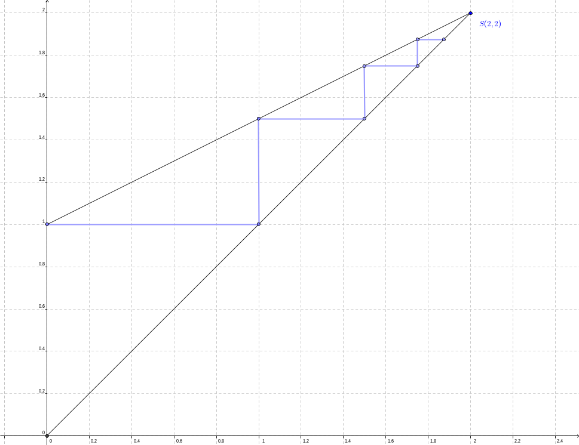

<!--
author:   Marco Hamann

email:    marco.hamann@htw-dresden.de

version:  0.0.1

language: de

comment:  Dieser Kurs richtet sich an Studierende der Hochschule für Technik und Wirtschaft Dresden im Studiengang Fahrzeugtechnik im 3. Semester.

import: https://raw.githubusercontent.com/LiaTemplates/tiny-turtle/master/README.md

import: https://raw.githubusercontent.com/liaTemplates/algebrite/master/README.md

import: https://raw.githubusercontent.com/LiaTemplates/Pyodide/master/README.md

-->


# Mathematik 3 (I959)


Dieser Kurs richtet sich an Studierende der Hochschule für Technik und Wirtschaft Dresden im Studiengang Fahrzeugtechnik im 3. Semester.

Sie können diesen Kurs auf [LiaScript](https://liascript.github.io/course/?https://github.com/marco-hamann/Mathe3/blob/main/README.md) oder [Opal](https://bildungsportal.sachsen.de/opal/auth/RepositoryEntry/16648798212) aufrufen. Das Repository zu diesem Kurs finden Sie unter

https://github.com/marco-hamann/Mathe3

```python
import numpy as np
import matplotlib.pyplot as plt

t = np.arange(0.0, 2.0, 0.01)
s = np.sin(2 * np.pi * t)

fig, ax = plt.subplots()
ax.plot(t, s)

ax.grid(True, linestyle='-.')
ax.tick_params(labelcolor='r', labelsize='medium', width=3)

plt.show()
```
@Pyodide.eval


## Funktionsreihen

Thema dieses Kapitels sind die Funktionsreihen für reelle Funktionen einer reellen Variablen. Speziell werden Potenzreihen und Fourierreihen eingeführt und untersucht.

~~Zentrale Fragen~~ sind dabei die folgenden:

1. Vertiefung von Zahlenfolgen und **Zahlenreihen**. Dies umfasst u. a. die Konvergenz und Divergenz von Zahlenfolgen, den Grenzwert einer konvergenten Zahlenfolge, Partialsummen für Zahlenfolgen und Partialsummenfolgen (Zahlenreihen), den Summenwert einer konvergenten Zahlenreihe sowie Konvergenzkriterien für Zahlenreihen und Eigenschaften konvergenter Zahlenreihen

2. Übertragung auf Funktionenfolgen und **Funktionenreihen**. Dies umfasst u. a. unendliche Folgen von reellen Funktionen einer reellen Veränderlichen über demselben Definitionsbereich (Funktionenfolge), den Konvergenzbereich einer Funktionenfolge und Grenzfunktion einer Funktionenfolge, gleichmäßige bzw. punktweise Konvergenz, Partialsummen für Funktionenfolgen und Partialsummenfolgen einer Funktionenfolge (Funktionenreihen) sowie die Summenfunktion der konvergenten Funktionenreihe
3. Untersuchung von **Potenzreihen** als speziellen Funktionenreihen, deren Eigenschaften, die Taylor-Entwicklung von reellen Funktionen von einer bzw. zwei reellen Veränderlichen zur Entwicklung einer Potenzreihe
4. Untersuchung von **Fourier-Reihen** zu periodischen Funktionen, Satz von Dirichlet, Entwicklung einer Fourier-Reihe zu einer gegebenen Funktion


### Zahlenfolgen und Reihen

Zahlenfolgen
============


In diesem Abschnitt werden grundlegende Begriffe wie Zahlenfolge, Zahlenreihe und Konvergenz wiederholt.

> Eine reelle **Zahlenfolge** ist eine Funktion der Form $f:\mathbb{N}\to\mathbb{R}$ mit
>$$
  f:k\mapsto y=f(k)=a_k
$$ worin $a_k$ $k-$tes Glied der Zahlenfolge genannt wird. Besitzt $f$ endlich viele (natürliche) Argumente, so heißt $f$ *endliche* Zahlenfolge, für unendlich viele Argumente *unendliche* Zahlenfolge.

**Bemerkung.** Reelle Zahlenfolgen lassen sich oftmals darstellen

1. in Form einer *Wertetabelle*. Die eindeutige Zuordnung der reellen Glieder $a_k$  zu den natürlichen Argumenten $k$ ist in den Spalten der nachfolgenden Tabelle formal dargestellt.  
| $k$ | $0$ | $1$ | $2$ | $...$ |
| :----- | :----- | :----- | :----- | :----- |
| $a_k$ | $a_0$ | $a_1$ | $a_2$ | $...$ |
2. als nach den natürlich geordneten Argumenten zugeordnete *Liste* der Zahlenfolgenglieder, beispielsweise
$$
  \left(a_k\right)_{k=0}^\infty=a_0,a_1,a_2,...
$$

> Eine unendliche reelle Zahlenfolge $(a_k)_{k=0}^\infty$ heißt *konvergent* gegen den Grenzwert $g\in\mathbb{R}$, $\lim_{k\to\infty}{a_k}=g$, falls ein $\epsilon>0$ existiert, dass ab einem hinreichend großem $n\in\mathbb{N}$ gilt
>$$
  |a_k-g|<\epsilon \quad\forall\; k>n
$$ Andernfalls heißt $(a_k)_{k=0}^\infty$ *divergent*.


Zahlenreihen
============


>Werden nun die Teilsummen von Gliedern der Zahlenfolge $(a_k)_{k=0}^\infty$ gebildet gemäß
>$$
  s_0=a_0\,,\quad s_1=s_0+a_1=a_0+a_1\,,\quad s_2=s_1+a_2=a_0+a_1+a_2\,, ...
$$ beziehungsweise allgemein für die $n$-te Teilsumme
>$$
  s_n=\sum_{k=0}^n{a_k}\,,\quad n\in\mathbb{N}
$$ so bildet die Zuordnung $n\mapsto s_n$, $n\in\mathbb{N}$, wieder eine unendliche Folge, die Partial-, Teilsummenfolge beziehungsweise **unendliche Zahlenreihe** $(s_n)_{n=0}^\infty$ von $(a_k)_{k=0}^\infty$ genannt wird.

Eine alternative Schreibweise für die Zahlenreihe $(s_n)_{n=0}^\infty$ zur Zahlenfolge $(a_k)_{k=0}^\infty$ ist
$$
  \sum_{k=0}^\infty{a_k}
$$ worin die Bezugnahme zur Zahlenfolge aufgezeigt ist.

Die Zahlenreihe $(s_n)_{n=0}^\infty$ zur Zahlenfolge $(a_k)_{k=0}^\infty$ heißt *konvergent* gegen den Grenzwert $w\in\mathbb{R}$, $\lim_{n\to\infty}{s_n}=w$, falls ein $\epsilon>0$ existiert, dass ab einem hinreichend großem $m\in\mathbb{N}$ gilt
$$
  |s_n-w|<\epsilon \quad\forall\; n>m
$$ Andernfalls heißt $(s_n)_{n=0}^\infty$ *divergent*.

**Beispiel 1.** Betrachtet wird die geometrische Zahlenfolge $$
  (a_k)_{k=0}^\infty=\left(\frac{1}{2^k}\right)_{k=0}^\infty=1,\frac{1}{2},\frac{1}{4},\frac{1}{8},...
$$ Für die Glieder dieser Zahlenfolge gilt $$
  \frac{a_{k+1}}{a_k}=\frac{1}{2}
$$ für alle Argumente $k$. Die Zahlenfolge ist konvergent mit Grenzwert $$
  \lim_{k\to\infty}{a_k}=0
$$

Für die Partialsummenfolge von $(a_k)_{k=0}^\infty$ gilt $$
  s_0=a_0=1\,,\quad
  s_1=a_0+a_1=1+\frac{1}{2}=\frac{3}{2}\,,\quad s_2=a_0+a_1+a_2=1+\frac{1}{2}+\frac{1}{4}=\frac{7}{4}\,,\quad ...
$$ beziehungsweise für das allgemeine Glied $$
  s_n=\sum_{k=0}^n{a_k}=a_0+a_1+a_2+...+a_n=1+\frac{1}{2}+\frac{1}{4}+...+\frac{1}{2^n}
$$ Die Konvergenz der Partialsummenfolge $$
  (s_n)_{n=0}^\infty=1,\frac{3}{2},\frac{7}{4},...
$$ folgt unter Benutzung der Summenformel für geometrische Reihen $$
  s_n-\frac{1}{2}\cdot s_n=\left(1+\frac{1}{2}+\frac{1}{4}+...+\frac{1}{2^n}\right)-\frac{1}{2}\cdot\left(1+\frac{1}{2}+\frac{1}{4}+...+\frac{1}{2^n}\right)=1-\frac{1}{2^{n+1}}\quad\leftrightarrow\quad s_n=2-\frac{1}{2^n}
$$ und schließlich $$
  \lim_{n\to\infty}{s_n}=2
$$ Graphisch geometrisch lässt sich der Grenzwert auch aus nachstehender Abbildung ermitteln. Hierfür sind die Längen der Strecken (blau) in Richtung der $x$-Achse beziehungsweise der $y$-Achse zu addieren.



**Beispiel 2.** Ganz ähnlich lässt sich der Grenzwert der alternierenden geometrischen Zahlenreihe $$
  \sum_{k=0}^\infty{\left((-1)^k\cdot\frac{1}{2^k}\right)}=1-\frac{1}{2}+\frac{1}{4}-\frac{1}{8}\pm ...
$$ bestimmen. Mit der Summenformel für geometrische Reihen folgt analog zu Beispiel 1 $$
  \lim_{n\to\infty}{\sum_{k=0}^n{\left((-1)^k\cdot\frac{1}{2^k}\right)}}=
  \lim_{n\to\infty}{\left(\frac{1-\left(-\frac{1}{2}\right)^{n+1}}{1-\left(-\frac{1}{2}\right)}\right)}=\frac{2}{3}
$$ Graphisch geometrisch lässt sich der Grenzwert auch aus nachstehender Abbildung ermitteln. Hierfür sind die Längen der Strecken (blau) in Richtung der $x$-Achse beziehungsweise der $y$-Achse des 'zwischen' beiden Geraden mit den Gleichungen $y=x$ und $y=1-\frac{1}{2}\cdot x$ erzeugten, achsenparallelen, spiralförmigen Polygons zu addieren / subtrahieren.


**Bemerkung 1.** Eine geometrische Zahlenreihe $$
  \sum_{k=0}^\infty{\left(a\cdot r^k\right)}\,,\quad a\in\mathbb{R}\setminus\{0\}
$$ konvergiert dann, wenn $\left|r\right|\in(0,1)$. Vergleiche Beispiel 1 und 2.

**Bemerkung 2.** Der Begriff einer Summe einer unendlichen Reihe ist wesentlich verschieden von der Summe endlich vieler Summanden. Zum Beispiel können zur divergenten Reihe $$
  1-1+1-1+1-1\pm ...
$$ durch Klammerung neue (!) Zahlenreihen gebildet werden $$
  (1-1)+(1-1)+(1-1)+...=0+0+0+...=0
$$ wohingegen eine davon abweichende Klammerung $$
  1-(1-1)-(1-1)-(1-1)-...=1-0-0-0-...=1
$$ erzeugt.

Es gilt folgender Satz (ohne Beweis):

>**Satz 1.** Wird zu einer ~~konvergenten~~ Reihe $$
  \sum_{k=0}^\infty{a_k}=a_0+a_1+a_2+...
$$ durch Klammerung die Reihe $$
  (a_0+...+a_{n_1})+(a_{n_1+1}+...+a_{n_2})++(a_{n_2+1}+...+a_{n_3})+...
$$ gebildet, so konvergiert diese stets und besitzt dieselbe Summe wie die Reihe $\sum_{k=0}^\infty{a_k}$ (*Assoziativgesetz*).

**Beispiel 3.** Analog zu Beispiel 1 lässt sich zeigen, dass die Reihe $$
  \sum_{m=0}^\infty{\left(\frac{3}{2^{2\cdot m+1}}\right)}=\frac{3}{2}+\frac{3}{8}+\frac{3}{32}+...=\left(1+\frac{1}{2}\right)+\left(\frac{1}{4}+\frac{1}{8}\right)+\left(\frac{1}{16}+\frac{1}{32}\right)+...
$$ gegen den Grenzwert $2$ konvergiert. Wegen $$
  \frac{1}{2^{2\cdot m}}+\frac{1}{2^{2\cdot m+1}}=\frac{2+1}{2^{2\cdot m+1}}=\frac{3}{2^{2\cdot m+1}}
$$ entsteht durch Klammerung aus der konvergenten Reihe $$
  1+\frac{1}{2}+\frac{1}{4}+\frac{1}{8}+...=2
$$


Konvergenzkriterien für Zahlenreihen
====================================


>**Satz 2.** Gegeben ist eine unendliche Zahlenreihe $\sum_{k=0}^\infty{a_k}$. Für die Konvergenz der Reihe ist
>
>1. *notwendig* $$
  \lim_{k\to\infty}{a_k}=0
$$ d.h. die zugehörige Zahlenfolge $(a_k)_{k=0}^\infty$ ist eine Nullfolge.
>2. *hinreichend*, falls $a_k\not=0$ für alle $k$ $$
  \lim_{k\to\infty}{\left|\frac{a_{k+1}}{a_k}\right|}=q<1
$$ Für $q>1$ divergiert die Reihe, für $q=1$ ist über die Konvergenz der Reihe mit diesem Kriterium nicht entscheidbar. Dieses Kriterium wird *Quotientenkriterium* genannt.

**Beweis.** Für Interessierte hier eine Beweisskizze für die zweite Aussage unter Benutzung des Majorantenkriteriums, siehe Satz 3.

Es werde $a_k>0$ für alle $k\in\mathbb{N}$ vorausgesetzt (alternativ $a_k<0$). Es gelte dann $$
  \lim_{k\to\infty}{\left|\frac{a_{k+1}}{a_k}\right|}=
  \lim_{k\to\infty}{\frac{a_{k+1}}{a_k}}<1
$$ Dann gibt es ein $k_0\in\mathbb{N}$, so dass $$
  \left|\frac{a_{k+1}}{a_k}\right|=\frac{a_{k+1}}{a_k}\leq r<1\quad\forall\;k\geq k_0
$$ für ein bestimmtes $r$. Hieraus folgt $$
  a_{k_0+j}\leq r\cdot a_{k_0+j-1}\leq r^2\cdot a_{k_0+j-2}\leq ...\leq r^j\cdot a_{k_0}\quad\forall\; j\geq0
$$ Damit ist die geometrische Reihe $$
  \sum_{j=0}^\infty{b_j}:=a_{k_0}\cdot\sum_{j=0}^\infty{r^j}
$$ eine konvergente Majorante der Reihe $\sum_{j=0}^\infty{a_{k_0+j}}$. Durch Addition endlich vieler Glieder $a_k$ mit $k<k_0$ ändert sich die Konvergenz nicht.

In den nachstehenden Videos werden notwendiges Kriterium / Quotientenkriterium / Wurzelkriterium für die Konvergenz einer Zahlenreihe an je einem Beispiel erläutert.

!?[Notwendiges Kriterium](https://www.youtube.com/watch?v=uafZtktPqN0&list=PLLTAHuUj-zHjs82YCjiSUeWnNGZkEePIE)

!?[Quotientenkriterium](https://www.youtube.com/watch?v=QVHW1YyNHgI&list=PLLTAHuUj-zHjs82YCjiSUeWnNGZkEePIE)

In den nachstehenden Videos wird das Wurzelkriterium für die Konvergenz einer Zahlenreihe an je einem Beispiel erläutert.

!?[Wurzelkriterium1](https://www.youtube.com/watch?v=-cnZrIZ66xs&list=PLLTAHuUj-zHjs82YCjiSUeWnNGZkEePIE)

!?[Wurzelkriterium2](https://www.youtube.com/watch?v=J0ZDceKddcI&list=PLLTAHuUj-zHjs82YCjiSUeWnNGZkEePIE)

Nachstehend werden weitere hinreichende Kriterien zum Nachweis der Konvergenz / Divergenz von Zahlenreihen aufgezeigt (ohne Beweis).

In Satz 3 werden alternierende Reihen untersucht.

>**Satz 3.** *Leibnizsches Konvergenzkriterium*
>
>Eine alternierende Reihe $$
  \sum_{k=1}^\infty{(-1)^{k+1}\cdot a_k}=a_1-a_2+a_3-a_4+-\ldots
$$ ist konvergent, wenn für die Reihenglieder gilt:
>
>1. $\left(a_k\right)_{k=1}^\infty$ bildet eine monoton fallende Zahlenfolge, d.h. $$
  a_1>a_2>a_3>\ldots>a_k>a_{k+1}>\ldots
$$ mit $a_k>0$ für alle $k\in\mathbb{N}\setminus\{0\}$.
>2. Für den Grenzwert gilt: $\lim_{k\rightarrow\infty}{a_k}=0$

In Satz 4 wird aus der zu untersuchenden Reihe durch Verdichten eine Vergleichsreihe gebildet, deren Konvergenzverhalten stellvertretend untersucht werden kann.

>**Satz 4.** *Cauchysches Verdichtungskriterium*
>
>Sei $(a_k)_{k\in\mathbb{N}}$ eine monoton fallende Zahlenfolge. Dann hat die unendliche Reihe $$
  S=\sum_{k=1}^\infty{a_k}=a_1+a_2+a_3+\ldots
$$ das gleiche Konvergenzverhalten wie die verdichtete Reihe $$
  T=\sum_{n=0}^\infty{2^na_{\left(2^n\right)}}=a_1+2\cdot a_2+4\cdot a_4+8\cdot a_8+\ldots
$$ das heißt, dass die eine Reihe genau dann konvergiert, wenn die andere konvergiert.

Durch Abschätzung der Reihenglieder werden Vergleichsreihen gebildet, deren Konvergenzverhalten Rückschluss auf das der zu untersuchenden Reihe lässt (Satz 5).

>**Satz 5.** Sei $\sum_{n=1}^\infty{a_n}$ eine unendliche Reihe mit positiven Gliedern $a_n$.
>
>*Majorantenkriterium.* Die Reihe *konvergiert*, wenn eine Vergleichsreihe $$
  \sum_{n=1}^\infty{b_n}
$$ existiert mit:
>
>* Die Vergleichsreihe $\sum_{n=1}^\infty{b_n}$ konvergiert.
>* Zwischen den Gliedern beider Reihen besteht die Relation $a_n\leq b_n$ für alle $n$.
>
>*Minorantenkriterium*. Die Reihe *divergiert*, wenn eine Vergleichsreihe $$
  \sum_{n=1}^\infty{b_n}
$$ existiert mit:
>
>* Die Vergleichsreihe $\sum_{n=1}^\infty{b_n}$ ist divergent.
>* Zwischen den Gliedern beider Reihen besteht die Relation $a_n\geq b_n$ für alle $n$.

**Beispiel 4.** Die zur unendlichen Zahlenfolge $$
  n\mapsto a_n=\frac{1}{n} \quad (n\in\mathbb{N}\setminus\emptyset)
$$ gebildete unendliche Folge $\left( s_n\right)_{n=1}^\infty$ der Partialsummen mit $$
  s_n=\sum_{k=1}^n{\frac{1}{k}}= 1+\frac{1}{2}+\frac{1}{3}+\ldots+\frac{1}{n-1}+\frac{1}{n}
$$ heißt *harmonische Reihe*.

Zur Untersuchung des Konvergenzverhaltens der Reihe werden die Teilsummen $s_n$ zum Index $n=2^m$ gebildet $$
  s_{2^m}=\sum_{k=1}^{2^m}{\frac{1}{k}}=1+\frac{1}{2}+\frac{1}{3}+\cdots+\frac{1}{2^m}
$$ und anschließend durch Vergleichssummen von Potenzen $\frac{1}{2^p}$ mit $p\in\{0,1,\ldots,m\}$ nach unten abgeschätzt. Für $m\geq1$ gelten beispielsweise: $$
  s_{2^1} = 1+\frac{1}{2}
$$ beziehungsweise $$
  s_{2^2} = 1+\frac{1}{2}+\left(\frac{1}{3}+\frac{1}{4}\right) > 1+\frac{1}{2}+\frac{1}{4}+\frac{1}{4} = \underline{1+\frac{1}{2}+\frac{1}{2}}
$$ beziehungsweise $$
  s_{2^3} = 1+\frac{1}{2}+\left(\frac{1}{3}+\frac{1}{4}\right)+\left(\frac{1}{5}+\frac{1}{6}+\frac{1}{7}+\frac{1}{8}\right) > 1+\frac{1}{2}+\frac{1}{4}+\frac{1}{4}+\frac{1}{8}+\frac{1}{8}+\frac{1}{8}+\frac{1}{8} = \underline{1+\frac{1}{2}+\frac{1}{2}+\frac{1}{2}}
$$ sowie für ein allgemeines $m$ $$
  s_{2^m} = 1+\frac{1}{2}+\left(\frac{1}{3}+\frac{1}{4}\right)+\ldots+\left(\frac{1}{2^{m-1}+1}+\frac{1}{2^{m-1}+2}+\ldots+\frac{1}{2^{m-1}+2^{m-1}}\right) > 1+\frac{1}{2}+\frac{1}{4}+\frac{1}{4}+\ldots+\frac{1}{2^m}\cdot l
$$ mit $l=2^m-\left(2^{m-1}+1\right)+1=2^{m-1}$.

Hieraus folgt $$
  s_{2^m}>m\cdot\frac{1}{2}+1
$$ Somit ist die Teilfolge $\left(s_{2^m}\right)_{m=1}^\infty$ nicht beschränkt, also auch nicht konvergent. Und schließlich folgt, dass die Reihe $\left(s_n\right)_{n=1}^\infty$ nach Satz 4 keinen Grenzwert besitzt.

**Beispiel 5.** Zu untersuchen ist die unendliche Reihe $\left( t_n\right)_{n=1}^\infty$ mit $$
  t_n=\sum_{k=1}^n{\frac{1}{\sqrt{k}}}= 1+\frac{1}{\sqrt{2}}+\frac{1}{\sqrt{3}}+\ldots+\frac{1}{\sqrt{n-1}}+\frac{1}{\sqrt{n}}
$$ auf Konvergenz durch Vergleich mit der harmonischen Reihe.

Mit dem Minorantenkriterium folgt wegen $$
  \frac{1}{\sqrt{k}}\geq\frac{1}{k} \quad\forall k
$$ und der Eigenschaft, dass die Folge $\left(\frac{1}{\sqrt{k}}\right)_{k=1}^\infty$ streng monoton fallend ist, dass die harmonische Reihe (Beispiel 4) eine divergente Minorante der Reihe $\left( t_n\right)_{n=1}^\infty$ ist, letztere also ebs. divergent ist. Vergleiche Satz 5.

>**Satz 6.**   Seien $\left(\sum_{k=0}^na_k\right)_{n=0}^\infty$ und $\left(\sum_{k=0}^nb_k\right)_{n=0}^\infty$ konvergente Reihen mit Summenwerten $$
  \sum_{k=0}^\infty a_k=a\,,\quad\sum_{k=0}^\infty b_k=b
$$ Dann gelten:
>
>1. Gliedweise Multiplikation mit $\lambda\in\mathbb{R}$ $$
  \lambda\cdot\sum_{k=0}^na_k=\sum_{k=0}^n\left(\lambda a_k\right)\longrightarrow \lambda\cdot\sum_{k=0}^\infty a_k=\lambda\cdot a
$$
>2. Gliedweise Addition und Subtraktion: $$
\sum_{k=0}^na_k\pm \sum_{k=0}^nb_k=\sum_{k=0}^n\left(a_k\pm b_k\right)\longrightarrow \sum_{k=0}^\infty a_k\pm \sum_{k=0}^\infty b_k=a\pm b
$$


Sicher gewußt
=============


Testen Sie Ihr Wissen zu den Themen dieses Abschnitts.

**Frage 1.** Für welche der folgenden Zahlenreihen ist die notwendige Bedingung für die Konvergenz erfüllt?

[[X]] $$\sum_{k=1}^\infty{\frac{1}{k\cdot(k+1)}}$$
[[X]] $$\sum_{k=0}^\infty{\left(k\cdot\exp{(-k)}\right)}$$
[[ ]] $$\sum_{k=0}^\infty{\exp{k}}$$
[[?]] Notwendig für die Konvergenz einer Reihe $\sum_{k\in\mathbb{N}}{a_k}$ ist $$
  \lim_{k\to\infty}{a_k}=0
$$ d. h. dass die Folge der Glieder $a_k$ mit $n\in\mathbb{N}$ eine Nullfolge ist. Vergleiche Satz 2.
****************************************

Mit Hilfe der Grenzwertsätze und $\lim_{k\to\infty}{(1/k^m)}=0$ für beliebiges $m\in\mathbb{N}\setminus{0}$ ergibt sich $$
  \lim_{k\to\infty}{\frac{1}{k\cdot(k+1)}}=
  \lim_{k\to\infty}{\frac{\frac{1}{k^2}}{1+\frac{1}{k}}}=0
$$ unter Benutzung der L´Hospital-Regel für die reellen Funktionen $k\mapsto k$ und $k\mapsto \exp{k}$ mit $k\in\mathbb{R}$ $$
  \lim_{k\to\infty}{\left(k\cdot\exp{(-k)}\right)}=
  \lim_{k\to\infty}{\left(-1\cdot\exp{(-k)}\right)}=0
$$ jedoch $$
  \lim_{k\to\infty}{\exp{k}}=\infty
$$

****************************************

**Frage 2.** Berechnen Sie den Summenwert $s$ der folgenden geometrischen Reihen.

[[$\sum_{n=1}^\infty{\left(-\frac{1}{8}\right)^{n-1}}$] [$\sum_{n=0}^\infty{\left(\frac{1}{8}\right)^{n}}$] [$\sum_{n=0}^\infty{\left(-\frac{1}{7}\right)^{n}}$]]
[( ) ( ) (X)]  $s=\frac{7}{8}$
[( ) (X) ( )]  $s=\frac{8}{7}$
[(X) ( ) ( )]  $s=\frac{8}{9}$
[[?]] Für das $n$-te Folgenglied einer geometrischen Zahlenreihe $\sum_{n=0}^\infty{\left(q^n\right)}$ gilt $$
  s_n=\sum_{k=0}^n{\left(q^k\right)}=\left\{
  \begin{array}{ccc}\frac{1-q^{n+1}}{1-q} & \text{für} & q\not=1 \\ n+1 & \text{für} & q=1 \end{array}\right.
$$ Bilden Sie das $n$-te Folgenglied für ein $q$ und führen Sie den Grenzübergang $n\to\infty$ durch.
****************************************

Da jeweils $|q|<1$ sind die drei gegebenen geometrischen Reihen konvergent. Sie berechnen sich unter Benutzung der Summenformel

* $$\sum_{n=1}^\infty{\left(-\frac{1}{8}\right)^{n-1}}=\frac{1}{1-\left(-\frac{1}{8}\right)}=\frac{8}{9}$$
* $$\sum_{n=0}^\infty{\left(\frac{1}{8}\right)^{n}}=\frac{1}{1-\frac{1}{8}}=\frac{8}{7}$$
* $$\sum_{n=0}^\infty{\left(-\frac{1}{7}\right)^{n}}=\frac{1}{1-\left(-\frac{1}{7}\right)}=\frac{7}{8}$$

****************************************

**Frage 3.** Gegeben ist die Zahlenreihe $$
  \sum_{n=1}^\infty{\left(\frac{1}{2^n}\cdot\cos{(2\cdot n)}\right)}
$$ Entscheiden Sie, welche der nachstehenden (konträren!) Aussagen zur Konvergenz dieser Reihe wahr ist.

Die oben stehende Reihe besitzt eine Vergleichreihe mit

[(X)] $$
  \sum_{n=1}^\infty{\left(\frac{1}{2^n}\cdot\cos{(2\cdot n)}\right)}\leq\sum_{n=1}^\infty{\left(\frac{1}{2}\right)^n}=2
$$
[( )] $$
  \sum_{n=1}^\infty{\left(\frac{1}{2^n}\cdot\cos{(2\cdot n)}\right)}\geq\sum_{n=1}^\infty{\left(\frac{1}{n}\right)^\frac{1}{2}}=\infty
$$


### Definition einer Funktionenreihe


Funktionenfolge
===============


Es bezeichne $\left(f_k\right)_{k=1}^\infty$ mit $$
  f_k:x\mapsto y=f_k(x)
$$ eine unendliche Folge reeller Funktionen mit gemeinsamen Definitionsbereich $D\subseteq\mathbb{R}$. Für ein Argument $x_0\in D$ bildet $$
  (y_k)_{k=1}^\infty=\left(f_k(x_0)\right)_{k=1}^\infty
$$ eine zu $x_0$ gehörende Zahlenfolge von Funktionswerten $y_k=f_k(x_0)$.

Für die anstehende Begriffsbildung wird das folgende Beispiel betrachtet.

**Beispiel 1.** Es wird die Folge $\left( f_k\right)_{k=1}^\infty$ der Funktionen $f_k:x\mapsto x^k=f_k(x),\; x\in\mathbb{R}$ betrachtet.

1. Für $x_0=1$ bildet $$
  \left(f_k(x_0)\right)_{k=1}^\infty=\left(1^k\right)_{k=1}^\infty=1,1,1,1,...
$$ eine unendliche, konstante Zahlenfolge der zu $x_0$ gehörenden Funktionswerte $f_k(x_0)$.
2. Für $x_0=-1$ bildet $$
  \left(f_k(x_0)\right)_{k=1}^\infty=\left((-1)^k\right)_{k=1}^\infty=-1,1,-1,1,...
$$ eine unendliche, alternierende Zahlenfolge der zu $x_0$ gehörenden Funktionswerte $f_k(x_0)$. Diese ist divergent mit den beiden Häufungswerten $1$ und $-1$.
3. Für $x_0=\frac{1}{2}$ bildet $$
  \left(f_k(x_0)\right)_{k=1}^\infty=\left(\left(\frac{1}{2}\right)^k\right)_{k=1}^\infty=\frac{1}{2},\frac{1}{4},\frac{1}{8},\frac{1}{16},...
$$ eine unendliche, monoton fallende Zahlenfolge der zu $x_0$ gehörenden Funktionswerte $f_k(x_0)$. Diese ist konvergent mit dem Grenzwert $0$. (Nachweis beispielsweise mit Quotientenkriterium, siehe Abschnitt [Zahlenreihen](#Zahlenfolgen-und-Reihen))
4. Für ein allgemeines Argument $x_0\in D$ bildet $$
  \left(f_k(x_0)\right)_{k=1}^\infty=\left(x_0^k\right)_{k=1}^\infty=x_0,x_0^2,x_0^3,x_0^4,...
$$ eine unendliche, geometrische Zahlenfolge. Dabei gilt $$
  \lim_{k\rightarrow\infty}{f_k(x_0)}=\left\{\begin{array}{ll}
    0 & \text{ für } |x_0|<1 \\ 1 & \text{ für } x_0=1
  \end{array}\right.
$$ Für $|x_0|>1$ beziehungsweise für $x_0=-1$ ist die Folge $\left(f_k(x_0)\right)_{k=1}^\infty$ divergent.

Das Intervall $D_0=(-1,1]$ heißt *Konvergenzbereich* der Funktionenfolge $\left( f_k\right)_{k=1}^\infty$. Es ist $D_0\subset D$.

_{k=1}^\infty$ der Funktionen $f_k:x\mapsto x^k=f_k(x),\; x\in\mathbb{R}$ mit $n=1$ (rot), $n=2$ (blau), $n=3$ (lila), $n=4$ (cyan), $n=5$ (grün) und $n=100$ (schwarz). Die Funktionen sind auf dem Intervall $(-1,1]$ definiert.")

>**Definition 1.** Sei $\left( f_k\right)_{k=1}^\infty$ eine unendliche Folge reeller Funktionen mit gemeinsamen Definitionsbereich $D\subseteq\mathbb{R}$. Sei $D_0\subseteq D$ die Menge aller Argumente $x\in D$, für welche die Folge der Funktionswerte $\left( f_k(x)\right)_{k=1}^\infty$ konvergiert. $D_0$ heißt **Konvergenzbereich** der Funktionenfolge $\left( f_k\right)_{k=1}^\infty$ und $$
  f:x\mapsto f(x)=\lim_{k\to\infty}{f_k(x)}\,,\quad x\in D_0
$$ heißt **Grenzfunktion** dieser Folge.

**Bemerkung 1.** Konvergenzbereich und Grenzfunktion übertragen den Begriff des Grenzwertes einer Zahlenfolge auf Folgen reeller Funktionen.

**Beispiel 2.** (Fortführung von Beispiel 1.) Die Grenzfunktion der Funktionenfolge $\left( f_k\right)_{k=1}^\infty$ der Funktionen $$
  f_k:x\mapsto y=f_k(x)=x^k,\; x\in\mathbb{R}
$$ ist die Funktion $$
  f:x\mapsto y=f(x)=\left\{
    \begin{array}{ccc}
      0 & \text{ für } & x\in(-1,1) \\ 1 & \text{ für } & x=1
    \end{array}
  \right.
$$ der Konvergenzbereich der Funktionenfolge bildet den Definitionsbereich der Grenzfunktion. Zu bemerken ist, das alle Funktionen $f_k$ mit $k\geq1$ differenzierbar sind, hingegen ist die Grenzfunktion $f$ nicht stetig in $x=1$. Siehe auch die vorstehende Abbildung.


Funktionenreihe
===============


In gewisser Analogie zur Bildung einer Partialsummenfolge zu einer Zahlenfolge wird nun zu gegebener Folge $\left( f_k\right)_{k=1}^\infty$ reeller Funktionen mit gemeinsamen Definitionsbereich $D_0$ (Konvergenzbereich der Funktionenfolge) die Folge von Teilsummen von $\left( f_k(x)\right)_{k=1}^\infty$ für $x\in D_0$ gebildet, für $n=1$ $$
  s_1(x)=f_1(x)
$$ beziehungsweise für $n=2$ $$
  s_2(x)=f_1(x)+f_2(x)
$$ beziehungsweise für ein allgemeines $n\in\mathbb{N}$ $$
  s_n(x)=\sum_{k=1}^n{f_k(x)}
$$ das *$n$-tes Glied der Funktionenreihe* genannt wird. Anders als bei Zahlenreihen ist das Glied $s_n(x)$ abhängig von der Stelle $x$.

---

Die zu $\left( f_k\right)_{k=1}^\infty$ gebildete Partialsummenfolge $$
  \left(s_n(x)\right)_{n=0}^\infty=\sum_{k=1}^\infty{f_k(x)}\,,\quad x\in D_0
$$ wird **Funktionenreihe** der Funktionenfolge genannt.

---

**Beispiel 3.**  (Fortführung der Beispiele 1 und 2.) Für die Funktionenfolge $\left( f_k\right)_{k=1}^\infty$ der Funktionen $f_k:x\mapsto x^k=f_k(x),\; x\in D_0$ ergibt sich das allgemeine Glied der Funktionenreihe $$
  s_n(x)=x+x^2+...+x^n=\sum_{k=1}^n{x^k}\,,\quad x\in D_0
$$ Unter Benutzung von $$
  x\cdot s_n(x)=x^2+...+x^n+x^{n+1}=\sum_{k=2}^{n+1}{x^k}
$$ folgt hieraus für das allgemeine Glied der Funktionenreihe $$
  s_n(x)=\left\{\begin{array}{lcl}
    x\cdot\frac{1-x^n}{1-x} & \text{für} & x\not=1 \\
    n & \text{für} & x=1 \\
  \end{array}\right.
$$ Damit ergibt sich unter dem Grenzübergang $n\to\infty$ $$
  \lim_{n\to\infty}{s_n(x)}=\left\{\begin{array}{lcl}
    \frac{1}{1-x}-1 & \text{für} & x\in(-1,1) \\
    \infty & \text{für} & x=1 \\
  \end{array}\right.
$$ und schließlich für die Summenfunktion der Funktionenreihe $(s_n(x))_{n=1}^\infty=\sum_{k=1}^\infty{f_k(x)}$ $$
  s:x\mapsto y=s(x)=\frac{1}{1-x}-1\,,\quad x\in(-1,1)
$$ Siehe nachstehende Abbildung.

 sowie Glieder der Funktionenfolge $\left( f_k\right)_{k=1}^\infty$ der Funktionen $f_k:x\mapsto x^k=f_k(x),\; x\in\mathbb{R}$ mit $n=1$ (rot), $n=2$ (blau), $n=3$ (lila), $n=4$ (cyan), $n=5$ (grün) und $n=100$ (schwarz).Die Funktion $s$ ist im Intervall $(-1,1)$ definiert.")

>**Definition 2.** Die Menge aller Argumente $x_0\in D_0$, für welche die Reihe $\sum_{k=0}^\infty{(f_k(x_0))}$ konvergiert, heißt **Konvergenzbereich** $D_1$ der Funktionenreihe, und $$
  x\mapsto s(x)=\sum_{k=0}^\infty{(f_k(x))}\,,\quad x\in D_1
$$ heißt **Summenfunktion** der Funktionenreihe.

**Bemerkung 2.** Der in Definition 1 genutzte Begriff der Konvergenz ist auf eine Stelle $x_0$ des Konvergenzbereiches bezogen. Unter Zuhilfenahme von Quantoren lässt sich diese darstellen: $$
  \forall \epsilon>0\;\; \forall x\in D\;\; \exists n_0\in\mathbb{N}\;\; \forall n\geq n_0\;\; \left(|f_n(x)-f(x)|<\epsilon\right)
$$ worin $x$ eine Stelle des Konvergenzbereiches $D$ und $f$ die Grenzfunktion bezeichnen. Die so definierte Konvergenz wird **punktweise Konvergenz** genannt.

Demgegenüber legt $$
  \forall \epsilon>0\;\; \exists n_0\in\mathbb{N}\;\; \forall x\in D\;\; \forall n\geq n_0\;\; \left(|f_n(x)-f(x)|<\epsilon\right)
$$ **gleichmäßige Konvergenz** fest. Hier wird die absolute Differenz zwischen $f_n(x)$ und $f(x)$ für alle $x\in D$ betrachtet.

**Beispiel 4.**   (Fortführung der Beispiele 1, 2 und 3.)

1. Betrachtet sei $(f_k)_{k=0}^\infty$ mit $f_k(x)=x^k$ wie im vorigen Beispiel, jedoch mit eingeschränktem Definitionsbereich $D=[0,q)$ und $q\in(0,1)$ als reellem Parameter. Die Funktionen $f_k$ konvergieren gleichmäßig gegen $f:x\mapsto 0$ (Nullfunktion).
2. Für $D=[0,1)$ konvergieren $f_k$ punktweise gegen die Nullfunktion, nicht aber gleichmäßig, da $$
  \lim_{x\to 1-0}{f_k(x)}=1\;\;\forall k
$$ aber $$
  \lim_{x\to 1-0}{f(x)}=0
$$


Sicher gewußt
=============


Testen Sie Ihr Wissen zu den Themen dieses Abschnitts.

**Frage 1.** Für welche reellen $x$ gilt die folgende Gleichung? $$
  \sum_{k=0}^\infty{x^k}=
  \sum_{k=0}^\infty{\left(\left(\frac{1}{2}\right)^{k+1}\cdot(x+1)^k\right)}
$$

[( )] $x\in\mathbb{R}$
[( )] $x\in\mathbb{R}\setminus\{1\}$
[(X)] $x\in(-1,1)$
[[?]] Linke und reche Seite der Gleichung sind unter Benutzung der Summenformel für geometrische Reihen umzuformen. Der Konvergenzbereich der jeweiligen Reihe ist zu beachten.
****************************************

Die linke Seite der Gleichung berechnet sich unter Benutzung der Summenformel zu $$
  \sum_{k=0}^\infty{x^k}=\frac{1}{1-x}\,,\quad x\in(-1,1)
$$ die rechte Seite entsprechend $$
  \sum_{k=0}^\infty{\left(\left(\frac{1}{2}\right)^{k+1}\cdot(x+1)^k\right)}=
  \sum_{k=0}^\infty{\left(\frac{1}{2}\cdot\left(\frac{x+1}{2}\right)^k\right)}=
  \frac{1}{2}\cdot\frac{1}{1-\frac{x+1}{2}}=\frac{1}{1-x}
$$ worin $$
  \frac{x+1}{2}\in(-1,1)\quad\leftrightarrow\quad x\in(-3,1)
$$ den Konvergenzbereich angibt. Die Gleichheit von linker und rechter Seite ergibt sich also für alle $x$ in $$
  (-1,1)=(-1,1)\cap(-3,1)
$$

****************************************


### Potenzreihen

Definition und Eigenschaften
============================


In diesem Abschnitt wird eine spezielle Klasse von Funktionenreihen untersucht.

>**Definition 1.** Eine Funktionenreihe der Form $$
  \sum_{k=0}^\infty{\left(a_k\cdot(x-x_0)^k\right)}
$$ mit Koeffizienten $a_k\in\mathbb{R}$ heißt **Potenzreihe**. Die feste Stelle $x_0\in\mathbb{R}$ wird **Entwicklungsstelle** bzw. Mittelpunkt der Potenzreihe genannt.

Das allgemeine Glied der Potenzreihe in Definition 1 ist $$
  s_n(x)=\sum_{k=0}^n{\left(a_k\cdot(x-x_0)^k\right)}
$$ Bezeichnet $D_1$ den Konvergenzbereich der Potenzreihe, so stellt $$
  x\mapsto s(x)=\sum_{k=0}^\infty{\left(a_k\cdot(x-x_0)^k\right)}=\lim_{n\to\infty}{s_n(x)}
$$ die *Summenfunktion* der Potenzreihe dar.

**Beispiel 1.** Die nachstehenden Beispiele von Funktionenreihen stellen Potenzreihen dar.

1. Die bereits in ähnlicher Form im vorangegangenen Abschnitt betrachtete Funktionenreihe kann dargestellt werden $$
  \sum_{k=0}^\infty{x^k}=1+x+x^2+...+x^n+x^{n+1}+...=\sum_{k=0}^\infty{\left(1\cdot(x-0)^k\right)}
$$ woraus sich die Koeffizienten $a_k=1$ für beliebige Werte $k\in\mathbb{N}$ und die Entwicklungsstelle $x_0=0$ ablesen lassen. Damit lassen sich das allgemeine Glied der Potenzreihe $$
  s_n(x)=\sum_{k=0}^\infty{x^k}
$$ sowie die Summenfunktion der Potenzreihe $$
  x\mapsto s(x)=\frac{1}{1-x}\,,\quad x\in(-1,1)
$$ angeben.
2. Die Funktionenreihe der Form $$
  \sum_{k=0}^\infty{\left((x+2)^k\right)}=1+(x+2)+(x+2)^2+(x+2)^3+...
$$ ist eine Potenzreihe mit reellen Koeffizienten $a_k=1$ für beliebige Werte $k\in\mathbb{N}$ und der Entwicklungsstelle $x_0=-2$, da sich die Summanden der Reihe in der Form $$
  (x+2)^k=(x-(-2))^k
$$ (vergleiche Definition 1) darstellen lassen. Diese Funktionenreihe liefert für jedes $x\not=-2$ eine geometrische Reihe, wonach unter Nutzung der Summenformel für geometrische Reihen $$
  x\mapsto s(x)=\frac{1}{1-(x+2)}=-\frac{1}{1+x}\,,\quad x\in(-3,-1)
$$ für die Summenformel der Funktionenreihe ergibt.
3. Die Funktionenreihe der Form $$
  \sum_{k=0}^\infty{\frac{x^k}{k!}}=1+\frac{x}{1}+\frac{x^2}{2}+\frac{x^3}{3!}+...+\frac{x^n}{n!}+\frac{x^{n+1}}{(n+1)!}+...
$$ lässt sich in der Form von Definition 1 darstellen $$
  \sum_{k=0}^\infty{\frac{x^k}{k!}}=\sum_{k=0}^\infty{\left(\frac{1}{k!}\cdot (x-0)^k\right)}
$$ woraus sich die Koeffizienten $a_k=\frac{1}{k!}$ für beliebige Werte $k\in\mathbb{N}$ und die Entwicklungsstelle $x_0=0$ ablesen lassen. Damit lässt sich das allgemeine Glied der Potenzreihe $$
  s_n(x)=\sum_{k=0}^n{\left(\frac{1}{k!}\cdot (x-0)^k\right)}
$$ angeben. Um die Summenfunktion dieser Potenzreihe zu ermitteln, ist zunächst der Konvergenzbereich $D_1$ der Reihe zu bestimmen. Hierfür wird ein $x\in\mathbb{R}$ beliebig, aber fest gewählt. Mit $$
  b_n=\frac{x^n}{n!}\quad\text{und}\quad b_{n+1}=\frac{x^{n+1}}{{n+1}!}=\frac{x^n}{n!}\cdot\frac{x}{n+1}=b_n\cdot\frac{x}{n+1}
$$ lässt sich unter Benutzung des Quotientenkriteriums für die Zahlenreihen (siehe Abschnitt [Zahlenfolgen und Reihen](#Zahlenfolgen-und-Reihen) zeigen $$
  \left|\frac{b_{n+1}}{b_n}\right|=\frac{|x|}{n+1}
$$ sowie $$
  \lim_{n\to\infty}\left|\frac{b_{n+1}}{b_n}\right|=0\quad \forall x\in\mathbb{R}
$$ Dies bedeutet, dass für jedes $x\in\mathbb{R}$ die entsprechende Zahlenreihe $\sum_{n=0}^\infty{b_n}$ konvergiert und damit $D_1=\mathbb{R}$. Die Summenfunktion ergibt sich damit $$
  x\mapsto s(x)=\sum_{k=0}^\infty{\frac{x^k}{k!}}\,,\quad x\in\mathbb{R}
$$

Im nachstehenden Video werden Definition und allgemeine Darstellungeiner Potenzreihen sowie Begriffe wie Koeffizienten und Entwicklungsstelle erläutert.

!?[Potenzreihe](https://www.youtube.com/watch?v=CeEfXWalXeU&list=PLLTAHuUj-zHjs82YCjiSUeWnNGZkEePIE)


Konvergenzbereich
=================


Der ~~Konvergenzbereich~~ $D_1$ einer Potenzreihe ergibt sich zu $$
  D_1=(x_0-r,x_0+r)\quad\text{mit}\quad r\geq 0
$$ d. h. als zur Entwicklungsstelle $x_0$ symmetrisches Intervall, worin $r$ den **Konvergenzradius** bezeichnet, beziehungsweise ist $D_1=\mathbb{R}$. (In diesem Fall ist $r$ als 'unbegrenzt' groß zu interpretieren.)

Der Konvergenzradius lässt sich mithilfe der Formel $$
    r=\frac{1}{\limsup_{n\to\infty}{\sqrt[n]{|a_{n}|}}}
$$ d. h. unter Benutzung des Limes superior und der expliziten Darstellung der Koeffizienten $n\mapsto a_n$ der Potenzreihe berechnen. Siehe auch [Konvergenzradius](https://de.wikipedia.org/wiki/Konvergenzradius).

Gilt ab einem $n\in\mathbb{N}$ für alle folgenden Argumente $N>n$ für die Koeffizienten der Potenzreihe $a_N\not=0$, so lässt sich der Konvergenzradius einfacher berechnen mittels $$
  r=\lim_{n\to\infty}{\left|\frac{a_n}{a_{n+1}}\right|}
$$ sobald dieser existiert ($r\in\mathbb{R}$) bzw. 'unendlich' ergibt.

**Nachweis.** Es bezeichne $$
  \sum_{k=0}^\infty{\left(a_k\cdot(x-x_0)^k\right)}
$$ eine Potenzreihe mit reellen Koeffizienten $a_k$, Entwicklungsstelle $x_0\in D_1$ des Konvergenzbereiches $D_1$. Es sei eine weitere Stelle $x_1\not=x_0$ des Konvergenzbereiches $D_1$ der Potenzreihe vorausgesetzt. Damit gelte $$
  a_k\cdot(x_1-x_0)^k<c \quad\forall\; k\in\mathbb{N}
$$ für ein $c\in\mathbb{R}$. Hieraus lässt sich unter Benutzung von $$
  \left|a_k\cdot(x-x_0)^k\right|=\left|a_k\cdot(x_1-x_0)^k\right|\cdot\frac{|x-x_0|^k}{|x_1-x_0|^k}<
  c\cdot\frac{|x-x_0|^k}{|x_1-x_0|^k}
$$ eine Majorante konstruieren $$
  c\cdot\sum_{k=0}^\infty\cdot\left|\frac{x-x_0}{x_1-x_0}\right|^k
$$ die für jede Wahl $x$ eine geometrische Reihe bestimmt. Diese konvergiert, falls $$
  \left|\frac{x-x_0}{x_1-x_0}\right|<1
$$ Vergleiche Beispiel 1 im Abschnitt [Zahlenfolgen und Reihen](#Zahlenfolgen-und-Reihen). Letztere Bedingung liefert eine Ungleichung für den Konvergenzradius $r$ $$
  |x-x_0|<|x_1-x_0|=:r_1<r
$$ (als Supremum über alle $x_1\in D_1$). Außerdem folgt mit Hilfe des Quotientenkriteriums $$
  \lim_{k\to\infty}\left|\frac{a_{k+1}\cdot(x-x_0)^{k+1}}{a_{k}\cdot(x-x_0)^{k}}\right|=
  \lim_{k\to\infty}{\left|\frac{a_{k+1}}{a_{k}}\right|}\cdot|x-x_0|<1
$$ woraus die Formel zur Berechnung des Konvergenzradius folgt $$
  |x-x_0|<\lim_{k\to\infty}{\left|\frac{a_{k}}{a_{k+1}}\right|}=r
$$ $\square$

>**Satz 1.** (Gleichmäßige Konvergenz von Potenzreihen)
>
>Jede Potenzreihe $$
  \sum_{k=0}^\infty{\left(a_k\cdot(x-x_0)^k\right)}
$$ konvergiert gleichmäßig auf jedem abgeschlossenen und beschränkten Teilbereich $$
  [x_0-r_1,x_0+r_1]\subset D_1
$$ des Konvergenzbereiches $D_1$, worin $0<r_1<r$ für den Konvergenzradius $r$ gilt.

>**Folgerung 2.** Gegeben seien die auf dem gemeinsamen Bereich $D=[x_0-d,x_0+d]$ konvergenten Potenzreihen $$
 s_a(x)=\sum_{k=0}^\infty{a_k\left(x-x_0\right)^k}\,, \quad s_b(x)=\sum_{k=0}^\infty{b_k\left(x-x_0\right)^k} \quad (x\in D)
$$ mit $d>0$.[^1]
>
>1. $s_a$ darf beliebig oft gliedweise differenziert und integriert werden. Die neuen Potenzreihen konvergieren im gleichen Bereich $D$.
>2. $s_a$ und $s_b$ dürfen gliedweise addiert, subtrahiert, multipliziert werden. Die neuen Potenzreihen konvergieren mindestens im Bereich $D$.


Konstruktion einer Potenzreihe zu gegebener Funktion
====================================================


Nun soll die Konstruktion einer Potenzreihe zu einer hinreichend of stetig differenzierbaren Funktion $f$ betrachtet werden.

>**Satz 3.** (Taylor-Polynom)
>
>Ist eine Funktion $f:D\to\mathbb{R}$ mit $D\subseteq\mathbb{R}$ in der Umgebung $U(x_0)$ einer Entwicklungsstelle $x_0\in D$ $(n+1)$-mal stetig differenzierbar, dann existiert eine Stelle $\xi\in U(x_0)$, so dass für alle $x\in U(x_0)$ gilt $$
  f(x)=P_n(x)+R_n(x)
$$ mit **Taylorpolynom** $n$-ten Grades $$
  P_n(x)=f(x_0)+\sum_{k=1}^n{\frac{f^{(k)}(x_0)}{k!}\cdot(x-x_0)^k}
$$ und dem **Restglied** $$
  R_n(x)=\frac{f^{(n+1)}(\xi)}{(n+1)!}\cdot(x-x_0)^{n+1}
$$ das ein Polynom  $(n+1)$-ten Grades ist.

**Beispiel 2.** Gegeben sei die Funktion $$
  f:x\mapsto y=\sin{x}\,,\quad x\in\mathbb{R}
$$ sowie die Stelle $x_0=\frac{\pi}{2}$.

Das Taylorpolynom zweiten Grades von $f$ an der Stelle $x_0$ berechnet sich mittels $f(x_0)=\sin{x_0}=1$ und der beiden Ableitungen $$
  f^\prime(x_0)=\cos{x_0}=0\quad\text{und}\quad
  f^{\prime\prime}(x_0)=-\sin{x_0}=-1
$$ zu $$
  P_2(x)=1+\frac{0}{1!}\cdot(x-x_0)-\frac{1}{2!}\cdot(x-x_0)^2=1-\frac{1}{2}\cdot\left(x-\frac{\pi}{2}\right)^2
$$ Wird $x\mapsto P_2(x)$ als quadratische Funktion betrachtet, so beschreibt das Taylorpolynom $P_2(x)$ eine nach 'unten' geöffnete Parabel mit Scheitelpunkt $S\left(\frac{\pi}{2},1\right)$, die gegenüber der Normalparabel mit dem Faktor $-\frac{1}{2}$ gestaucht ist.

 und des Taylorpolynoms $P_2$ zu $f$ an der Stelle $x_0=\frac{\pi}{2}$.")

Die Berechnung des Taylorpolynoms $P_n(x)$ $n$-ten Grades einer mindestens $n$-mal stetig differenzierbaren reellen Funktion $f:x\mapsto y=f(x)$ ist nachfolgend unter Benutzung der Javascript Bibliothek Algebrite ausgeführt. Die beiden letzten Argumente in der Funktion `taylor(.)` bezeichnen dessen Grad $n$ und die Entwicklungsstelle $x_0$.

```javascript
f=sin(x)
p=taylor(f,x,2,pi/2)
p
coeff(p,x,2)
```
@Algebrite.eval

**Bemerkung 1.** Für $$
  \lim_{n\to\infty}{R_n(x)}=0
$$ ist nach dem vorstehenden Satz 3 $$
  f(x)=\lim_{n\to\infty}{P_n(x)}=f(x_0)+\sum_{k=1}^\infty{\frac{f^{(k)}(x_0)}{k!}\cdot(x-x_0)^k}
$$ d. h. das Taylorpolynom $P_n(x)$ konvergiert in diesem Fall gegen $f(x)$ auf $U(x_0)$.

Wird das Restglied $R_n(x)$ in der Darstellung aus Satz 3 weggelassen, so ist $P_n(x)$ in der Umgebung $U(x_0)$ nur eine Näherung von $f(x)$.

>**Definition 2.** (Taylorreihe)
>
>Sei $f$ wie oben definiert. $f$ werde in $U(x_0)$ beliebig of stetig differenzierbar vorausgesetzt, wobei $f^{(k)}(x_0)$ die $k$-te Ableitung der Funktion $f$ in $x_0$ bezeichnet. Dann heißt $$
  f(x_0)+\sum_{k=1}^\infty{\frac{f^{(k)}(x_0)}{k!}\cdot(x-x_0)^k}=
  f(x_0)+\frac{f^{\prime}(x_0)}{1!}\cdot(x-x_0)^1+
  \frac{f^{\prime\prime}(x_0)}{2!}\cdot(x-x_0)^2+...
$$ die **Taylorreihe** von $f$ in $x_0$.
>
>Falls die Entwicklungsstelle $x_0=0$, so wird die Taylorreihe auch **McLaurin-Reihe** genannt.

**Bemerkung 2.** Die zum Taylorpolynom gebildete Funktion $x\mapsto P_n(x)$ besitzt in $x_0\in U(x_0)\subseteq D_f$ mit $f$

1. denselben Funktionswert $P_n(x_0)=f(x_0)$, da $$
  P_n(x_0)=f(x_0)+\sum_{k=1}^n{\frac{f^{(k)}(x_0)}{k!}\cdot(x_0-x_0)^k}=f(x_0)
$$
2. übereinstimmende Ableitungen $$
  P_n^{(k)}(x_0)=\left.\frac{\mathrm{d}}{\mathrm{d}x}{P_n(x)}\right|_{x=x_0}=f^{(k)}(x_0)
$$ für $k\in{1,2,...,n}$, da unter Benutzung der $k$-ten Ableitung $P_n^{(k)}$ $$
    P_n^{(k)}(x)=f^{(k)}(x_0)+\sum_{i=k+1}^n{\left(\frac{f^{(i)}(x_0)}{i!}\cdot(x-x_0)^{i-k}\cdot\frac{i!}{(i-k)!}\right)}
$$ und somit $P_n^{(k)}(x_0)=f^{(k)}(x_0)$.

---

Ein Vergleich der $k$-ten Ableitungen des Taylorpolynoms $P_n(x)$ $n$-ten Grades  $(k\leq n)$ einer mindestens $n$-mal stetig differenzierbaren reellen Funktion $f:x\mapsto y=f(x)$ an der Entwicklungsstelle $x_0\in D_f$ kann interaktiv unter Benutzung der Javascript Bibliothek Algebrite durchgeführt werden. Neben den Ableitungen $P_n^{(k)}(x)$ und $f^{(k)}(x)$ wird an letzter Stelle die Differenz $P_n^{(k)}(x_0)-f^{(k)}(x_0)$ ausgegeben.

```javascript
f=sin(x)
n=3
x0=1
p=taylor(f,x,n,x0)
k=1
pk=d(p,x,k)
fk=d(f,x,k)
pk
fk
subst(x0,x,pk)-subst(x0,x,fk)
```
@Algebrite.eval


In den beiden nachstehenden Videos wird die Differentiation / Integration von Potenzreihen am Beispiel der Taylorentwicklung der Exponentialfunktion zu exp(x) erklärt.

!?[Ableitung der Taylorreihe](https://www.youtube.com/watch?v=DHTXqFjwJIA&list=PLLTAHuUj-zHjs82YCjiSUeWnNGZkEePIE&index=40)

!?[Integration der Taylorreihe](https://www.youtube.com/watch?v=UDAqeXyBmf0&list=PLLTAHuUj-zHjs82YCjiSUeWnNGZkEePIE&index=41)

**Beispiel 3.** Die Funktion $f:\mathbb{R}\to\mathbb{R}$ mit $$
  f:x\mapsto y=f(x)=\sin{x}
$$ soll an der Stelle $x_0=1$ in Ihre Potenzreihe entwickelt werden.

Die $k$-ten Ableitungen $f^{(k)}(x)$ berechnen sich einsichtig zu $$
  f^{(k)}(x)=\left\{
    \begin{array}{rcl}
       \sin{x} & \text{für} & k=4\cdot m \\
       \cos{x} & \text{für} & k=4\cdot m+1 \\
      -\sin{x} & \text{für} & k=4\cdot m+2 \\
      -\cos{x} & \text{für} & k=4\cdot m+3
    \end{array}
  \right.
$$ worin $m\in\mathbb{N}$. Für $m=0$ wird $f^{(0)}(x)=f(x)$ vereinbart. Hiermit ergeben sich die Koeffizienten der Potenzreihe $$
  a_k=\frac{f^{(k)}(x_0)}{k!}=\left\{
    \begin{array}{rcl}
       \frac{\sin{1}}{k!} & \text{für} & k=4\cdot m \\
       \frac{\cos{1}}{k!} & \text{für} & k=4\cdot m+1 \\
      -\frac{\sin{1}}{k!} & \text{für} & k=4\cdot m+2 \\
      -\frac{\cos{1}}{k!} & \text{für} & k=4\cdot m+3
    \end{array}
  \right.
$$ Für den Konvergenzradius folgt $$
  \left|\frac{a_k}{a_{k+1}}\right|=\left\{
    \begin{array}{rcl}
      \tan{1}\cdot\frac{(k+1)!}{k!} & \text{für} & k=2\cdot n \\
      \cot{1}\cdot\frac{(k+1)!}{k!} & \text{für} & k=2\cdot n+1
    \end{array}
  \right.
$$ mit $n\in\mathbb{N}$. Für den Grenzübergang $n\to\mathbb{R}$ ergibt sich der Konvergenzradius $r=\infty$ und somit der Konvergenzbereich $D_1=\mathbb{R}$. Die Taylorreihe zur Funktion $f$ lässt sich damit angeben $$
  \sin{1}+\frac{\cos{1}}{1!}\cdot(x-1)-\frac{\sin{1}}{2!}\cdot(x-1)^2-
  \frac{\cos{1}}{3!}\cdot(x-1)^3+\frac{\sin{1}}{1!}\cdot(x-1)^4+...
$$ beziehungsweise - unter Verwendung des Summenzeichens - $$
  \sum_{m=0}^\infty{\frac{\sin{1}}{(4\cdot m)!}\cdot(x-1)^{4\cdot m}}+
  \sum_{m=0}^\infty{\frac{\cos{1}}{(4\cdot m+1)!}\cdot(x-1)^{4\cdot m+1}}-
  \sum_{m=0}^\infty{\frac{\sin{1}}{(4\cdot m+2)!}\cdot(x-1)^{4\cdot m+2}}-
  \sum_{m=0}^\infty{\frac{\cos{1}}{(4\cdot m+3)!}\cdot(x-1)^{4\cdot m+3}}
$$ mit $x\in\mathbb{R}$. (Die hier vorgenommene Umordnung der Summanden in der Darstellung ist zulässig, da für jede Wahl von $x$ die zugehörige Zahlenreihe absolut konvergent ist.)

Wird die Reihenentwicklung nach dem $k$-ten Glied abgebrochen entsteht das Taylorpolynom $k$-ter Ordnung. Die nachstehende Abbildung zeigt die Taylorpolynome der Ordnungen $k=1$ (rot), $k=3$ (lila) und $k=5$ (blau).

 und der Taylorpolynome $P_1$ (rot), $P_3$ (lila) und $P_5$ (blau) zu $f$ an der Stelle $x_0=1$.")

---

**Beispiel 4.** Die Funktion $f:\mathbb{R}\to\mathbb{R}$ mit $$
  f:x\mapsto y=f(x)=\exp{x}\cdot\arctan{x}
$$ kann nicht elementar integriert werden.

```javascript
f=exp(x)*arctan(x)
integral(f)
```
@Algebrite.eval

*Ansatz*: Zur Ermittlung des unbestimmten Integrals von $f$

1. wird $f$ als Produkt der Funktionen $$
  f_1:x\mapsto y=f_1(x)=\exp{x}\quad\text{und}\quad
  f_2:x\mapsto y=f_2(x)=\arctan{x}
$$ mit $x\in\mathbb{R}$ aufgefasst.
2. Unter Benutzung der Reihenentwicklung der Funktionen $f_1$ und $f_2$ werden diese nach Folgerung 2 auf einem gemeinsamen Konvergenzbereich (gliedweise) multipliziert.
3. Das Produkt beider Potenzreihen konvergiert (mindestens) auf dem gemeinsamen Konvergenzbereich und wird dort gliedweise integriert.

Die Taylorreihe der Funktion $f_1$ an der Entwicklungstelle $x_0=0$ ist $$
  f_1(x)=\exp{x}=\sum_{n=0}^\infty{\frac{x^n}{n!}}=1+x+\frac{x^2}{2!}+\frac{x^3}{3!}+...
$$ mit Konvergenzbereich $D_1=\mathbb{R}$. (Bitte nachrechnen.)

Zur Berechnung der Taylorreihe der Funktion $f_2$ kann man (alternativ) zunächst $f_2^\prime$ in eine Potenzreihe entwickeln und diese anschließend gliedweise integrieren. Es ist $$
  f_2^\prime(x)=\frac{1}{1+x^2}=\frac{1}{1-(-x^2)}=\sum_{n=0}^\infty{\left(-x^2\right)^n}=\sum_{n=0}^\infty{\left((-1)^n\cdot x^{2\cdot n}\right)}
$$ als Summenfunktion einer geometrischen Reihe. Der Konvergenzbereich ist $|x|<1$. Nach Folgerung 2 ergibt sich $$
  f_2(x)=\sum_{n=0}^\infty{\left(\frac{(-1)^n}{2\cdot n+1}\cdot x^{2\cdot n+1}\right)}
$$ mit $|x|<1$.

Die Potenzreihe der Funktion $f$ ergibt sich durch gliedweise Multiplikation der Reihen für $f_1$ und $f_2$ $$
  f_1(x)\cdot f_2(x)=\left(\sum_{n=0}^\infty{\frac{x^n}{n!}}\right)\cdot
  \left(\sum_{k=0}^\infty{\left(\frac{(-1)^k}{2\cdot k+1}\cdot x^{2\cdot k+1}\right)}\right)=
  \sum_{i=1}^\infty{\left(x^i\cdot\left(\sum_{k\leq \frac{i-1}{2}}{\frac{(-1)^k}{2\cdot k+1}\cdot\frac{1}{(i-(2\cdot k+1))!}}\right)\right)}
$$ mit $x\in(-1,1)$ beziehungsweise $$
  f_1(x)\cdot f_2(x)=\sum_{i=1}^\infty{b_i\cdot x^i}
$$ mit

<!-- data-type="none" -->
| $i$ | $k$ | $b_i$ |
| :--- | :--- | :--- |
| $1$ | $0$ | $1$ |
| $2$ | $0$ | $1$ |
| $3$ | $\leq 1$ | $1\cdot\frac{1}{2!}-\frac{1}{3}\cdot\frac{1}{0!}=\frac{1}{6}$ |
| $4$ | $\leq 1$ | $1\cdot\frac{1}{3!}-\frac{1}{3}\cdot\frac{1}{1!}=-\frac{1}{6}$ |
| $5$ | $\leq 2$ | $1\cdot\frac{1}{4!}-\frac{1}{3}\cdot\frac{1}{2!}+\frac{1}{5}\cdot\frac{1}{0!}=\frac{3}{40}$ |
| $\vdots$ | $\vdots$ | $\vdots$ |

Die entstandene Reihe zu $f(x)=f_1(x)\cdot f_2(x)$ konvergiert mindestens im Intervall $(-1,1)$ und darf gliedweise integriert werden $$
  \int{f(x)}{\mathrm{d}x}=\sum_{i=1}^\infty{\frac{b_i}{i+1}\cdot x^{i+1}}+c=\frac{1}{2}\cdot x^2+\frac{1}{3}\cdot x^3+\frac{1}{24}\cdot x^4-\frac{1}{30}\cdot x^5+\frac{1}{80}\cdot x^6 +...
$$ mit $c\in\mathbb{R}$. Wird die Reihe abgebrochen, so entsteht eine 'Näherung' für das unbestimmte Integral.

Wird die Berechnung einer Näherung des unbestimmten Integrals unter Benutzung der Javascript Bibliothek Algebrite durchgeführt, ist darauf zu achten, dass die aus den Taylorpolynomen berechneten Koeffizienten $a_i$ in der Näherung für $\int{f}{\mathrm{d}x}$ nur für hinreichend kleine $i$ mit den Koeffizienten $b_i/(i+1)$ übereinstimmen.

```javascript
f1=taylor(exp(x),x,4,0)
f2=taylor(arctan(x),x,4,0)
f=f1*f2
f
integral(f,x)
```
@Algebrite.eval

**Bemerkung 3.** Ein Taylorpolynom lässt sich für reelle Funktionen zweier reeller Veränderlicher konstruieren. Sei hierfür $$
  f:(x,y)\mapsto z=f(x,y)\quad\text{mit}\quad (x,y)\in D\subset\mathbb{R}^2
$$ in Umgebung von $(x_0,y_0)\in D$ $(k+1)$-mal stetig partiell differenzierbar. Dann heißt $$
  P_n(x,y)=f(x_0,y_0)+
  \sum_{k=1}^n{\frac{1}{k!}\left((x-x_0)\frac{\partial}{\partial x}+(y-y_0)\frac{\partial}{\partial y}\right)^k\cdot f(x_0,y_0)}
$$ das **Taylor-Polynom** $n$-ter Ordnung zu $f$ und $$
  R_n(x,y)=\frac{1}{(k+1)!}\left((x-x_0)\frac{\partial}{\partial x}+(y-y_0)\frac{\partial}{\partial y}\right)^{k+1} f(\xi_0,\chi_0),\quad (\xi_0,\chi_0)\in D
$$ das Restglied $(n+1)$-ter Ordnung.

Hierin kann das Argument der Summe in $P_n(x,y)$ mithilfe des Binomischen Lehrsatzes ausgewertet werden. Für $n=1$ ergibt sich beispielsweise $$
  \frac{1}{1!}\left(f_x(x_0,y_0)\cdot(x-x_0)^1+f_y(x_0,y_0)\cdot(y-y_0)^1\right)
$$ für $n=2$ $$
  \frac{1}{2!}\left(f_{xx}(x_0,y_0)\cdot(x-x_0)^2+2f_{xy}(x_0,y_0)\cdot(x-x_0)(y-y_0)+f_{yy}(x_0,y_0)\cdot(y-y_0)^2\right)
$$

**Beispiel 5.** Es ist das Taylorpolynom $3$-ter Ordnung für die Funktion $$
  f:(x,y)\mapsto z=f(x,y)=\exp{x}\cdot\sin{y}\,,\quad (x,y)\in\mathbb{R}^2
$$ an der Stelle $(x_0,y_0)=(0,0)$ zu berechnen.

1. Der Funktionswert an der Stelle $(0,0)$ ist $f(0,0)=\exp{0}\cdot\sin{0}=0$.
2. Die partiellen ersten Ableitungen von $f$ berechnen sich zu $$
  f_x(x,y)=f(x,y)\,,\quad f_y(x,y)=\exp{x}\cdot\cos{y}
$$ und damit $f_x(0,0)=0$ und $f_y(0,0)=1$.
3. Die partiellen zweiten Ableitungen von $f$ berechnen sich zu $$
  f_{xx}(x,y)=f(x,y)\,,\quad
  f_{xy}(x,y)=f_{yx}(x,y)=\exp{x}\cdot\cos{y}\quad\text{und}\quad
  f_{yy}(x,y)=-\exp{x}\cdot\sin{y}
$$ und somit $$
  f_{xx}(0,0)=f_{yy}(0,0)=0\quad\text{und}\quad
  f_{xy}(0,0)=f_{yx}(0,0)=1
$$
4. Entsprechend berechnen sich die partiellen dritten Ableitungen von $f$ $$
  f_{xxx}(x,y)=f(x,y)\quad\text{mit}\quad f_{xxx}(0,0)=0
$$ und $$
    f_{xxy}(x,y)=f_{xyx}(x,y)=f_{yxx}(x,y)=\exp{x}\cdot\cos{y}\quad\text{mit}\quad f_{xxy}(0,0)=1
$$ und $$
    f_{xyy}(x,y)=f_{yxy}(x,y)=f_{yyx}(x,y)=-\exp{x}\cdot\sin{y}\quad\text{mit}\quad f_{xyy}(0,0)=0
$$ sowie $$
    f_{yyy}(x,y)=-\exp{x}\cdot\cos{y}\quad\text{mit}\quad f_{yyy}(0,0)=-1
$$
5. Aus dem berechneten Funktionswert und den partiellen Ableitungen lässt sich nun das Taylorpolynom dritter Ordnung an der Entwicklungsstelle $(0,0)$ berechnen. $$
  P_3(x,y)=0+y+x\cdot y+\frac{1}{6}\cdot\left(3\cdot x^2\cdot y-y^3\right)=
  x+x\cdot y+\frac{1}{2}\cdot x^2\cdot y-\frac{1}{6}\cdot y^3
$$


Sicher gewußt
=============


Testen Sie Ihr Wissen zu den Themen dieses Abschnitts.

---

**Frage 1.** Berechnen Sie den Konvergenzbereich der Potenzreihe $$
  \sum_{k=1}^\infty{\frac{(x+2)^k}{k^3\cdot 2^k}}
$$

[( )] $$x\in[0,4]$$
[( )] $$x\in\left[-\frac{5}{2},\frac{5}{2}\right]$$
[(X)] $$x\in[-4,0]$$
[[?]] Der Konvergenzradius $r$ und die Entwicklungsstelle $x_0$ der Reihe sind zu berechnen. Der Konvergenzbereich ist das Intervall $(x_0-r,x_0+r)$. Die Konvergenz der Potenzreihe an den Intervallgrenzen $x=x_0\pm r$ ist separat zu untersuchen.
****************************************

Die Entwicklungsstelle $x_0=-2$ ist abzulesen aus $x+2=x-(-2)$ in der allgemeinen Darstellung der Potenzreihe.

Die Koeffizienten der Potenzreihe sind $$
  a_k=\frac{1}{k^3\cdot 2^k}
$$ Hieraus berechnet sich der Konvergenzradius $r$ $$
  r=\lim_{k\to\infty}\left|\frac{(k+1)^3\cdot 2^{k+1}}{k^3\cdot 2^k}\right|=
  2\cdot\lim_{k\to\infty}\left|\frac{(k+1)^3}{k^3}\right|=2
$$ Hieraus ergibt sich der Konvergenzbereich $K=(-4,0)$. An der Grenze $x=-4$ ergibt sich die konvergente Reihe $$
  \sum_{k=1}^\infty{\frac{(-2)^k}{k^3\cdot 2^k}}=
  \sum_{k=1}^\infty{\frac{(-1)^k}{k^3}}=-1+\frac{1}{8}-\frac{1}{27}+\frac{1}{64}\mp...
$$ (Konvergenz nach Leibnitzkriterium), für $x=0$ die ebenfalls konvergente Reihe $$
  \sum_{k=1}^\infty{\frac{2^k}{k^3\cdot 2^k}}=
  \sum_{k=1}^\infty{\frac{1}{k^3}}=1+\frac{1}{8}+\frac{1}{27}+\frac{1}{64}+...
$$

****************************************

---

**Frage 2.** Berechnen Sie zur Funktion $$
  f:x\mapsto y=f(x)=\ln{(2\cdot x+1)}\,,\quad x>-\frac{1}{2}
$$ das Taylorpolynom $3$-ten Grades an der Stelle $x_0=0$.

[( )] $$ 2\cdot x-2\cdot x^2+\frac{8}{3}\cdot x^3\pm... $$
[(X)] $$ 2\cdot x-2\cdot x^2+\frac{8}{3}\cdot x^3 $$
[( )] $$ 2\cdot x-4\cdot x^2+16\cdot x^3 $$
[[?]] Das Taylorpolynom $P_n(x)$ $n$-ter Ordnung einer mindestens $n$-mal stetig differenzierbaren Funktion berechnet sich an der Entwicklungsstelle $x_0$ nach der Formel $$
  P_n(x)=f(x_0)+\sum_{k=1}^n{\frac{f^{(k)}(x_0)}{k!}\cdot(x-x_0)^k}
$$
****************************************

Die ersten drei Ableitungen berechnen sich $$
  f^\prime(x)=\frac{2}{2\cdot x+1}\,,\quad
  f^{\prime\prime}(x)=-\frac{4}{\left(2\cdot x+1\right)^2}\quad\text{und}\quad
  f^{\prime\prime\prime}(x)=\frac{16}{\left(2\cdot x+1\right)^3}
$$ und also an der Entwicklungsstelle $x_0=0$ $$
  f^\prime(0)=2\,,\quad
  f^{\prime\prime}(0)=-4\quad\text{und}\quad
  f^{\prime\prime\prime}(0)=16
$$ Das Taylorpolynom dritten Grades an der Stelle $x_0=0$ berechnet sich hiermit $$
  P_3(x)=f(0)+\frac{1}{1!}\cdot f^\prime(0)\cdot x
  +\frac{1}{2!}\cdot f^{\prime\prime}(0)\cdot x^2
  +\frac{1}{3!}\cdot f^{\prime\prime\prime}(0)\cdot x^3=
  2\cdot x-2\cdot x^2+\frac{8}{3}\cdot x^3
$$ Es ist durch die Koeffizienten $a_0=0$, $a_1=\frac{2}{1!}=2$, $a_2=-\frac{4}{2!}=-2$ und $a_3=\frac{16}{3!}$ eindeutig festgelegt.

****************************************


[^1]: Die Summe $s_a(x)$ darf auf dem Konvergenzbereich $D_1$ als Funktion $s_a:x\mapsto s(x)$ aufgefasst werden, ebs. $s_b(x)$.


### Fourierreihen


Ziel ist es, eine periodische Funktion in eine unendliche Reihe periodischer Funktionen zu entwickeln.

---

Spezialfall
===========

Gegeben sei zunächst eine reelle Funktion $f$ mit $$
  f:x\mapsto y=f(x)\,,\quad x\in D\subseteq\mathbb{R}
$$ welche <span style="color: orange" > periodisch mit Periode $2\pi$ </span> ist, d. h. $$
  f(x)=f(x+2\cdot\pi)\quad\forall x\in D
$$ $f$ darf in $D$ endlich viele Definitionslücken beziehungsweise Sprünge endlicher Höhe besitzen.


Ansatzgleichung
---------------


Mit der Gleichung $$
  f(x)=\sum_{k=0}^\infty{\left(A_k\cdot\sin{(k\cdot x+\varphi_k)}\right)}
$$ und zu bestimmenden Parametern $A_k\geq0$ und $\varphi_k$ für $k\in\mathbb{N}$ wird eine unendliche Reihe von Sinusfunktionen angesetzt, deren Perioden $p_k=2\pi/k$ sind. Unter Benutzung des Additionstheorems für den Sinus folgt hieraus $$
  f(x)=A_0\cdot\sin{\varphi_0}+\sum_{k=1}^\infty{\left(
    A_k\cdot\cos{\varphi_k}\cdot\sin{(k\cdot x)}+
    A_k\cdot\sin{\varphi_k}\cdot\cos{(k\cdot x)}
  \right)}
$$ was zur allgemeinen Darstellung einer **Fourierreihe** $$
f(x)=\frac{a_0}{2}+\sum_{k=1}^\infty{\left(
    a_k\cdot\cos{(k\cdot x)}+
    b_k\cdot\sin{(k\cdot x)}
\right)}
$$ mit zu bestimmenden **Fourierkoeffizienten** $a_k$ und $b_k$ führt.


Fourierkoeffizienten
--------------------


Für die Berechnung der Fourierkoeffizienten wird $D\supseteq(-\pi,\pi)$ vorausgesetzt.

1. Zur Berechnung des Fourierkoeffizienten $a_0$ werden beide Seiten der Ansatzgleichung über dem Intervall $(-\pi,\pi)$ integriert. Es ergibt sich (ohne Nachweis) $$
  \int_{-\pi}^\pi{f(x)}\,\mathrm{d}x=\int_{-\pi}^\pi{\frac{a_0}{2}}\,\mathrm{d}x+
  \sum_{i=1}^\infty{a_k\cdot\int_{-\pi}^\pi{\cos{(k\cdot x)}}\,\mathrm{d}x}+
  \sum_{i=1}^\infty{b_k\cdot\int_{-\pi}^\pi{\sin{(k\cdot x)}}\,\mathrm{d}x}=0
$$ woraus sich unter Beachtung von $$
  \int_{-\pi}^\pi{\cos{(k\cdot x)}}\,\mathrm{d}x=0\quad\text{und}\quad
  \int_{-\pi}^\pi{\sin{(k\cdot x)}}\,\mathrm{d}x=0
$$ für beliebige $k\in\mathbb{Z}$ der Fourierkoeffizient $a_0$ berechnet
>$$
  a_0=\frac{1}{\pi}\cdot\int_{-\pi}^\pi{f(x)}\,\mathrm{d}x
$$
2. Die Fourierkoeffizienten $a_k$, $k\geq1$, berechnen sich aus dem Ansatz $$
  \int_{-\pi}^\pi{f(x)\cdot\textcolor{orange}{\cos(n\cdot x)}}\,\mathrm{d}x=
  a_0\cdot\int_{-\pi}^\pi{\textcolor{orange}{\cos(n\cdot x)}}\,\mathrm{d}x+
  \sum_{i=1}^\infty{a_k\cdot\int_{-\pi}^\pi{\left(\textcolor{orange}{\cos(n\cdot x)}\cdot\cos{(k\cdot x)}\right)}\,\mathrm{d}x}+
  \sum_{i=1}^\infty{b_k\cdot\int_{-\pi}^\pi{\left(\textcolor{orange}{\cos(n\cdot x)}\cdot\sin{(k\cdot x)}\right)}\,\mathrm{d}x}
$$ für ein $n\in\mathbb{N}\setminus\{0\}$. Darin berechnen sich $$
  \int_{-\pi}^\pi{\cos(n\cdot x)}\,\mathrm{d}x=\left.\frac{1}{n}\cdot\sin{(n\cdot x)}\right|_{-\pi}^\pi=0
$$ ebenso - unter partieller Integration $$
  \int_{-\pi}^\pi{\left(\cos(n\cdot x)\cdot\cos{(k\cdot x)}\right)}\,\mathrm{d}x=
  \left.\frac{1}{n}\cdot\sin{(n\cdot x)}\cdot\cos{(k\cdot x)}\right|_{-\pi}^\pi+
  \frac{k}{n}\cdot\int_{-\pi}^\pi{\sin{(n\cdot x)}\cdot\sin{(k\cdot x)}}\,\mathrm{d}x
$$ was für $n\not=k$ unter nochmaliger Integration auf $$
  \int_{-\pi}^\pi{\left(\cos(n\cdot x)\cdot\cos{(k\cdot x)}\right)}\,\mathrm{d}x=
  \left.{\frac{n}{n^2-k^2}\cdot\sin{(n\cdot x)}\cdot\cos{(k\cdot x)}-\frac{k}{n^2-k^2}\cdot\cos{(n\cdot x)}\cdot\sin{(k\cdot x)}}\right|_{-\pi}^\pi=0
$$ führt, wohingegen für $n=k$ unter Nutzung des Additionstheorems für den Sinus folgt $$
  \int_{-\pi}^\pi{\left(\cos^2(k\cdot x)\right)}\,\mathrm{d}x=\left.{\frac{1}{4\cdot k}\cdot\sin{(2\cdot k\cdot x)}+\frac{x}{2}}\right|_{-\pi}^\pi=\pi
$$ Ebenso berechnet sich $$
  \int_{-\pi}^\pi{\left(\cos(n\cdot x)\cdot\sin{(k\cdot x)}\right)}\,\mathrm{d}x=0
$$ für alle $n$. Aus diesen bestimmten Integralen ergibt sich die Berechnung der Fourierkoeffizienten $a_k$
>$$
  a_k=\frac{1}{\pi}\cdot\int_{-\pi}^\pi{f(x)\cdot\cos{(k\cdot x)}}\,\mathrm{d}x\,,\quad  k\geq1
$$
3. Die Fourierkoeffizienten $b_k$, $k\geq1$, berechnen sich aus dem Ansatz $$
  \int_{-\pi}^\pi{f(x)\cdot\textcolor{orange}{\sin(n\cdot x)}}\,\mathrm{d}x=
  a_0\cdot\int_{-\pi}^\pi{\textcolor{orange}{\sin(n\cdot x)}}\,\mathrm{d}x+
  \sum_{i=1}^\infty{a_k\cdot\int_{-\pi}^\pi{\left(\textcolor{orange}{\sin(n\cdot x)}\cdot\cos{(k\cdot x)}\right)}\,\mathrm{d}x}+
  \sum_{i=1}^\infty{b_k\cdot\int_{-\pi}^\pi{\left(\textcolor{orange}{\sin(n\cdot x)}\cdot\sin{(k\cdot x)}\right)}\,\mathrm{d}x}
$$ für ein $n\in\mathbb{N}\setminus\{0\}$. Darin berechnen sich $$
  \int_{-\pi}^\pi{\sin(n\cdot x)}\,\mathrm{d}x=\left.-\frac{1}{n}\cdot\cos{(n\cdot x)}\right|_{-\pi}^\pi=0
$$ Ebenso berechnet sich - vergleiche Punkt 2 - $$
  \int_{-\pi}^\pi{\left(\sin(n\cdot x)\cdot\cos{(k\cdot x)}\right)}\,\mathrm{d}x=0
$$ für alle $n$. Unter Benutzung partieller Integration berechnet sich $$
  \int_{-\pi}^\pi{\left(\sin(n\cdot x)\cdot\sin{(k\cdot x)}\right)}\,\mathrm{d}x=
  \left.-\frac{1}{n}\cdot\cos{(n\cdot x)}\cdot\sin{(k\cdot x)}\right|_{-\pi}^\pi+
  \frac{k}{n}\cdot\int_{-\pi}^\pi{\cos{(n\cdot x)}\cdot\cos{(k\cdot x)}}\,\mathrm{d}x
$$ was für $n\not=k$ unter nochmaliger Integration auf $$
  \int_{-\pi}^\pi{\left(\sin(n\cdot x)\cdot\sin{(k\cdot x)}\right)}\,\mathrm{d}x=
  \left.{-\frac{n}{n^2-k^2}\cdot\cos{(n\cdot x)}\cdot\sin{(k\cdot x)}+\frac{k}{n^2-k^2}\cdot\sin{(n\cdot x)}\cdot\cos{(k\cdot x)}}\right|_{-\pi}^\pi=0
$$ führt, wohingegen für $n=k$ unter Nutzung des Additionstheorems für den Sinus folgt $$
  \int_{-\pi}^\pi{\left(\sin^2(k\cdot x)\right)}\,\mathrm{d}x=\left.{-\frac{1}{4\cdot k}\cdot\sin{(2\cdot k\cdot x)}+\frac{x}{2}}\right|_{-\pi}^\pi=\pi
$$ Aus diesen bestimmten Integralen ergibt sich die Berechnung der Fourierkoeffizienten $a_k$
>$$
  b_k=\frac{1}{\pi}\cdot\int_{-\pi}^\pi{f(x)\cdot\sin{(k\cdot x)}}\,\mathrm{d}x\,,\quad  k\geq1
$$

Der nachstehende Satz fasst Fourierreihenentwicklung einer periodischen Funktion mit $p=2\cdot\pi$ zusammen.

>**Satz 1.** Eine periodische Funktion $f:x\mapsto y=f(x)$, $x\in D$ mit der Periode $p=2\cdot\pi$ lässt sich darstellen als [Fourierreihe](https://de.wikipedia.org/wiki/Fourierreihe) $$
  S_f(x)=\frac{a_0}{2}+\sum_{k=1}^\infty{\left(a_k\cdot\cos{(k\cdot x)}+b_k\cdot\sin{(k\cdot x)}\right)}
$$ mit den Koeffizienten $$
  a_0=\frac{1}{\pi}\cdot\int_{-\pi}^\pi{f(x)}\,\mathrm{d}x\,,\quad
  a_k=\frac{1}{\pi}\cdot\int_{-\pi}^\pi{f(x)\cdot\cos{(k\cdot x)}}\,\mathrm{d}x\quad\text{und}\quad
  b_k=\frac{1}{\pi}\cdot\int_{-\pi}^\pi{f(x)\cdot\sin{(k\cdot x)}}\,\mathrm{d}x
$$ mit $k\geq1$.

**Bemerkung 1.** Durch Abbruch der Fourier-Reihe nach endlich vielen Gliedern erhält man $$
  S_f(x)\approx\frac{a_0}{2}+\sum_{k=1}^n{\left(a_k\cos{(k\cdot\omega\cdot x)}+b_k\sin{(k\cdot\omega\cdot x)}\right)}
$$ diese wird *Näherung der Ordnung $n$* $(n\geq1)$ genannt. In der Umgebung einer Sprungstelle der Grundfunktion tritt dabei für abgebrochene Fourierreihen ein Überschwingen auf, dass unabhängig von der Ordnung $n$ cirka neun Prozent der Sprunghöhe beträgt. (*[Gibbsches Phänomen](https://en.wikipedia.org/wiki/Gibbs_phenomenon)*)

---

 Allgemeiner Fall
=================


Gegeben sei nun eine reelle Funktion $f$ mit $$
  f:x\mapsto y=f(x)\,,\quad x\in D\subseteq\mathbb{R}
$$ welche <span style="color: orange" > periodisch mit Periode $p>0$ </span> ist, d. h. $$
  f(x)=f(x+p)\quad\forall x\in D
$$ $f$ darf in $D$ endlich viele Definitionslücken beziehungsweise Sprünge endlicher Höhe besitzen.

Durch die Substitution $$
  \left(z\mapsto x=\frac{p}{2\cdot\pi}\cdot z\right)\quad\leftrightarrow\quad
  \left(x\mapsto z=\frac{2\cdot\pi}{p}\cdot x\right)
$$ ergeben sich $$
  f(x)=f\left(\frac{p}{2\cdot\pi}\cdot z\right)=g(z)
$$ und die zugehörige  Fourierreihe $$
  \frac{a_0}{2}+\sum_{k=1}^\infty{
    \left(a_k\cdot\cos{(k\cdot z)}+b_k\cdot\sin{(k\cdot z)}\right)
  }=\frac{a_0}{2}+\sum_{k=1}^\infty{
    \left(a_k\cdot\cos{\left(k\cdot\frac{2\cdot\pi}{p}\cdot x\right)}+b_k\cdot\sin{\left(k\cdot\frac{2\cdot\pi}{p}\cdot x\right)}\right)
  }
$$ Die Fourierkoeffizienten berechnen unter der Substitution zu
>$$
  a_0=\frac{1}{\pi}\cdot\int_{-\pi}^\pi{g(z)}\,\mathrm{d}z=\frac{2}{p}\cdot\int_{-\frac{p}{2}}^\frac{p}{2}{f(x)}\,\mathrm{d}x
$$

beziehungsweise
>$$
  a_k=\frac{1}{\pi}\cdot\int_{-\pi}^\pi{f(z)\cdot\cos{(k\cdot z)}}\,\mathrm{d}z=\frac{2}{p}\cdot\int_{-\frac{p}{2}}^\frac{p}{2}{\left(\cos{\left(k\cdot\frac{2\cdot\pi}{p}\cdot x\right)}\cdot f(x)\right)}\,\mathrm{d}x\,,\quad k\geq1
$$

sowie
>$$
  b_k=\frac{1}{\pi}\cdot\int_{-\pi}^\pi{f(z)\cdot\sin{(k\cdot z)}}\,\mathrm{d}z=\frac{2}{p}\cdot\int_{-\frac{p}{2}}^\frac{p}{2}{\left(\sin{\left(k\cdot\frac{2\cdot\pi}{p}\cdot x\right)}\cdot f(x)\right)}\,\mathrm{d}x\,,\quad k\geq1
$$

Der Ausdruck $$
  \omega=\frac{2\cdot\pi}{p}
$$ wird *Kreisfrequenz* der Grundschwingung genannt.

---

**Beispiel 1.** Gegeben ist eine stückweise definierte Funktion $f$ mit $$
  f(x)=\left\{
      \begin{array}{rcl}
        1 & \text{für} & |x|\leq1 \\ 0 & \text{für} & (-2<x<-1)\vee(1<x\leq 2)
      \end{array}
    \right.
$$ Diese Funktion soll auf mittels $$
  f(x)=f(x+4)\quad\forall\; x\in\mathbb{R}
$$ periodisch fortgesetzt werden.

Die Periode der auf $\mathbb{R}$ periodisch fortgesetzten Funktion $f$ ist $p=4$, woraus sich deren Kreisfrequenz $\omega=\frac{\pi}{2}$ berechnet.

Die im Fourierreihenansatz auftretenden Fourierkoeffizienten berechnen sich $$
  a_0=\frac{1}{2}\cdot\int_{-2}^2{f(x)}\,\mathrm{d}x=
  \frac{1}{2}\cdot\left(
    \int_{-2}^{-1}{f(x)}\,\mathrm{d}x+
    \int_{-1}^{1}{f(x)}\,\mathrm{d}x+
    \int_{1}^{2}{f(x)}\,\mathrm{d}x
  \right)=
  \frac{1}{2}\cdot(0+2+0)=1
$$ unter Zerlegung des Integrationsgebietes gemäß der stückweisen Definition von $f(x)$, sowie entsprechend für $k\geq1$ $$
  a_k=\frac{1}{2}\cdot\int_{-2}^{2}{\left(f(x)\cdot\cos{\left(k\cdot\frac{\pi}{2}\cdot x\right)}\right)}\,\mathrm{d}x=
  \frac{1}{2}\cdot\int_{-1}^{1}{\cos{\left(k\cdot\frac{\pi}{2}\cdot x\right)}}\,\mathrm{d}x=
  \frac{1}{2}\cdot\left[\frac{2}{k\cdot\pi}\cdot\sin{\left(k\cdot\frac{\pi}{2}\cdot x\right)}\right]_{-1}^1=
  \frac{1}{k\cdot\pi}\cdot\left(2\cdot\sin{\left(k\cdot\frac{\pi}{2}\right)}\right)
$$ und somit $$
  a_k=\left\{
      \begin{array}{rcl}
        0 & \text{für} & k=2\cdot m \\
        \frac{2}{k\cdot\pi} & \text{für} & k=4\cdot m-3  \\
        -\frac{2}{k\cdot\pi} & \text{für} & k=4\cdot m-1 \\
      \end{array}
    \right.
$$ worin $m\in\mathbb{N}$ mit $m\geq1$ gewählt werden können. Die Fourierkoeffizienten $b_k$ der Sinusfunktionen im Reihenansatz berechnen sich hingegen $$
  b_k=\frac{1}{2}\cdot\int_{-2}^{2}{\left(f(x)\cdot\sin{\left(k\cdot\frac{\pi}{2}\cdot x\right)}\right)}\,\mathrm{d}x=

  \frac{1}{2}\cdot\left[-\frac{2}{k\cdot\pi}\cdot\cos{\left(k\cdot\frac{\pi}{2}\cdot x\right)}\right]_{-1}^1=
  \frac{1}{k\cdot\pi}\cdot\left(\cos{\left(k\cdot\frac{\pi}{2}\right)}-\cos{\left(-k\cdot\frac{\pi}{2}\right)}\right)=0
$$ für alle $k\in\mathbb{N}$ mit $k\geq1$. Hiernach treten die Sinusfunktionen $x\mapsto\sin{(k\cdot\omega\cdot x)}$ in der Fourierreihe nicht auf, was nicht überrascht, da die Grundfunktion $f$ und deren periodische Fortsetzung auf $\mathbb{R}$ gerade Funktionen sind, wohingegen die Sinusfunktionen für jede Wahl von $k$ ungerade Summanden liefern.

Die Berechnung der Fourierkoeffizienten kann interaktiv unter Benutzung der Javascript Bibliothek [Algebrite](http://algebrite.org/) nachstehend ausgeführt werden.

```javascript
f=1
ak=1/2*defint(f*cos(k*pi/2*x),x,-1,1)
bk=1/2*defint(f*sin(k*pi/2*x),x,-1,1)
bk
subst(1,k,ak)
```
@Algebrite.eval

Schließlich stellt sich die Fourierreihe der periodischen Grundfunktion dar $$
  x\mapsto S_f(x)=
  \frac{1}{2}+\sum_{m=1}^\infty{\left[\frac{2}{(4\cdot m-3)\cdot\pi}\cdot\cos{\left(\frac{4\cdot m-3}{2}\cdot\pi\cdot x\right)}-\frac{2}{(4\cdot m-1)\cdot\pi}\cdot\cos{\left(\frac{4\cdot m-1}{2}\cdot\pi\cdot x\right)}\right]}
$$ beziehungsweise - unter Weglassen des Summenzeichens - $$
  x\mapsto S_f(x)=
  \frac{1}{2}
  +\frac{2}{\pi}\cdot\cos{\left(\frac{1}{2}\cdot\pi\cdot x\right)}
  -\frac{2}{3\cdot\pi}\cdot\cos{\left(\frac{3}{2}\cdot\pi\cdot x\right)}
  +\frac{2}{5\cdot\pi}\cdot\cos{\left(\frac{5}{2}\cdot\pi\cdot x\right)}
  -\frac{2}{7\cdot\pi}\cdot\cos{\left(\frac{7}{2}\cdot\pi\cdot x\right)}
  \pm ...
$$

An den beiden Sprungstellen des Grundintervalls $(-2,2)$ gilt einsichtig $S_f(\pm1)=\frac{1}{2}$.

In der nachfolgenden Abbildung sind die Graphen der Grundfunktion $f$ sowie der bei $n=3$ beziehungsweise $n=7$ abgebrochenen Fourierreihenentwicklungen dargestellt.

 und $x\mapsto S_3(x)$ (helllila) sowie $x\mapsto S_7(x)$ (blau), dargestellt in einem gemeinsamen Koordinatensystem. An den Sprungellen ist ein Überschwingen gegenüber der Grundfunktion zu beobachten.")

Der [Satz von Dirichlet](https://de.wikipedia.org/wiki/Dirichlet-Bedingung) trifft eine Aussage, unter welchen Voraussetzungen eine Fourierreihe zu einer gegebenen periodischen Funktion $f$ mit $p>0$ konvergiert. (hier ohne Beweis)

>**Satz 2.** (*Satz von Dirichlet*) Sind für eine gegebene periodische, reelle Funktion $f$ mit Definitionsbereich $D\subseteq\mathbb{R}$ und Periode $p>0$ folgende Bedingungen erfüllt,
>
>1. Das Intervall $(0,p)\subseteq D$ lässt sich in endlich viele Teilintervalle zerlegen, in denen $f(x)$ jeweils stetig und monoton ist.
>2. Ist $x_0\in(0,p)$ eine Unstetigkeitsstelle von $f(x)$, so existieren die einseitigen Grenzwerte $$
  \lim_{x\to x_0-0}{f(x)}\quad\text{und}\quad
  \lim_{x\to x_0+0}{f(x)}
$$
>
> so konvergiert die Funktionenreihe $S_f$ von $f$ gegen $$
  \lim_{n\to\infty}{S_f(x_0)}=\left\{
    \begin{array}{rl}
      f(x_0) & \text{falls $f(x)$ in $x_0$ stetig} \\
      \frac{1}{2}\cdot\left(\lim_{x\to x_0-0}{f(x)}+\lim_{x\to x_0+0}{f(x)}\right) & \text{sonst}
    \end{array}
  \right.
$$ Der Grenzwert in der letzten Formelzeile bildet das arithmetische Mittel des links- und rechtseitigen Grenzwertes an dieser Stelle.

**Bemerkung 2.** Zu einer periodischen, reellen Funktion $f$ mit Periode $p>0$ soll eine Fourierreihe $$
  S_f(x)=\frac{a_0}{2}+\sum_{k=1}^\infty{\left(a_k\cdot\cos{(k\cdot\omega\cdot x)}+b_k\cdot\sin{(k\cdot\omega\cdot x)}\right)}
$$ ermittelt werden. Der Aufwand zur Berechnung der Fourierkoeffizienten $a_0$ sowie $a_k$ und $b_k$ mit $k\geq1$ lässt sich ggf. durch folgende Überlegungen reduzieren.

1. Das Integrationsintervall $[0,p]$ kann durch $[x_0,x_0+p]\subset D$ mit beliebiger Stelle $x_0\in D$ ersetzt werden.
2. Ist $y=f(x)$ eine *gerade* Funktion, so gilt $b_k=0$ für alle $k\geq1$ und $$
  S_f(x)=\frac{a_0}{2}+\sum_{k=1}^\infty{a_k\cos{(k\cdot\omega\cdot x)}}
$$ Gilt hingegen $y=f(x)$ *ungerade*, so gelten $a_0=0$ und $a_k=0$ für alle $k\geq1$ und $$
  S_f(x)=\sum_{k=1}^\infty{b_k\sin{(k\cdot\omega\cdot x)}}
$$

Die zweite Aussage soll für den Fall einer geraden Funktion $f:x\mapsto y=f(x)$ mit $$
  f(x)=f(-x)\quad\forall\, x\in(-a,a)\,,\;a>0\quad(\text{bzw.}\; \forall\,x\in\mathbb{R})
$$ nachgerechnet werden. Die Fourierkoeffizienten $b_k$ berechnen sich in diesem Fall unter Benutzung der Substitution $x=-t$ mit $\mathrm{d}x=-\mathrm{d}t$ sowie $$
  \int_{-\frac{p}{2}}^\frac{p}{2}{\left(\sin{\left(k\cdot\omega\cdot x\right)}\cdot f(x)\right)}\,\mathrm{d}x=
  \int_{\frac{p}{2}}^{-\frac{p}{2}}{\left(\sin{\left(k\cdot\omega\cdot (-1)\cdot t\right)}\cdot f(-t)\right)}\cdot(-1)\,\mathrm{d}t=
  \int_{-\frac{p}{2}}^{\frac{p}{2}}{\left(\sin{\left(k\cdot\omega\cdot (-1)\cdot t\right)}\cdot f(-t)\right)}\,\mathrm{d}t
$$ Mit dem Wissen der Eigenschaft von $f$, eine gerade Funktion zu sein, sowie $\sin{x}=-\sin{(-x)}$ für alle $x$ folgt hieraus direkt $$
  b_k=\frac{2}{p}\cdot\int_{-\frac{p}{2}}^\frac{p}{2}{\left(\sin{\left(k\cdot\omega\cdot x\right)}\cdot f(x)\right)}\,\mathrm{d}x=
  -\frac{2}{p}\cdot\int_{-\frac{p}{2}}^\frac{p}{2}{\left(\sin{\left(k\cdot\omega\cdot x\right)}\cdot f(x)\right)}\,\mathrm{d}x=0
$$ für alle $k\geq1$.

Im nachstehenden Video ist noch einmal die Frage thematisiert, zu erkennen, ob die - stückweise stetige Grundfunktion $f$ gerade beziehungsweise ungerade ist. Der Aufwand zur Berechnung der Fourierkoeffizienten einer Fourierreihe lässt sich ggf. reduzieren.

!?[Gerade-ungerade Funktion](https://www.youtube.com/watch?v=7Uig_X9Lg3s&list=PLLTAHuUj-zHgvbOordkJ5jLmqcls2ZNrg&index=22)


Sicher gewußt
=============


Testen Sie Ihr Wissen zu den Themen dieses Abschnitts.

---

**Frage 1.** Setzen Sie die Funktion $f:[0,1]\to\mathbb{R}$ mit $f(x)=a\cdot(1-x)$ und $a\in\mathbb{R}\setminus{0}$ zu einer geraden Funktion $g$ auf dem Intervall $[-1,1]$ fort.

[( )] $$ g(x)=\left\{ \begin{array}{rcl} f(x) & \text{für} & x\in[0,1] \\ -a\cdot(1+x) & \text{für} & x\in[-1,0) \end{array} \right. $$
[( )] $$ g(x)=f(x)\quad\text{für alle}\quad x\in[-1,1] $$
[(X)] $$ g(x)=\left\{ \begin{array}{rcl} f(x) & \text{für} & x\in[0,1] \\ a\cdot(1+x) & \text{für} & x\in[-1,0) \end{array} \right. $$
[[?]] Stellen Sie den Graph der Funktion $f$ im kartesischen Koordinatensystem graphisch dar. Ergänzen Sie zu einem Graph einer Funktion $g$ über dem Intervall $[-1,1]$, welcher symmetrisch zur zweiten Achse des Koordinatensystems ist. Bestimmen Sie den Funktionsterm von $g$ über dem Teilintervall $[-1,0)$.
****************************************

Für eine gerade Funktion $g$ gilt $$
  g(x)=g(-x)\quad\forall\;x\in D
$$ worin $D\in\mathbb{R}$ beziehungsweise $D=(-d,d)$ mit $d>0$ ist. Wird $x>0$ vorausgesetzt, so gelten $-x<0$ sowie $$
  g(x)=a\cdot(1-x)=a\cdot(1+(-x))=g(-x)
$$ Die Funkion $g$ der ersten Antwortoption ist ungerade, da für $x>0$ analog gilt $$
  g(x)=a\cdot(1-x)=a\cdot(1+(-x))=-g(-x)
$$ Die Funktion $g$ der zweiten Antwortoption ist weder gerade noch ungerade.

****************************************

---

**Frage 2.** Entscheiden Sie, welche Periode $p>0$ die Funktion $$
  f:x\mapsto y=f(x)=\left|\cos{\left(2\cdot x+\frac{\pi}{8}\right)}\right|\,,\quad x\in\mathbb{R}
$$ besitzt.

[( )] $p=\pi$
[(X)] $p=\frac{\pi}{2}$
[( )] $p=2\cdot\pi$
[[?]] Eine reelle Funktion $f$ einer reellen Variablen $x\in\mathbb{R}$ heißt periodisch, falls es ein $p>0$ gibt, so dass für alle $x$ gilt $f(x+p)=f(x)$.
****************************************

Die Kosinusfunktion ist periodisch mit der Fundamentalperiode $p=2\cdot\pi$. Für die Hilfsfunktion $h:x\mapsto h(x)$, $x\in\mathbb{R}$, mit $$
  h(x)=\cos{\left(2\cdot x+\frac{\pi}{8}\right)}
$$ gilt für beliebige $k\in\mathbb{Z}$ $$
  h(x)=\cos{\left(2\cdot x+\frac{\pi}{8}\right)}=
  \cos{\left(2\cdot x+\frac{\pi}{8}+\textcolor{red}{2\cdot k\cdot\pi}\right)}=
  \cos{\left(2\cdot (x+k\cdot\pi)+\frac{\pi}{8}\right)}=h(x+k\cdot\pi)
$$ d. h. $h$ ist periodisch mit Fundamentalperiode $p=\pi$. Der Summand $\pi/8$ im Argument des Kosinus hat keinen Einfluss auf die Periode.

Des Weiteren berechnet sich unter Verwendung des Additionstheorems für den Kosinus $$
  h\left(x+\textcolor{red}{\frac{\pi}{2}}\right)=
  \cos{\left(2\cdot\left(x +\textcolor{red}{\frac{\pi}{2}}\right)+\frac{\pi}{8}\right)}=
  \cos{(2\cdot x+\pi)}\cdot\cos{\left(\frac{\pi}{8}\right)}-
  \sin{(2\cdot x+\pi)}\cdot\sin{\left(\frac{\pi}{8}\right)}=
  -\left(
    \cos{(2\cdot x)}\cdot\cos{\left(\frac{\pi}{8}\right)}-
    \sin{(2\cdot x)}\cdot\sin{\left(\frac{\pi}{8}\right)}
  \right)=
  -h(x)
$$ für alle $x\in\mathbb{R}$, woraus unmittelbar folgt $$
  f(x)=f\left(x+\frac{\pi}{2}\right)\quad\forall x\in\mathbb{R}
$$ Die Funktion $f$ besitzt die Fundamentalperiode $p=\frac{Pi}{2}$.

****************************************

---

**Frage 3.** Berechnen Sie zur periodischen Funktion $$
  f:x\mapsto y=f(x)=\left|\cos{\left(2\cdot x+\frac{\pi}{8}\right)}\right|\,,\quad x\in\mathbb{R}
$$ den Fourierkoeffizienten $a_0$.

[( )] $$ \frac{2}{\pi} $$
[( )] $$ 0 $$
[(X)] $$ \frac{4}{\pi} $$
[[?]] Der Fourierkoeffizient $a_0$ berechnet sich mit Hilfe des bestimmten Integrals $$
  a_0=\frac{2}{p}\cdot\int_{-\frac{p}{2}}^\frac{p}{2}{\left|\cos{\left(2\cdot x+\frac{\pi}{8}\right)}\right|}\,\mathrm{d}x
$$ worin - unter Nutzung der Lösung zu Frage 2 - für die Periode $p=\frac{\pi}{2}$ einzusetzen ist. Beachten Sie, dass vor Bildung einer Stammfunktion die Beträge im Integranden zu eliminieren sind.
****************************************

Zur Berechnung des bestimmten Integrals kann das Integrationsintervall $\left[0,\frac{\pi}{2}\right]$ durch das Intervall gleicher Länge $$
  \left[-\frac{\pi}{16},\frac{\pi}{2}-\frac{\pi}{16}\right]=
  \left[-\frac{1}{16}\cdot\pi,\frac{7}{16}\cdot\pi\right]
$$ ersetzt werden. (Verschiebung um den Wert $-\frac{\pi}{16}$.) Für die Grenzen / Mitte dieses Intervalls berechnen sich die Argumente des trigonometrischen Terms $$
  2\cdot x+\frac{\pi}{8}=\left\{
    \begin{array}{rcl}
      0 & \text{für} & x=-\frac{1}{16}\cdot\pi \\
      \frac{\pi}{2} & \text{für} & x=\frac{3}{16}\cdot\pi \\
      \pi & \text{für} & x=\frac{7}{16}\cdot\pi
    \end{array}
  \right.
$$ Somit ergibt sich $$
  \left\{
    \begin{array}{rcl}
      \cos{\left(2\cdot x+\frac{\pi}{8}\right)}\geq0 & \text{für} & x\in\left[-\frac{\pi}{16},\frac{3}{16}\cdot\pi\right] \\
      \cos{\left(2\cdot x+\frac{\pi}{8}\right)}<0 & \text{für} & x\in\left(\frac{3}{16}\cdot\pi,\frac{7}{16}\cdot\pi\right]
    \end{array}
  \right.
$$ Der Fourierkoeffizient berechnet sich damit $$
  a_0=\frac{4}{\pi}\cdot\left(
    \int_{-\frac{1}{16}\cdot\pi}^{\frac{3}{16}\cdot\pi}{\cos{\left(2\cdot x+\frac{\pi}{8}\right)}}\,\mathrm{d}x+
    \int_{ \frac{3}{16}\cdot\pi}^{\frac{7}{16}\cdot\pi}{\left[-\cos{\left(2\cdot x+\frac{\pi}{8}\right)}\right]}\,\mathrm{d}x
  \right)=
  \frac{2}{\pi}\cdot\left(
    \left[
      \sin{\left(2\cdot x+\frac{\pi}{8}\right)}
    \right]_{-\frac{1}{16}\cdot\pi}^{\frac{3}{16}\cdot\pi}+
    \left[
      -\sin{\left(2\cdot x+\frac{\pi}{8}\right)}
    \right]_{ \frac{3}{16}\cdot\pi}^{\frac{7}{16}\cdot\pi}
  \right)=\frac{4}{\pi}
$$

****************************************


## Differentialgleichungen


Thema dieses Kapitels sind die Differentialgleichungen für reelle Funktionen (einer reellen Variablen). Speziell werden die für viele Anwendungen wichtigen linearen Differentialgleichungen untersucht.

~~Zentrale Fragen~~ sind dabei die Folgenden:

1. Definition einer Differentialgleichung, Unterscheidung zwischen gewöhnlichen und partiellen Differentialgleichungen, Ordnung einer Differentialgleichung, explizite und implizite Darstellung einer Differentialgleichung, Lösung einer Differentialgleichung: allgemeine / spezielle / singuläre Lösungen
2. Richtungsfeld einer gewöhnlichen Differentialgleichung erster Ordnung in expliziter Darstellung, Isoklinen
3. ...


### Grundbegriffe


Definition und Lösung
===


Zur Begriffsbildung wird einführend das folgende physikalische Beispiel betrachtet.

**Beispiel 1.** Betrachtet wird die Schwingung eines Federschwingers entlang einer vertikalen Achse. Die Funktion $$
  f:t\mapsto x(t)\,,\quad t\in[0,\infty)
$$ bezeichnet die Elongation des Federschwingers, $m>0$ dessen Masse.

Durch Analyse der wirkenden Kräfte, deren Überlagerung nach dem Superpositionsprinzip die Änderung des Bewegungszustandes bewirken, lässt sich der Schwingungsvorgang erklären. Es reicht aus, die Beträge der Kräfte zu betrachten, Orientierungen werden durch Multiplikation mit $-1$ bzw. $+1$ erfasst.

* $F_R=-k\cdot x\quad ... \quad$ Rückstellkraft
* $F_D=-b\cdot\dot{x}\quad ... \quad$ Dämpfungskraft
* $F(t)\quad ... \quad$ zeitabhängige äußere Kraft

worin $k>0$ die Federkonstante und $b>0$ die Dämpfungskonstante bezeichnen. Nach Newtonschen Grundgesetz gilt $$
  m\cdot\ddot{x}(t) = F(t)-b\cdot \dot{x}(t)-k\cdot x(t) \quad\leftrightarrow\quad
 \frac{F(t)}{m} = \ddot{x}(t)+\frac{b}{m}\cdot\dot{x}(t)+\frac{k}{m}\cdot x(t)
$$ Dies ist eine so genannte **lineare Differentialgleichung**, in der

* die den Schwingungsvorgang beschreibende Funktion $x(t)$ zusammen mit ihren ersten beiden Ableitungen $\dot{x}(t)$ und $\ddot{x}(t)$ als unbekannte Größen (linear) in der Gleichung auftauchen.
* die Koeffizienten vor $x(t)$, $\dot{x}(t)$ beziehungsweise $\ddot{x}(t)$, also die Ausdrücke $$
  \frac{k}{m}\,,\quad\frac{b}{m}\,,\quad 1
$$ konstant sind und die physikalischen Parameter des Schwingungsvorgangs enthalten.

Werden speziell $F(t)\equiv 0$ (keine Anregung von außen) und $b=0$ (Reibung vernachlässigt) angenommen, so wird - durch initiale Auslenkung - eine harmonische Schwingung erzeugt[^1], die sich durch die Funktion $f$ mit $$
  f:t\mapsto x(t)=A\cdot\sin{(\omega\cdot t+\varphi)}
$$ beschreiben lässt. Hierin bezeichnen $A>0$ die Amplitude der Schwingung, $\omega>0$ deren Kreisfrequenz und $\varphi\in[0,2\pi)$ die Anfangsphase. Setzt man diese Funktion und deren Ableitungen $$
  \dot{f}:t\mapsto \dot{x}(t)=A\cdot\omega\cdot\cos{(\omega\cdot t+\varphi)}\,,\quad
  \ddot{f}:t\mapsto \ddot{x}(t)=-A\cdot\omega^2\cdot\sin{(\omega\cdot t+\varphi)}
$$ in obige Differentialgleichung ein, so erhält man $$
  0=-A\cdot\omega^2\cdot\sin{(\omega\cdot t+\varphi)}+\frac{k}{m}\cdot
  A\cdot\sin{(\omega\cdot t+\varphi)} \quad\forall t\geq0
$$ woraus unmittelbar folgt $$
  \omega^2=\frac{k}{m}\quad\text{mit der Einheit}\quad \left[\frac{k}{m}\right]={\rm 1 \frac{N}{m}\cdot\frac{1}{kg}=\frac{kg\cdot m}{m\cdot s^2}\cdot\frac{1}{kg}=\frac{1}{s^2}}
$$ Die Funktion $f$ ist eine **Lösung** der Differentialgleichung, deren Kreisfrequenz ist durch physikalische Parameter bestimmt. Demgegenüber sind die Parameter $A$ und $\varphi$ als Lösungsparameter frei wählbar, die Lösung besitzt zwei Freiheitsgrade.


Differentialgleichungen
===


>**Definition 1.** Eine Gleichung, in der gewöhnliche beziehungsweise partielle Ableitungen einer gesuchten Funktion $f$ auftreten, nennt man [Differentialgleichung](https://de.wikipedia.org/wiki/Differentialgleichung).
>
>1. Für reelle Funktionen in einer reellen Variablen $x\in D\subseteq\mathbb{R}$ treten gewöhnliche Ableitungen von $f$ nach $x$ auf. Die Differentialgleichung wird **gewöhnliche** Differentialgleichung genannt.
>2. Für reelle Funktionen in mehreren reellen Variablen $(x_1,...,x_k)\in D\subseteq\mathbb{R}^k$ treten partielle Ableitungen von $f$ nach $x_1$ bis $x_k$ auf. Die Differentialgleichung wird **partielle** Differentialgleichung genannt.
>
> Die höchste, auftretende Ableitungsordnung der gesuchten Funktion $f$ in der Differentialgleichung heißt **Ordnung** der Differentialgleichung.

Die Begriffe *Gewöhnliche Differentialgleichung* und Lösung einer Differentialgleichung sind in nachstehendem Video an einem Beispiel erklärt.

!?[Begriff](https://www.youtube.com/watch?v=3cBIjccY5Qs&list=PLLTAHuUj-zHhJSdV8hqWaydgOWjF-fYK0&index=2 "Differentialgleichung, Daniel Jung")

**Bemerkung 1.** Eine gewöhnliche Differentialgleichung $n$-ter Ordnung in der gesuchten Funktion $$
  f:x\mapsto y=f(x)\,,\quad x\in D\subseteq\mathbb{R}
$$ ist **implizit** dargestellt, wenn es einen Ausdruck $$
  G\left(x,f(x),f^\prime(x),...,f^{(n)}(x)\right)=:G\left(x,y,y^\prime,...,y^{(n)}\right)
$$ gibt, der die unabhängige Variable, die Funktion $f$ und deren Ableitungen bis zur Ordnung $n$ enthält, und die Differentialgleichung in der Form $G=0$ dargestellt werden kann. Lässt sich die Differentialgleichung auflösen nach der Ableitung zur höchsten vorkommenden Ordnung $$
  y^{(n)}=f^{(n)}(x)=g\left(x,f(x),f^\prime(x),...,f^{(n-1)}(x)\right)
$$ so wird diese Darstellung **explizit** genannt.

**Beispiel 2.** Die nachstehenden Differentialgleichungen sind auf ihren Typ und die Darstellungsform zu untersuchen.

1. $$ \ddot{x}(t)=-\left(2\delta\cdot\dot{x}(t)+\omega^2\cdot x(t)\right) $$
2. $$ \left(y^\prime(x)\right)^2+x\cdot y^\prime(x)-3\cdot y(x)=0 $$
3. $$ \exp{\left(2\cdot\ln{\left(y^{\prime\prime\prime}(x)\right)}\right)}+y^2(x)\cdot y^{(2)}(x)=1+\left(y^{\prime\prime\prime}(x)\right)^2 $$
4. $$ u_{xx}(x,t)-u_t(x,t)=0 $$

<!-- data-style="none" -->
| Nummer | gesuchte Funktion | Typ | Ordnung | Darstellungsform |
| :---: | :---: | :---: | :---: | :---: |
| 1. | $t\mapsto x$ | gewöhnlich | $2$ | explizit |
| 2. | $x\mapsto y$ | gewöhnlich | $1$ | implizit |
| 3. | $x\mapsto y$ | gewöhnlich | $2$ | - |
| 4. | $(t,x)\mapsto u$ | partiell | $2$ | implizit |

Es ist zu beachten, dass sich die linke Seite der Gleichung äquivalent umformt $$
  \exp{\left(2\cdot\ln{\left(y^{\prime\prime\prime}(x)\right)}\right)}=
  \exp{\left(\ln{\left(y^{\prime\prime\prime}(x)\right)^2}\right)}=\left(y^{\prime\prime\prime}(x)\right)^2
$$ wonach sich das Quadrat $\left(y^{\prime\prime\prime}(x)\right)^2$ auf beiden Seiten der Gleichung eliminieren lässt.

**Beispiel 3.** Angegeben werden noch je eine gewöhnliche beziehungsweise partielle Differentialgleichung, die auf die Verwendung von Differentialgleichungen in verschiedenen physikalisch-technischen Zusammenhängen verweisen soll.

1. Die partielle Differentialgleichung $$
  \frac{\partial T}{\partial t}=\frac{\lambda}{\rho\cdot c}\cdot\left(
    \frac{\partial^2 T}{\partial x^2}+\frac{\partial^2 T}{\partial y^2}+\frac{\partial^2 T}{\partial z^2}
  \right)\,,\quad (t,x,y,z)\mapsto T=f(t,x,y,z)
$$ heißt *Wärmeleitungsgleichung*. Sie ist von zweiter Ordnung.
2. Die gewöhnliche Differentialgleichung $$
  \frac{\mathrm{d}^2s}{\mathrm{d}t^2}=g
$$ mit der (konstanten) Schwerebeschleunigung $g$ beschreibt *senkrechte Würfe* sowie den *freien Fall*. Die gesuchte Funktion beschreibt das zu dieser Differentialgleichung gehörende Weg-Zeit-Gesetz.


Lösungen einer gewöhnlichen Differentialgleichung
===


Gesucht ist eine Funktion $f$, welche zusammen mit den Ableitungen $f^\prime$, ... , $f^{(n)}$ mit $n\in\mathbb{N}^\ast$ eine gewöhnliche Differentialgleichung $n$-ter Ordnung $$
  G\left(x,y,y^\prime,...,y^{(n)}\right)=0
$$ erfüllt.

>Wir unterscheiden:
>
>1. Eine Funktion $f$ in der reellen Variablen $x$ mit $$
  f:I\to\mathbb{R},\, x\mapsto y=f(x)\quad\text{kurz:}\;y=y(x)
$$ heißt **Lösung** der Differentialgleichung $G=0$, falls $f$ auf dem Intervall $I\subseteq\mathbb{R}$ mindestens $n$-mal differenzierbar ist und für alle $x\in I$ die Differentialgleichung $G=0$ erfüllt.
>2. Die **allgemeine Lösung** ist die Menge aller Lösungen der Differentialgleichung $G=0$. Sie bildet im Allgemeinen eine Schar von Funktionen in $n$ voneinander unabhängigen Parametern $c_i$, $i\in\{1,2,...,n\}$.
>3. Eine **spezielle Lösung** der Differentialgleichung $G=0$ entsteht aus der allgemeinen Lösung durch Spezifikation / Wahl aller auftretenden Parameter $c_i$, $i\in\{1,2,...,n\}$. Als **singulär** bezeichnet man  Lösungen, die nicht durch spezielle Wahl der Parameter aus der allgemeinen Lösung erhalten werden können.

**Beispiel 4.** Betrachtet werden die nachstehenden, gewöhnlichen Differentialgleichungen in der gesuchten Funktion $y=y(x)$ beziehungsweise $s=s(t)$.

1. $y''\cdot y-y-x^2=0$. Die Funktion $y=x^2$ mit $x\in\mathbb{R}$ ist eine Lösung der Differentialgleichung, da mit den ersten beiden Ableitungen $$
  y'(x)=2\cdot x\,,\quad y''(x)=2
$$ durch Einsetzen in die Differentialgleichung folgt $$
  2\cdot y-y-x^2=y-x^2=0\quad\leftrightarrow\quad y=x^2\quad \forall x\in\mathbb{R}
$$
2. $\ddot{s}=g$ (konstant, Fallbeschleunigung). Durch zweimalige unbestimmte Integration von linker und rechter Seite der Differentialgleichung berechnet sich die allgemeine Lösung $$
  s(t)=\frac{1}{2}\cdot g\cdot t^2+c_1\cdot t+c_2\,,\quad t\in\mathbb{R}
$$ worin $c_1\in\mathbb{R}$ und $c_2\in\mathbb{R}$ die auftretenden Scharparameter bezeichnen. $c_1=\dot{s}(0)$ kann als Anfangsgeschwindigkeit, $c_2=s(0)$ als Anfangsweg interpretiert werden. Sind speziell $c_1=0$ und $c_2=0$ gewählt, so beschreibt die spezielle Lösung $s(t)$ das Weg-Zeit-Gesetz des freien Falls.


Anfangs- und Randbedingungen
===


Wie im vorangegangenen Beispiel findet man spezielle Lösungen aus der allgemeinen Lösung häufig durch Vorgabe von Anfangsbedingungen beziehungsweise Randbedingungen.

> Gegeben sind eine
>
>* gewöhnliche Differentialgleichung $n$-ter Ordnung $$
  G\left(x,y,y^\prime,...,y^{(n)}\right)=0
$$ in einer gesuchten, $n$-mal stetig differenzierbaren Funktion $y=y(x)$ mit $x\in D\subseteq\mathbb{R}$.
>* Menge von $n$ Anfangsbedingungen $$
  y(\textcolor{red}{x_0})=y_0\,,\quad y'(\textcolor{red}{x_0})=y_1\,,\quad...\quad\,,\quad y^{(n-1)}(\textcolor{red}{x_0})=y_{n-1}
$$ für einen Anfangswert $\textcolor{red}{x_0}\in D$ und vorgeschriebenen Werten $y_0$, $y_1$, ... , $y_{n-1}$ für diese Ableitungen.
>
> Gesucht ist eine spezielle Lösung der Differentialgleichung, welche alle Anfangsbedingungen erfüllt. Diese wird Lösung des **Anfangswertproblems** genannt.

> Wird alternativ eine Menge von $n$ Randbedingungen betrachtet, die durch Vorgabe der Funktionswerte $$
  y(\textcolor{red}{x_1})\,,\quad y(\textcolor{blue}{x_2})\,,\quad...\,,\quad y(\textcolor{purple}{x_n})
$$ an $n$ verschiedenen Stellen $\textcolor{red}{x_1}\in D$, $\textcolor{blue}{x_2}\in D$, ... , $\textcolor{purple}{x_n}\in D$  entstehen, entsteht ein **Randwertproblem**.
>
> Eine spezielle Lösung der Differentialgleichung, welche alle Randbedingungen erfüllt, wird Lösung des Randwertproblems genannt.


**Beispiel 5.**

1. Bezogen auf die in Beispiel 4 (2) betrachtete Differentialgleichung $\ddot{s}=g$ werden die beiden *Anfangsbedingungen* $$
  s(0)=0\,,\quad \dot{s}(0)=10
$$ vorgegeben; erstere gibt den zur Zeit $t_0=0$ zurückgelegten Weg vor, letztere die zu dieser Zeit angenommenen / geforderte Anfangsgeschwindigkeit. Die Funktion $$
  t\mapsto s(t)=\frac{1}{2}\cdot g\cdot t^2+10\cdot t\,, \quad t\geq 0
$$ erfüllt die Differentialgleichung und zusätzlich beide Anfangsbedingungen: Sie wird Lösung des Anfangsproblems genannt. Physikalisch beschreibt diese das Weg-Zeit-Gesetz eines senkrechten Wurfes (nach unten).
2. Alternativ lassen sich in dem Beispiel auch zwei *Randbedingungen* an die gesuchte Funktion $s=s(t)$ stellen. $$
  s(0)=10\,,\quad s(1)=20
$$ Mit Hilfe dieser Bedingungen lassen sich die in der allgemeinen Lösung auftretenden Lösungsparameter berechnen und eine spezielle Lösung bestimmen. Neben $s(0)=10\;\leadsto\; c_2=10 $ berechnet sich so $$
  s(1)=\frac{1}{2}\cdot g\cdot 1^2+c_1\cdot 1 +10=20\quad\leftrightarrow\quad c_1=10-\frac{1}{2}\cdot g
$$


Richtungsvektorfeld
===


Für gewöhnliche Differentialgleichungen erster Ordnung in den Formen $$
  y'(x)=g(x,y(x))\quad\text{bzw.}\quad G(x,y(x),y'(x))=0
$$ in der gesuchten Funktion $f:x\mapsto y=f(x)$ mit $x\in D\subseteq\mathbb{R}$ wird hier ein weiterer Begriff betrachtet. das [Richtungsvektorfeld](https://de.wikipedia.org/wiki/Richtungsfeld).

Das Richtungsvektorfeld einer Differentialgleichung wird gebildet, in dem man jedem Punkt $P(x_0,y_0)$ der Ebene, durch welchen (genau) eine Lösungskurve verläuft, einen Vektor mit der Steigung $y'|_{(x_0,y_0)}$ in diesem Punkt zuordnet. Für Differentialgleichungen der obigen Form sind $$
  y_0=f(x_0)\quad\text{und}\quad y'|_{(x_0,y_0)}=y'(x_0)=g\left(x_0,y(x_0),y'(x_0)\right)
$$ D. h., durch Einsetzen der kartesischen Koordinaten in die rechte Seite der Differentialgleichung in expliziter Form berechnet sich der Anstieg derjenigen Funktion $f$ mit Graph $G_f\ni P$.[^2]

**Bemerkung 2.** Das aus einem Kurvenpunkt $P(x_0,y_0)$ der zugeordneten Tangentenrichtung $$
  v(x_0,y_0)=\begin{pmatrix} 1 \\ y'(x_0) \end{pmatrix}=\begin{pmatrix} 1 \\ g(x_0,y_0) \end{pmatrix}
$$ bestehende Paar $(P,v)$ in einem Richtungsvektorfeld einer gewöhnlichen Differentialgleichung bildet ein sogenanntes **Richtungselement**. Die Vereinigung über alle Richtungselemente $$
  \bigcup_{D\times f(D)}{(P,v)}
$$ zu beliebigen Lösungen $f$ der Differentialgleichung heißt **Richtungsvektorfeld** der Differentialgleichung.

**Beispiel 6.** Gegeben ist die Anfangswertaufgabe $$
  y'(x)=2\cdot x\,,\quad y(0)=1
$$ in der gesuchten Funktion $x\mapsto y(x)$ mit $x\in\mathbb{R}$. Die Differentialgleichung ist von der Ordnung $1$ und in expliziter Form gegeben. Für das Richtungsvektorfeld erhält man unmittelbar $$
  m=y'(x)=2\cdot x\quad\leadsto\quad (x,y)\mapsto \begin{pmatrix} 1 \\ 2\cdot x \end{pmatrix}
$$ Die Anstiege $m$ sind für beliebige Punkte $P(x_0,y_0)$ und $Q(x_0,y_1)$ gleich. Dies sind die Punkte der zur $y$-Achse parallelen Geraden. Die allgemeine Lösung der Differentialgleichung ergibt sich durch einmaliges unbestimmtes Integrieren zu $$
  f:x\mapsto y=f(x)=x^2+k\,,\quad\c\in\mathbb{R}
$$ das ist eine Schar kongruenter Parabeln, die aus der Normalform $x\mapsto x^2$ um $k$ Einheiten entlang der $y$-Achse geschoben sind. Für die Anfangswertbedinung ergibt sich die spezielle Lösung $y(x)=x^2+1$.

=2\cdot x$, Funktionsgraphen der speziellen Lösungen sind Parabeln und zu $k=\pm 1$ und $k=\pm 2$ dargestellt.")<!-- style="display: block; margin-left: auto; margin-right: auto; max-width: 615px;" -->

Der Begriff 'Richtungsvektorfeld' beziehungsweise 'Richtungsfeld' einer gewöhnlichen Differentialgleichung erster Ordnung in expliziter Form wird im nachstehenden Video an der gewählten Differentialgleichung aus Beispiel 6 erläutert.

!?[Richtungsfeld](https://www.youtube.com/watch?v=4_R1vMB91Fs "Daniel Jung, Richtungsfeld einer Differentialgleichung, 'zeichnerisches Lösen'.")

>**Definition 2.** Die Menge aller Punkte $P(x,y)$, deren Koordinaten die Differentialgleichung $$
  g(x,y(x))=y'(x)=m \quad\text{für}\quad x\mapsto y(x)
$$ mit einem konstanten $m\in\mathbb{R}$ erfüllen, heißen [Isokline](https://de.wikipedia.org/wiki/Isokline). Dies sind Punkte auf den Lösungskurven der Differentialgleichung, in denen die Lösungskurven festen Anstieg $m$ besitzen. Die vorstehende Gleichung wird Isoklinengleichung genannt.

**Beispiel 7.**

1. Die Isoklinen zur Differentialgleichung aus Beispiel 6 sind zur $y$-Achse parallele Geraden. Dies ergibt sich unmittelbar aus $$
  y'(x)=m=2\cdot x\quad\leftrightarrow\quad x=\frac{m}{2}
$$ für ein beliebiges aber festes $m\in\mathbb{R}$.
2. Gegeben ist die gewöhnliche Differentialgleichung $$
  y'(x)=x^2+\left(y(x)\right)^2
$$ in der gesuchten Funktion $x\mapsto y=f(x)$ mit $x\in\mathbb{R}$. Hieraus lässt sich die Isoklinengleichung unmittelbar ablesen $$
  m=\left(\sqrt{m}\right)^2x^2+\left(y(x)\right)^2
$$ worin $m\geq0$ vorausgesetzt wird. Dies ist die Gleichung einer Schar von Kreisen um den Koordinatenursprung mit Radien $r=\sqrt{m}$. Siehe nachfolgende Abbildung.

=x^2+(y(x))^2$, Funktionsgraph einer speziellen Lösung (blau) und Isoklinen (rot) für die Isoklinenwerte $m=1$, $m=2$ und $m=4$ sind dargestellt.")<!-- style="display: block; margin-left: auto; margin-right: auto; max-width: 615px;" -->

Im nachstehenden Video wird an einem weiteren Beispiel erläutert, wie sich die Isoklinen aus einer gewöhnlichen Differentialgleichung in expliziter Form bestimmen und zeichnen lassen.

!?[Isoklinen zeichnen](https://www.youtube.com/watch?v=r72_qQpYAQM "MrYouMath, Differentialgleichungen  - Isoklinen bestimmen und zeichnen")


Sicher gewusst?
===


Testen Sie Ihr Wissen zu den Themen dieses Abschnitts.

**Frage 1.** Gegeben ist eine dreiparametrige Schar von Kurven zu den Funktionen $$
  x\mapsto y(x)=c_1\cdot\exp{x}+c_2\cdot\exp{(2\cdot x)}+c_3\cdot\exp{(3\cdot x)}\,,\quad c_1\in\mathbb{R}\,,\;c_2\in\mathbb{R}\,,\;c_3\in\mathbb{R}
$$ Geben Sie die Ordnung einer gewöhnlichen Differentialgleichung an, deren allgemeine Lösung obige Funktionenschar ist.

[( )] $1$
[( )] $2$
[(X)] $3$
[[?]] Nach Definition 1 ist die Ordnung einer gewöhnlichen Differentialgleichung die höchste, auftretende Ableitungsordnung der gesuchten Funktion. Überlegen Sie, welche Beziehung zwischen der Ordnung und den auftretenden Parametern in der allgemeinen Lösung besteht.
****************************************

Die Funktion $x\mapsto y(x)$ ist eine Linearkombination der Funktionen $$
  x\mapsto y=f_1(x)=\exp{x}\,,\quad x\mapsto y=f_2(x)=\exp{(2\cdot x)}\quad\text{und}\quad x\mapsto y=f_3(x)=\exp{(3\cdot x)}
$$ mit gemeinsamen, maximalem reellem Definitionsbereich $D=\mathbb{R}$. Die Funktionen sind offensichtlich linear unabhängig. Noch ohne Wissen zu linearen Differentialgleichungen mit konstanten Koeffizienten wird hier eine Linearkombination der Funktion $x\mapsto y(x)$ und ihrer ersten drei gewöhnlichen Ableitungen gebildet, um eine Differentialgleichung zu bestimmen. $$
  a\cdot y(x)+b\cdot y^{\prime}+c\cdot y^{\prime\prime}+d\cdot y^{\prime\prime\prime}=0\;\forall x\in D
$$
In der Differentialgleichung treten die ersten drei Ableitungen der Funktionen $x\mapsto y=f(x)$, $x\in D$ auf, die sich ergeben zu $$
  \begin{split}
   f^\prime(x) & =c_1\cdot \exp{x}+2\cdot c_2\cdot \exp{2x}+3\cdot c_3\cdot  \exp{3x} \\
   f^{\prime\prime}(x) & =c_1\cdot \exp{x}+4\cdot c_2\cdot \exp{2x}+9\cdot c_3\cdot  \exp{3x} \\
   f^{\prime\prime\prime}(x) & =c_1\cdot \exp{x}+8\cdot c_2\cdot \exp{2x}+27\cdot c_3\cdot  \exp{3x} \\
  \end{split}
$$ Eingesetzt in die Differentialgleichung für $y(x)$, $y^{\prime}(x)$, $y^{\prime\prime}(x)$ und $y^{\prime\prime\prime}(x)$ ergibt schrittweise $$
  \begin{split}
   & a\cdot \left( c_1\cdot \exp{x}+8\cdot c_2\cdot \exp{2x}+27\cdot c_3\cdot  \exp{3x} \right) \\
   + & b\cdot \left( c_1\cdot \exp{x}+4\cdot c_2\cdot \exp{2x}+9\cdot c_3\cdot  \exp{3x} \right) \\
   + & c\cdot \left( c_1\cdot \exp{x}+2\cdot c_2\cdot \exp{2x}+3\cdot c_3\cdot  \exp{3x} \right) \\
   + & d\cdot \left( c_1\cdot \exp{x}+c_2\cdot \exp{2x}+c_3\cdot \exp{3x} \right) \\
   = & \exp{x}\cdot c_1\cdot\left(a+b+c+d\right) + \exp{2x}\cdot c_2\cdot\left(8a+4b+2c+d\right) + \exp{3x}\cdot c_3\cdot\left(27a+9b+3c+d\right)\stackrel{!}{=}0
  \end{split}
$$ Wegen der linearen Unabhängigkeit der Funktionen $x\mapsto \exp{x}$, $x\mapsto \exp{2x}$ und $x\mapsto \exp{3x}$ auf $D=\mathbb{R}$ ist die Differentialgleichung für jedes Parametertripel $(c_1,c_2,c_3)$ erfüllt genau dann, wenn $$
  a+b+c+d=0\quad\wedge\quad 8a+4b+2c+d=0\quad\wedge\quad 27a+9b+3c+d=0
 $$ Dies ist ein System homogener linearer Gleichungen in den Koeffizienten $a$, $b$, $c$ und $d$ der Differentialgleichung mit der Lösung $$
  a=-\lambda ,\quad
  b=6\cdot\lambda ,\quad
  c=-11\cdot\lambda ,\quad
  d=6\cdot\lambda
$$ wobei $\lambda\in\mathbb{R}$ beliebig gewählt werden darf.

****************************************

**Frage 2.** Die gegebene, dreiparametrige Schar von Funktionen $$
  x\mapsto y(x)=c_1\cdot\exp{x}+c_2\cdot\exp{(2\cdot x)}+c_3\cdot\exp{(3\cdot x)}\,,\quad c_1\in\mathbb{R}\,,\;c_2\in\mathbb{R}\,,\;c_3\in\mathbb{R}
$$ sei allgemeine Lösung einer gewöhnlichen Differentialgleichung.

Berechnen Sie hieraus die spezielle Lösung der Differentialgleichung zum Anfangsproblem $$
  y(0)=0\,,\quad y'(0)=0\quad\text{und}\quad y''(0)=1
$$

[( )] $$ x\mapsto y(x)=\frac{1}{2}\cdot\exp{x}+\exp{(2\cdot x)}-\frac{1}{2}\cdot\exp{(3\cdot x)} $$
[(X)] $$ x\mapsto y(x)=\frac{1}{2}\cdot\exp{x}-\exp{(2\cdot x)}+\frac{1}{2}\cdot\exp{(3\cdot x)} $$
[( )] $$ x\mapsto y(x)=\frac{1}{2}\cdot\exp{(2\cdot x)}-\exp{(3\cdot x)}+\frac{1}{2}\cdot\exp{(4\cdot x)} $$
[[?]] Prüfen Sie, ob die einzelnen Funktionen $x\mapsto y(x)$ der Antwortoptionen die Anfangsbedingungen erfüllen, ~~und~~, ob Sie durch Spezifikation (Wahl) der Scharparameter $c_1$, $c_2$ und $c_3$ aus der allgemeinen Lösung erhalten werden.
****************************************

* Für die erste Antwortoption können die Parameter $c_1=\frac{1}{2}$, $c_2=1$ und $c_3=\frac-{1}{2}$ in der angegebenen, allgemeinen Lösung gewählt werden, erstere ist also eine spezielle Lösung der gewöhnlichen Differentialgleichung. Hingegen gelten für die Funktion $$
  y(0)=\frac{1}{2}+1-\frac{1}{2}=0\,,\quad
  y'(0)=\frac{1}{2}+2-3\cdot\frac{1}{2}=1\quad\text{und}\quad
  y''(0)=\frac{1}{2}+2^2-3^2\cdot\frac{1}{2}=0
$$ Diese Funktion löst die gegebenen Anfangsbedingungen nicht.
* Für die zweite Antwortoption können die Parameter $c_1=\frac{1}{2}$, $c_2=-1$ und $c_3=\frac{1}{2}$ in der angegebenen, allgemeinen Lösung gewählt werden, auch diese Funktion ist somit eine spezielle Lösung der gewöhnlichen Differentialgleichung. Darüberhinaus gelten für die Funktion $$
  y(0)=\frac{1}{2}-1+\frac{1}{2}=0\,,\quad
  y'(0)=\frac{1}{2}-2+3\cdot\frac{1}{2}=0\quad\text{und}\quad
  y''(0)=\frac{1}{2}-2^2+3^2\cdot\frac{1}{2}=1
$$ Diese Funktion löst zusätzlich die gegebenen Anfangsbedingungen, ist demnach die gesuchte spezielle Lösung der Differentialgleichung.
* Für die dritte Antwortoption gelten zwar die Bedingungen $$
  y(0)=\frac{1}{2}-1+\frac{1}{2}=0\,,\quad
  y'(0)=2\cdot\frac{1}{2}-3+4\cdot\frac{1}{2}=0\quad\text{und}\quad
  y''(0)=2^2\cdot\frac{1}{2}-3^2+4^2\cdot\frac{1}{2}=1
$$ d. h. diese Funktion löst ebenfalls die gegebenen Anfangsbedingungen. Jedoch lassen sich keine Parameter $c_1$, $c_2$ und $c_3$ in der gegebenen, allgemeinen Differentialgleichung finden, diese als spezielle Lösung anzugeben. Die dritte Antwortoption löst nicht die gewöhnliche Differentialgleichung.
****************************************


[^1]: Für $F(t)\equiv 0$ wird die Schwingung *frei* genannt, die obige Differentialgleichung *homogen*. Ist hingegen $F(t)\not\equiv0$, so wird die Schwingung *erzwungen* genannt, die obige Differentialgleichung * inhomogen*. Siehe Abschnitt [Linearer Typ der Ordnung n](#Linearer-Typ-der-Ordnung n).

[^2]: Sind Differentialgleichungen der obigen Form implizit gegeben, so ist nach Möglichkeit zunächt in die explizite Form umzustellen. Alternativ ist die Differentialgleichung nach Einsetzen der Punktkoordinaten $(x_0,y_0)$ nach $y'(x_0)$ zu lösen, um den zugeordneten Anstieg bestimmen zu können.


### Trennung der Variablen


In diesem Abschnitt wird ein Verfahren zur Lösung spezieller gewöhnlicher Differentialgleichungen $1$-ter Ordnung vorgestellt.

>**Definition 1.** Eine gewöhnliche Differentialgleichung erster Ordnung in der gesuchten Funktion $$
  f:x\mapsto y=f(x)\,,\quad x\in D\subseteq\mathbb{R}
$$ kurz: $y(x)$, die sich in der Form $$
  y^\prime(x)=g(x)\cdot h(y)
$$ d. h. als Produkt zweier von $x$ beziehungsweise $y$ darstellen lässt, wird **separabel** genannt.


Lösungsverfahren
===


1. [Trennung der Variablen](https://de.wikipedia.org/wiki/Trennung_der_Ver%C3%A4nderlichen). Unter der Annahme $h(y)\not=0$ wird aus der Differentialgleichung $$
  \frac{1}{h(y)}\cdot\mathrm{d}{y}=g(x)\cdot\mathrm{d}{x}
$$ erhalten. Linke und rechte Seite der Gleichung hängen nun nur von einer Variablen ab, $x$ beziehungsweise $y$.
2. Auf beiden Seiten wird das unbestimmte Integral gebildet, nach $\mathrm{d}{x}$ beziehungsweise nach $\mathrm{d}{y}$. $$
  \int{\frac{1}{h(y)}}\,\mathrm{d}{y}=F_1(y)+c_1\quad\text{bzw.}\quad
  \int{g(x)}\,\mathrm{d}{x}=F_2(x)+c_2
$$ worin $c_1\in\mathbb{R}$ und $c_2\in\mathbb{R}$ die jeweiligen Integrationskonstanten bezeichnen.
3. Falls möglich, kann die Gleichung $$
  F_1(y)+c_1=F_2(x)+c_2\quad \leftrightarrow\quad
  F_1(y)=F_2(x)+c
$$ mit $c=c_2-c_1$ nach $y(x)$ aufgelöst werden.

**Beispiel 1.** Die Lösung der gewöhnlichen Differentialgleichung erster Ordnung $$
  y^\prime(x)=\frac{2\cdot x\cdot y(x)}{1+x^2}=\frac{2\cdot x}{1+x^2}\cdot y(x)
$$ ist zu berechnen, worin $f:x\mapsto y=f(x)$, $x\in D\subseteq\mathbb{R}$, die gesuchte reelle Funktion bezeichnet (kurz: $y(x)$).

1. Die Differentialgleichung ist in expliziter Darstellung gegeben, die 'rechte Seite' ist ein Produkt mit den Faktoren $$
  g(x)=\frac{2\cdot x}{1+x^2}\quad\text{und}\quad h(y)=y
$$ Vergleiche Definition 1. Unter der Voraussetzung $y(x)\not=0$ lassen sich die Variablen trennen $$
  \frac{\mathrm{d}{y}}{y}=\frac{2\cdot x}{1+x^2}\cdot\mathrm{d}{x}
$$
2. Durch Integration beider Seiten der Gleichung berechnen sich $$
  \int{\frac{1}{y}}\,\mathrm{d}{y}=\ln{|y|}+c_1\quad\text{sowie}\quad
  \int{\frac{2\cdot x}{1+x^2}}\,\mathrm{d}{x}=\left.\int{\frac{1}{u}}\,\mathrm{d}{u}\right|_{u=1+x^2}=\ln{|1+x^2|}+c_2
$$ worin $c_1\in\mathbb{R}$ und $c_2\in\mathbb{R}$ die Integrationskonstanten bezeichnen.
3. Es ergibt sich hieraus $$
  \ln{|y|}=\ln{|1+x^2|}+c\,,\quad c=c_2-c_1
$$ beziehungsweise unter Verwendung der Definition des Logarithmus $$
  |y|=(1+x^2)\cdot\exp{c}\quad\leadsto\quad y=(1+x^2)\cdot k
$$ mit $k=\exp{c}$ beziehungsweise $k=-\exp{c}$ (Auswahl). Somit ergibt sich die allgemeine Lösung der obigen Differentialgleichung $$
  f:x\mapsto y(x)=(1+x^2)\cdot k\,,\quad k\in\mathbb{R}\setminus\{0\}
$$ Aus der obigen Annahme ergibt sich des Weiteren die singuläre Lösung $s:x\mapsto y=s(x)=0$, $x\in D$, die sich hier durch Erweiterung des Parameterbereiches um $k=0$ in die allgemeine Lösung einbetten lässt.

Um sich das Richtungsfeld der Differentialgleichung sowie eine Lösungskurve zu einem gewählten Punkt grafisch anzeigen zu lassen, nutzen Sie bitte [Richtungsfeld](https://www.geogebra.org/m/hUKJCc4q#material/u7EpDQPy) und geben Sie die Differentialgleichung an.

**Beispiel 2.** Auch eine gewöhnliche Differentialgleichung erster Ordnung der Form $$
  y^\prime(x)+(y(x))^2=0\quad\leftrightarrow\quad  y^\prime(x)=-(y(x))^2
$$ worin $$
  f:x\mapsto y(x)\,,\quad x\in D\subseteq\mathbb{R}
$$ die gesuchte reelle Funktion bezeichnet, kann mittels Trennung der Variablen berechnet werden. Hierfür ist die 'rechte Seite' in die Form $$
  g(x)\cdot h(y)=1\cdot (-y^2)
$$ zu bringen (Ergänze den Faktor $g(x)=1$). Durch Trennung der Variablen ergeben sich die beiden unbestimmten Integrale $$
  -\int{\frac{1}{y^2}}\,\mathrm{d}{y}=y^{-1}+c_1\quad(y\not=0)\quad\text{sowie}\quad
  \int{1}\,\mathrm{d}{x}=x+c_2
$$ worin $c_1\in\mathbb{R}$ und $c_2\in\mathbb{R}$ die Integrationskonstanten bezeichnen. Es folgt unmittelbar $$
  y^{-1}=x+c\,,\quad c=c_2-c_1\quad\leadsto\quad y=\frac{1}{x+c}\quad(x+c\not=0)
$$ woraus sich die allgemeine Lösung obiger Differentialgleichung ergibt $$
  f:x\mapsto y=f(x)=\frac{1}{x+c}\,,\quad D\subset\mathbb{R}\,,\; x\not=-c
$$ Aus obiger Annahme lässt sich eine singuläre Lösung der Differentialgleichung ableiten $$
  s:x\mapsto y=s(x)=0 \quad\forall x\in D
$$ die sich hier - im Gegensatz zu Beispiel 1 - nicht durch Erweiterung des Parameterbereiches von $c$ in die allgemeine Lösung einbetten lässt.

Um sich das Richtungsfeld der Differentialgleichung sowie eine Lösungskurve zu einem gewählten Punkt grafisch anzeigen zu lassen, nutzen Sie bitte [Richtungsfeld](https://www.geogebra.org/m/hUKJCc4q#material/u7EpDQPy) und geben Sie die Differentialgleichung an. Die singuläre Lösung der Differentialgleichung bildet die erste Achse des Koordinatensystems und besitzt eine andere Gestalt als jede der übrigen Lösungskurven.

In den nachstehenden Videos wird die Methode 'Trennung der Variablen' an Beispielen erläutert.

!?[Trennung der Variablen](https://www.youtube.com/watch?v=pljDPmmizvA&list=PLLTAHuUj-zHhJSdV8hqWaydgOWjF-fYK0&index=19)

!?[Trennung der Variablen 2](https://www.youtube.com/watch?v=yXdIinZuIxk&list=PLLTAHuUj-zHhJSdV8hqWaydgOWjF-fYK0&index=28)


Sicher gewußt
===


Testen Sie Ihr Wissen zu den Themen dieses Abschnitts.

**Frage 1.** Gegeben ist die gewöhnliche Differentialgleichung $$
  y-2\cdot x\cdot y'=0
$$ in der gesuchten Funktion $x\mapsto y(x)$ mit $x\in D\subseteq\mathbb{R}$.

Bilden Sie für $x\not=0$ eine explizite Darstellung der Differentialgleichung, siehe Abschnitt [Grundbegriffe](#Grundbegriffe). Entscheiden Sie, ob die Differentialgleichung separabel ist.

[(X)] Die gegebene Differentialgleichung ist separabel.
[( )] Die gegebene Differentialgleichung ist nicht separabel.
[[?]] Formen Sie die Differentialgleichung in die Form $y'=g(x,y)$ um, d. h. lösen Sie nach $y'$ auf. Für separable Differentialgleichungen lässt sich der Term $g(x,y)$ als ein spezielles Produkt darstellen, siehe Definition 1.
****************************************

Unter der Voraussetzung $x\not=0$ lässt sich obige Differentialgleichung in explizite Darstellung umformen $$
  y-2\cdot x\cdot y'=0\quad\leftrightarrow\quad
  y=2\cdot x\cdot y'\quad\leftrightarrow\quad
  y'=\frac{y}{2\cdot x}\quad\leftrightarrow\quad
  y'=\frac{1}{2\cdot x}\cdot y
$$ Die erste Ableitung der gesuchten Funktion ist Produkt der Funktionen $$
  f(x)=\frac{1}{2\cdot x}\quad\text{und}\quad h(y)=y
$$ Nach Definition 1 ist die Differentialgleichung separabel und kann durch Trennung der Variablen gelöst werden.

****************************************

**Frage 2.** Gegeben ist die Anfangswertaufgabe $$
  y'(x)=\sinh(x)\,,\quad y(0)=1
$$ Berechnen Sie die Lösung der Anfangswertaufgabe.

[( )] $y(x)=\sinh{(x)}+1$
[( )] $y(x)=\cosh{(x)}+c\,,\quad c\in\mathbb{R}$
[(X)] $y(x)=\cosh{(x)}$
[[?]] Eine reelle Funktion $x\mapsto y(x)$, $x\in D\subseteq\mathbb{R}$ heißt Lösung einer Anfangswertaufgabe, wenn diese spezielle Lösung der Differentialgleichung ist und die Anfangsbedingungen löst.
****************************************

Die allgemeine Lösung der obigen Differentialgleichung ist durch einmalige gewöhnliche Integration von linker und rechter Seite berechenbar, da die rechte Seite nur von $x$, nicht jedoch von $y$ abhängt. Die allgemeine Lösung berechnet sich $$
  y(x)=\cosh{(x)}+c\,,\quad c\in\mathbb{R}
$$ Für die Anfangsbedingung folgt $$
  y(0)=\cosh{(0)}+c=1+c=1\quad\leftrightarrow\quad c=0
$$ Somit löst die in der dritten Antwortoption aufgeführte Funktion die Differentialgleichung und die Anfangsbedingung.

Die Funktion in der ersten Antwortoption erfüllt hingegen nur die Anfangsbedingung, löst jedoch nicht die Differentialgleichung.

****************************************


### Substitution


In diesem Abschnitt werden Substitutionsmethoden zur Lösung spezieller gewöhnlicher Differentialgleichungen erster Ordnung vorgestellt. Betrachtet werden Differentialgleichungen in der gesuchten Funktion $$
  f:x\mapsto y(x)\,,\quad x\in D\subseteq\mathbb{R}
$$ kurz $y(x)$, die eine der folgenden Darstellungsformen besitzen.


Lösungsverfahren
===


Ziel ist es, mittels geeigneter Substitution in eine separable Differentialgleichung umzuformen.

1. **Typ 1.** Eine Differentialgleichung besitzt die explizite Darstellungsform $$
  y^\prime(x)=g(a\cdot x+b\cdot y(x)+d)\,,\quad a\in\mathbb{R}\,,\; b\in\mathbb{R}\,,\; d\in\mathbb{R}
$$ Die 'rechte Seite' ist als Funktion $g$ eines linearen /affinen Ausdrucks der unabhängigen Variablen $x$ und der abhängigen Variablen $y(x)$ darstellbar, d. h. $$
  u\mapsto g(u)\quad\text{mit}\quad u(x)=a\cdot x+b\cdot y(x)+d
$$ Durch Differentiation nach $x$ ergibt sich aus der vorstehenden Substitutionsgleichung $$
  \frac{\mathrm{d}u}{\mathrm{d}x}=u^\prime(x)=a+b\cdot y^\prime(x)=a+b\cdot g(u)
$$ In dieser Form lässt sich die Differentialgleichung durch [Trennung der Variablen](#Trennung-der-Variablen) lösen. Es ergeben sich nach Umformung $$
  \int{\frac{1}{a+b\cdot g(u)}}\mathrm{d}{u}=\int{1}\mathrm{d}{x}
$$
2. **Typ 2.** Eine Differentialgleichung gestattet die Darstellung in der Form $$
  y^\prime(x)=h\left(\frac{y(x)}{x}\right)
$$ Hier ist die 'rechte Seite' der Differentialgleichung eine Funktion $h$ des Quotienten $y/x$, d. h. $$
  u\mapsto g(u)\quad\text{mit}\quad u(x)=\frac{y(x)}{x}\;\leftrightarrow\; y(x)=u(x)\cdot x
$$ Durch Differentiation nach $x$ ergibt sich aus der vorstehenden Substitutionsgleichung $$
  \frac{\mathrm{d}{y(x)}}{\mathrm{d}{x}}=y^\prime(x)=u^\prime(x)\cdot x+u(x)\cdot 1=h(u)
$$ In dieser Form lässt sich die Differentialgleichung durch [Trennung der Variablen](#Trennung-der-Variablen) lösen. Es ergeben sich nach Umformung $$
  \int{\frac{1}{h(u)-u}}\mathrm{d}{u}=\int{\frac{1}{x}}\mathrm{d}{x}
$$

In beiden Fällen ist die Lösung $u(x)$ aus der Integralgleichung - soweit nach dieser auflösbar - anschließend in die Substitutionsgleichung einzusetzen und diese nach $y(x)$ aufzulösen.

**Beispiel 1.** Gegeben ist die gewöhnliche Differentialgleichung $$
  y^\prime(x)=2\cdot x-y(x)
$$ in der gesuchten Funktion $$
  f:x\mapsto y=f(x)\,,\quad x\in D\subseteq\mathbb{R}
$$ Es liegt eine Differentialgleichung vom ~~Typ 1~~ vor: Betrachtet wird die Substitution $$
  u(x)=a\cdot x+b\cdot y(x)+d=2\cdot x-y(x)
$$ d. h. $a=2$, $b=-1$ und $c=0$. Die Differentiation der Substitutionsgleichung ergibt $$
  \frac{\mathrm{d}u}{\mathrm{d}x}=u^\prime(x)=2-y^\prime(x)=2-u(x)
$$ Diese Differentialgleichung in $u(x)$ ist separabel und kann mittels Trennung der Variablen berechnet werden. Für $2-u(x)\not=0$ ergibt sich $$
  u^\prime(x)=2-u(x)\quad\leftrightarrow\quad \int{\frac{1}{2-u}}\mathrm{d}{u}=\int{1}\mathrm{d}{x}\quad\leftrightarrow\quad
  -\ln{|2-u|}+c_1=x+c_2
$$ mit Integrationskonstanten $c_1\in\mathbb{R}$ und $c_2\in\mathbb{R}$. Die zuletzt dargestellte Gleichung kann nach $u(x)$ aufgelöst werden $$
  -\ln{|2-u|}+c_1=x+c_2\quad\leftrightarrow\quad \frac{1}{|2-u|}=\exp{x}\cdot\exp{c}\quad\leftrightarrow\quad
  |2-u|=\exp{(-x)}\cdot\exp{(-c)}\quad\leftrightarrow\quad
  u(x)=2-\exp{(-x)}\cdot k
$$ mit $c=c_2-c_1$ und $k=\pm\exp{(-c)}$ (Auswahl nach Auflösung des Absolutbetrages). Das rückwärtige Einsetzen in die Substitutionsgleichung ergibt schließlich die allgemeine Lösung der Differentialgleichung $$
  f:x\mapsto y=f(x)=2\cdot x-2+\exp{(-x)}\cdot k\,,\quad x\in D
$$ mit $k\in\mathbb{R}\setminus\{0\}$. Wird $$
  2-u(x)=0\;\leftrightarrow\; u(x)=2\;\text{(konst.)}\,,\; x\in D
$$ gesetzt, erhält man eine singuläre Lösung, die sich hier durch Erweiterung des Parameterbereiches um $k=0$ in die allgemeine Lösung einbetten lässt.

Funktionsgraphen zu speziellen Lösungen sowie zur singulären Lösung der Differentialgleichung sind in der nachstehenden Abbildung dargestellt. Weitere Lösungen lassen sich unter Benutzung der dynamischen Mathematiksoftware [GeoGebra](https://https://www.geogebra.org/classic) graphisch darstellen.[^1]

=2\cdot 2-y(x)$, Funktionsgraphen der speziellen Lösungen zu $k=1$ (grün), $k=-1$ (rot) sowie der singulären Lösung zu $k=0$.")

**Beispiel 2.** Gegeben ist die gewöhnliche Differentialgleichung $$
  y^\prime(x)=\frac{x+3\cdot y(x)}{2\cdot x}
$$ in der gesuchten Funktion $$
  f:x\mapsto y=f(x)\,,\quad x\in D\subseteq\mathbb{R}
$$ Es ist offensichtlich $0\not\in D$. Mit der Äquivalenzumformung der 'rechten Seite' $$
  \frac{x+3\cdot y(x)}{2\cdot x}=\frac{1}{2}+\frac{3}{2}\cdot\frac{y}{x}=h\left(\frac{y}{x}\right)
$$ ist diese eine Funktion $h$ des Quotienten $y/x$. Es liegt alse eine Differentialgleichung vom ~~Typ 2~~ vor: Aus der Substitution folgt $$
  u(x)=\frac{y(x)}{x}\quad\leftrightarrow\quad y(x)=u(x)\cdot x\quad\leadsto\quad
  y^\prime(x)=u^\prime(x)\cdot x+u(x)=h(u)\quad\leftrightarrow\quad
  u^\prime(x)\cdot x=\frac{1}{2}+\frac{1}{2}\cdot u(x)
$$ Dies ist eine separable Differentialgleichung, woraus durch Trennung der Variablen unter der Annahme $$
  \frac{1}{2}+\frac{1}{2}\cdot u\not=0
$$ die Integralgleichung $$
  \int{\frac{1}{\frac{1}{2}+\frac{1}{2}\cdot u}}\mathrm{d}u=2\cdot\int{\frac{1}{1+u}}\mathrm{d}u=\int{\frac{1}{x}}\mathrm{d}x
$$ folgt. Nach Integration beider Seiten der Gleichung ergibt sich schrittweise die allgemeine Lösung der Differentialgleichung $$
  \ln{(1+u)^2}=\ln{|x|}+c\quad\leftrightarrow\quad
  (1+u)^2=|x|\cdot\exp{c}\quad\leftrightarrow\quad
  u(x)=k\cdot\sqrt{|x|}-1
$$ worin $c\in\mathbb{R}$ die Integrationskonstante und $k=\pm\sqrt{\exp{c}}$ (Auswahl nach Auflösung des Absolutbetrages) mit $k\in\mathbb{R}\setminus\{0\}$ den Scharparameter bezeichnet. Das rückwärtige Einsetzen in die Substitutionsgleichung ergibt schließlich die allgemeine Lösung der Differentialgleichung $$
  f:x\mapsto y=f(x)=x\cdot\left(k\cdot\sqrt{|x|}-1\right)\,,\quad x\in D
$$ Des Weiteren wird aus der Bedingung $$
  \frac{1}{2}+\frac{1}{2}\cdot u(x)=0\quad\leftrightarrow\quad
  u(x)=-1
$$ durch rückwärtiges Einsetzen in die Substitutionsgleichung die singuläre Lösung $$
  s:x\mapsto y=s(x)=-x\,,\; x\in D
$$ erhalten, die sich hier durch Erweiterung des Parameterbereiches um $k=0$ in die allgemeine Lösung einbetten lässt.

Funktionsgraphen zu speziellen Lösungen sowie zur singulären Lösung der Differentialgleichung sind in der nachstehenden Abbildung dargestellt. Weitere Lösungen lassen sich unter Benutzung der dynamischen Mathematiksoftware [GeoGebra](https://https://www.geogebra.org/classic) graphisch darstellen.[^1]

=\frac{x+3\cdot y(x)}{2\cdot x}$, Funktionsgraphen der speziellen Lösungen zu $k=1$ (grün), $k=-1$ (rot) sowie der singulären Lösung zu $k=0$.")

**Bemerkung 1.** Die Isoklinen einer gewöhnlichen Differentialgleichung vom Typ 2 der Form $$
  y^\prime(x)=h\left(\frac{y(x)}{x}\right)
$$ mit stetiger Funktion $h$ liegen auf Geraden durch den Koordinatenursprung des kartesischen Koordinatensystems. Existieren zur Isoklinengleichung $$
    y^\prime(x)=h\left(\frac{y(x)}{x}\right)=c
$$ für ein beliebiges, aber fest gewähltes $c\in\mathbb{R}$ Lösungen und kann die Umkehrfunktion $h^{-1}$ gebildet werden so ist $$
  (x,y)\in G_f\,,\;\; y=h^{-1}(c)\cdot x
$$ die Lösung. Im Beispiel 2 ergibt sich demnach aus der Isoklinengleichung $$
  \frac{1}{2}+\frac{3}{2}\cdot\frac{y}{x}=c\quad\leftrightarrow\quad
  y=\frac{2}{3}\cdot\left(c-\frac{1}{2}\right)\cdot x
$$ Für jedes $c$ beschreibt die Gleichung eine Gerade durch den Ursprung des Koordninatensystems. Diese enthält alle Punkte $(x,y)$ der Ebene, durch die der Graph einer Lösung der Differentialgleichung zum Anstieg $c$ verläuft.

=\frac{x+3\cdot y(x)}{2\cdot x}$, Lösungen der Isoklinengleichung für $c=0$ $\left(-4,-1,\frac{1}{2},1,2,5\right)$.")

Differentialgleichungen dieses Typs werden aus diesem Grund [Ähnlichkeitsdifferentialgleichungen](https://de.wikipedia.org/wiki/%C3%84hnlichkeitsdifferentialgleichung) genannt.


Sicher gewußt
===


Testen Sie Ihr Wissen zu den Themen dieses Abschnitts.

**Frage 1.** Die nachstehenden gewöhnlichen Differentialgleichungen erster Ordnung $$
  y^\prime(x)=h\left(\frac{y(x)}{x}\right)\quad\text{bzw.}\quad y^\prime(x)=g(a\cdot x+b\cdot y(x)+d)
$$ mit $a\in\mathbb{R}$, $b\in\mathbb{R}$ und $d\in\mathbb{R}$ sollen mittels Substitution $$
  u(x)=\frac{y(x)}{x}\quad\text{bzw.}\quad u(x)=a\cdot x+b\cdot y(x)+d
$$ gelöst werden. Ordnen Sie die Differentialgleichungen vor und nach der durchgeführten Substitution einander zu.

[[$$ 2\cdot x\cdot y\cdot y'-x^2=y^2 $$] [$$ y'=(x+y)^2+2\cdot(x+y)+1 $$] [$$ x^2\cdot y'=y\cdot(x-y) $$]]
[(X) ( ) ( )]  $$ 2\cdot x\cdot u\cdot u'=1-u^2 $$
[( ) ( ) (X)]  $$ x\cdot u'=-u^2 $$
[( ) (X) ( )]  $$ u'=1+u^2 $$
[[?]] Formen Sie dort, wo noch nicht gegeben, die gegebenen Differentialgleichungen in die explizite Form um. Prüfen Sie, ob eine Substitution durch die gegebenen Funktionen $x\mapsto u(x)$ möglich ist und führen Sie die Substitution durch.
****************************************

* Die Differentialgleichung $ 2\cdot x\cdot y\cdot y'-x^2=y^2 $ lässt sich unter der Bedingung $x\cdot y\not=0$ in die explizite Form $$
  y'=\frac{1}{2}\cdot\frac{x^2+y^2}{x\cdot y}=\frac{1}{2}\cdot\left(\frac{x}{y}+\frac{y}{x}\right)
$$ umformen. Mittels der Substitution $$
  u=\frac{y}{x}\quad \rightarrow\quad y=u\cdot x\,,\quad y'=u'\cdot x+u
$$ ergibt sich nach Einsetzen in die Substitutionsfunktion $$
  \frac{1}{2}\cdot\left(\frac{1}{u}+u\right)=u'\cdot x+u\quad\rightarrow\quad 2\cdot x\cdot u\cdot u'=1-u^2
$$
* Die Differentialgleichung $$
  y'=(x+y)^2+2\cdot(x+y)+1=(1+x+y)^2
$$ ist bereits in expliziter Form gegeben. Mittels der Substitution $$
  u=1+x+y(x)\quad \rightarrow\quad u'=1+y'(x)
$$ ergibt sich nach Einsetzen in die Substitutionsfunktion $$
  u'=1+u^2
$$
* Die Differentialgleichung $ x^2\cdot y'=y\cdot(x-y) $ lässt sich unter der Bedingung $x\not=0$ in die explizite Form $$
  y'=\frac{y\cdot x-y^2}{x^2}=\frac{y}{x}-\left()\frac{y}{x}\right)^2
$$ umformen. Mittels der Substitution $$
  u=\frac{y}{x}\quad \rightarrow\quad y=u\cdot x\,,\quad y'=u'\cdot x+u
$$ ergibt sich nach Einsetzen in die Substitutionsfunktion $$
  u'\cdot x+u=u-u^2\quad\rightarrow\quad x\cdot u'=-u^2
$$

****************************************

**Frage 2.** Berechnen Sie die Lösung des Anfangswertproblems $$
  y'(x)=(1+x+y(x))^2\,,\quad y(0)=2
$$ in der gesuchten Funktion $x\in D\subseteq\mathbb{R}$.

[( )] $$ y(x)=\tan{(x+c)}-x-1\,,\quad c\in\mathbb{R}\,,\quad x\not=\frac{2\cdot k+1}{2}\cdot\pi-c\;\;(k\in\mathbb{Z}) $$
[(X)] $$ y(x)=\tan{(x+\arctan{3})}-x-1 $$
[( )] $$ y(x)=\tan{(x+3)}-x-1 $$
[[?]] Finden Sie eine geeignete Substitution, um die gewöhnliche Differentialgleichung in eine separable Differentialgleichung umzuwandeln.
****************************************

Die Differentialgleichung $$
  y'(x)=(1+x+y(x))^2
$$ ist bereits in expliziter Form gegeben. Mittels der Substitution $$
  u=1+x+y(x)\quad \rightarrow\quad u'=1+y'(x)
$$ ergibt sich nach Einsetzen in die Substitutionsfunktion $$
  u'=1+u^2
$$ Dies ist eine gewöhnliche, separable Differentialgleichung erster Ordnung in der gesuchten Funktion $x\mapsto u(x)$, die mittels Trennung der Variablen gelöst werden kann. Es berechnet sich schrittweise $$
  \frac{\mathrm{d}u}{1+u^2}=\mathrm{d}x\quad\leftrightarrow\quad
  \int{\frac{\mathrm{d}u}{1+u^2}}=\int{\mathrm{d}x}\quad\leftrightarrow\quad
  \arctan{u}+c_1=x+c_2
$$ mit reellen Integrationskonstanten $c_1$ und $c_2$. Durch Zusammenfassung dieser und Umformung in die explizite Darstellung ergibt sich daraus $$
  x\mapsto u(x)=\tan{(x+c)}\,,\quad c=c_2-c_1
$$ Rückersetzung in die Substitutionsgleichung liefert schließlich $$
  x\mapsto y(x)=\tan{(x+c)}-x-1\,,\quad c\in\mathbb{R}\,,\quad x\not=\frac{2\cdot k+1}{2}\cdot\pi-c\;\;(k\in\mathbb{Z})
$$ als allgemeine Lösung der Differentialgleichung.

Aus der Anfangsbedingung $y(0)=2$ lässt sich der Parameter $c$ bestimmen. $$
  y(0)=2\quad\leadsto\quad \tan{c}-1=2\quad\leftrightarrow\quad \tan{c}=3\quad\leftrightarrow\quad c=\arctan{3}
$$ Hieraus folgt die Lösung des Anfangswertproblems $$
  y(x)=\tan{(x+\arctan{3})}-x-1
$$

****************************************

[^1]: Benutzen Sie für die Darstellung des Richtungsfeldes einer gewöhnlichen Differentialgleichung erster Ordnung $$
  \frac{\mathrm{d}{y}}{\mathrm{d}{x}}=g(x,y(x))
$$ mit der Software GeoGebra den Befehl `Richtungsfeld(g(x,y(x)))`


### Linearer Typ der Ordnung 1


Definition
===


In diesem Abschnitt werden spezielle gewöhnliche Differentialgleichungen erster Ordnung vorgestellt. Betrachtet werden Differentialgleichungen in der gesuchten Funktion $$
  f:x\mapsto y(x)\,,\quad x\in D\subseteq\mathbb{R}
$$ kurz $y(x)$, die - gegebenenfalls nach Umformung - folgende Normalform besitzen.

>**Definition 1.** Eine gewöhnliche Differentialgleichung erster Ordnung der Form $$
  y^\prime(x)+p(x)\cdot y(x)=q(x)
$$ mit stetigen Funktionen $$
  x\mapsto p(x)\quad\text{und}\quad x\mapsto q(x)\,,\quad x\in D
$$ heißt **linear von erster Ordnung**.
>
> Dabei wird $q$ als *Störfunktion* bezeichnet. Ist $q(x)\equiv 0$ (identisch Null) beziehungsweise $q(x)\not\equiv 0$, so wir die Differentialgleichung *homogen* beziehungsweise *inhomogen* genannt.

**Bemerkung 1.**  Reelle Funktionen lassen sich als Vektoren (in einem Funktionsvektorraum) auffassen. In dieser Interpretation beschreibt die 'linke Seite' der Differentialgleichung eine Linearkombination der (gesuchten) Funktion $y(x)$ und deren Ableitungsfunktionen bis zur Ordnung $n$ mit den Koeffizientenfunktionen $1$ und $p$.

Die Bedeutung der Störfunktion wird an späterer Stelle im Kontext der Schwingungsgleichung der Mechanik erläutert.


Existenz und Eindeutigkeit der Lösung
===


Es sei $D\subseteq\mathbb{R}^2$ mit $$
  D=\left\{(x,y)\;\left(x\in I\subseteq\mathbb{R}\;\wedge\; y\in\mathbb{R}\right)\right\}
$$ ein Rechteckgebiet. Sind die Funktionen $p$ und $q$ in Definition 1 für alle $x\in I$ stetig, so verläuft durch jeden Punkt von $D$ genau ein Graph einer Lösung der linearen Differentialgleichung $$
  y^\prime(x)+p(x)\cdot y(x)=q(x)
$$


Allgemeine Lösung der homogenen Differentialgleichung
===


>**Proposition 1.** Eine homogene lineare Differentialgleichung erster Ordnung $$
  y^\prime(x)+p(x)\cdot y(x)=0
$$ ist stets eine separable Differentialgleichung, die sich durch [Trennung der Variablen](#Trennung-der-Variablen) lösen lässt. Die allgemeine Lösung der homogenen Differentialgleichung besitzt die Form $$
  f:x\mapsto y_h(x)=k\cdot\exp{((-1)\cdot P(x))}\,,\quad k\in\mathbb{R}
$$ worin die Funktion $P(x)$ im Exponenten eine (beliebige) Stammfunktion der Koeffizientenfunktion $p(x)$ ist.
>
> Die konstante Funktion $s:x\mapsto y=s(x)=0$, $x\in D$ ist singuläre Lösung der homogenen Differentialgleichung.

**Beweis.** Die homogene Differentialgleichung kann stets in der Form $$
  y^\prime(x)+p(x)\cdot y(x)=0\quad\leftrightarrow\quad
  y^\prime(x)=-p(x)\cdot y(x)
$$ dargestellt werden, ist demnach eine separable Differentialgleichung. , Durch [Trennung der Variablen](#Trennung-der-Variablen) ergibt sich unter Annahme $y(x)\not=0$ die Integralgleichung $$
  \int{\frac{1}{y}}\mathrm{d}y=-\int{p(x)}\mathrm{d}x
$$ woraus sich die allgemeine Lösung durch Berechnung der beiden unbestimmten Integrale ergibt $$
  \ln{|y|}+c_1=(-1)\cdot P(x)+c_2\quad\leftrightarrow\quad
  |y|=\exp{((-1)\cdot P(x)+c)}=\exp{c}\cdot\exp{((-1)\cdot P(x))}\quad\leftrightarrow\quad
  y=\pm\exp{c}\cdot\exp{((-1)\cdot P(x))}\quad\text{(Auswahl)}
$$ mit Stammfunktion $P(x)$ von $p(x)$, den Integrationskonstanten $c_1\in\mathbb{R}$, $c_2\in\mathbb{R}$ sowie $c=c_2-c_1$, und schließlich $$
  f:x\mapsto=k\cdot\exp{((-1)\cdot P(x))}
$$ mit Scharparameter $k\in\mathbb{R}\setminus\{0\}$ und $k=\pm\exp{c}$.

Für $k=0$ ist die konstante Funktion $s:x\mapsto y=s(x)=0$, $x\in D$ singuläre Lösung der homogenen Differentialgleichung, die sich unmittelbar aus der Annahme $y(x)=0$ ableiten lässt.

$\square$

**Beispiel 1.** Die allgemeine Lösung der Differentialgleichung $$
  y^\prime(x)+\sin{x}\cdot y(x)=0
$$ ist zu berechnen.

Die Differentialgleichung liegt in Normalform vor mit Koeffizientenfunktionen $1$ und $p(x)=\sin{x}$. Die Störfunktion ist identisch Null, $q(x)\equiv0$, daher ist die Differentialgleichung homogen.

Nach Trennung der Variablen erhält man unter der Annahme $y(x)\not=0$ $$
  \int{\frac{1}{y}}\mathrm{d}y=-\int{\sin{x}}\mathrm{d}x\quad\leadsto\quad
  \ln{|y|}=\cos{x}+c\quad\leftrightarrow\quad
  y=\pm\exp{c}\cdot\exp{(\cos{x})}\quad\text{(Auswahl)}
$$ woraus sich die allgemeine Lösung der homogenen Differentialgleichung berechnet $$
  f:x\mapsto=k\cdot\exp{(\cos{x})}
$$ mit Scharparameter $k\in\mathbb{R}\setminus\{0\}$ und $k=\pm\exp{c}$. Für $k=0$ lässt sich hier die singuläre Lösung $s:x\mapsto y=s(x)=0$, $x\in D$ in die allgemeine Lösung einbetten.


Allgemeine Lösung der inhomogenen Differentialgleichung
===


>**Proposition 2.** Eine inhomogene lineare Differentialgleichung erster Ordnung $$
  y^\prime(x)+p(x)\cdot y(x)=q(x)
$$ mit $q(x)\not=0$ besitzt stets die allgemeine Lösung $f:x\mapsto y=f(x)$, kurz $y(x)$, mit $$
  y(x)=y_{h}(x)+y_p(x)\,,\quad x\in D
$$ worin
>
>1. $y_h(x)$ die allgemeine Lösung der zugehörenden homogenen Differentialgleichung $y^\prime(x)+p(x)\cdot y(x)=0$ darstellt und
>2. $y_p(x)$ eine spezielle (partikuläre) Lösung der inhomogenen Differentialgleichung bezeichnet.

**Beweis.** Zu zeigen ist, dass sich die allgemeine Lösung einer inhomogenen linearen Differentialgleichung erster Ordnung als Summe zweier Lösungsanteile berechnen lässt. Hierin bezeichnen

1. $y_h(x)$  eine einparametrige Lösungsschar zur zugehörigen homogenen Differentialgleichung und
2. $y_p(x)$ eine (beliebige) parameterfreie Lösung der inhomogenen Differentialgleichung

Die allgemeine Lösung einer inhomogenen linearen Differentialgleichung erster Ordnung besitzt demnach einen freien Lösungsparameter.

Für den Nachweis, dass $y(x)=y_{h}(x)+y_p(x)$ die inhomogene Differentialgleichung löst, ist diese Summe einmal nach der unabhängigen Variablen $x$ zu differenzieren $$
  y^\prime(x)=y^\prime_{h}(x)+y^\prime_p(x)
$$ und in die inhomogene Differentialgleichung einzusetzen. Es berechnen sich $$
  y^\prime(x)+p(x)\cdot y(x)=\left(y^\prime_{h}(x)+y^\prime_p(x)\right)+p(x)\cdot\left(y_{h}(x)+y_p(x)\right)=
  \underbrace{\left(y^\prime_{h}(x)+p(x)\cdot y_{h}(x)\right)}_{=0}+\underbrace{\left(y^\prime_p(x)+p(x)\cdot y_p(x)\right)}_{=q(x)}=q(x)
$$ für alle $x\in D$.

$\square$


Allgemeines Lösungsverfahren
---


Hieraus ergeben sich folgende Schritte zur Lösung einer inhomogenen Differentialgleichung erster Ordnung $$
  y^\prime(x)+p(x)\cdot y(x)=q(x)
$$ mit $q(x)\not=0$.

1. Die allgemeine Lösung der zugehörigen homogenen Differentialgleichung $$
  y^\prime(x)+p(x)\cdot y(x)=0
$$ ist zu berechnen. Diese ist von der Bauart $$
  f:x\mapsto y_h(x)=k\cdot\exp{((-1)\cdot P(x))}\,,\quad k\in\mathbb{R}
$$ worin $P(x)$ eine beliebige Stammfunktion von $p(x)$ ist.
2. Berechne eine spezielle Lösung $y_p(x)$ der inhomogenen Differentialgleichung. Ein mögliches Berechnungsverfahren ist die [Variation der Konstanten](https://de.wikipedia.org/wiki/Variation_der_Konstanten).
3. Bilde die Summe aus beiden Lösungsanteilen $y(x)=y_{h}(x)+y_p(x)$.

>**Variation der Konstanten.** Um eine spezielle Lösung $y_p(x)$ der inhomogenen Differentialgleichung zu berechnen, wird
>
>* die reelle Konstante $k$ in der Lösung $y_h$ zunächst durch eine noch zu bestimmende differenzierbare Funktion $K(x)$ ersetzt $$
  y_h(x)=k\cdot\exp{((-1)\cdot P(x))}\quad\leadsto\quad y_p(x)=K(x)\cdot\exp{((-1)\cdot P(x))}
$$
>* diese Ansatzfunktion $y_p(x)$ ist zusammen mit der ersten Ableitung $$
  y^\prime_p(x)=K^\prime(x)\cdot\exp{((-1)\cdot P(x))}-K(x)\cdot\exp{((-1)\cdot P(x))}\cdot p(x)
$$ in die inhomogene Differentialgleichung eingesetzt $$
  y^\prime_p(x)+p(x)\cdot y_p(x)=K^\prime(x)\cdot\exp{((-1)\cdot P(x))}=q(x)\quad\leftrightarrow\quad
  K^\prime(x)=q(x)\cdot\exp{(P(x))}
$$ Hieraus ist eine Funktion $K(x)$ durch unbestimmte Integration von $K^\prime(x)$ nach $x$ zu berechnen.
>* die Lösung $K(x)$ schließlich in die Ansatzfunktion für $y_p(x)$ eingesetzt.

**Beispiel 2.** Die allgemeine Lösung der Differentialgleichung $$
  y^\prime(x)+\sin{x}\cdot y(x)=\sin{x}\cdot\cos{x}
$$ ist zu berechnen. Die Differentialgleichung liegt in Normalform vor mit Koeffizientenfunktionen $1$ und $p(x)=\sin{x}$. Die Störfunktion ist $q(x)=\sin{x}\cdot\cos{x}\not\equiv0$, daher ist die Differentialgleichung inhomogen.

1. Die zugehörige homogene Differentialgleichung $y^\prime(x)+\sin{x}\cdot y(x)=0$ besitzt die allgemeine Lösung $$
  y_h(x)=k\cdot\exp{(\cos{x})}
$$ vergleiche Beispiel 1 in diesem Abschnitt.
2. Durch Variation der Konstanten $k$ entsteht die Ansatzfunktion $$
  y_p(x)=K(x)\cdot\exp{(\cos{x})}
$$ mit zu bestimmender Funktion $K(x)$. Durch Einsetzen von $y_p(x)$ und $y^\prime_p(x)$ in die inhomogene Differentialgleichung ergibt sich $$
  K^\prime(x)=\sin{x}\cdot\cos{x}\cdot\exp{(-\cos{x})}
$$ Unter Benutzung der Substitution $u=-\cos{x}$ und partieller Integration berechnet sich $$
  K(x)=\int{K^\prime(x)}\mathrm{d}x=\int{\left(\sin{x}\cdot\cos{x}\cdot\exp{(-\cos{x})}\right)}\mathrm{d}x=(1+\cos{x})\cdot\exp{(-\cos{x})}+c\,,\quad c\in\mathbb{R}
$$ Die Integrationskonstante kann Null gesetzt werden, $c=0$. Die inhomogene Differentialgleichung besitzt die partikuläre Lösung $$
  x\mapsto y_p(x)=(1+\cos{x})\cdot\exp{(-\cos{x})}\cdot\exp{(\cos{x})}=1+\cos{x}
$$
3. Die inhomogene Differentialgleichung besitzt damit die allgemeine Lösung (als Summe der Lösungsteile aus den Abschnitten 1. und 2.)$$
  f:x\mapsto y(x)=\textcolor{purple}{y_h(x)}+\textcolor{pink}{y_p(x)}=\textcolor{purple}{k\cdot\exp{(\cos{x})}}+\textcolor{pink}{1+\cos{x}}
$$


Im nachstehenden Video wird die Methode 'Variation der Konstanten' bei linearen Differentialgleichungen erster Ordnung erläutert und der vollständige Rechenweg für ein Beispiel dargestellt.

!?[Variation der Konstanten](https://www.youtube.com/watch?v=kOw_H5gl-qA)


Anwendung
===

Lineare Differentialgleichungen erster Ordnung können zum Beispiel benutzt werden, um

* verschiedene Wachstums- / Zerfallsprozesse
* Bewegungsvorgänge

zu beschreiben.

**Beispiel 3.** (Beschleunigte Bewegung mit Reibung.) Betrachtet wird eine beschleunigte Bewegung eines Massepunktes der Masse $m>0$ entlang einer Geraden[^1], an dem eine konstante Kraft $K$ angreift. $K$ wird gemindert um die angreifende Reibungskraft $F_R$, deren Betrag proportional zur Geschwindigkeit $v$ des Massepunktes ist, $F_R\sim v$.

Mit Newtonschem Grundgesetz gilt für die den Bewegungszustand ändernde Kraft $$
  m\cdot\dot{v}(t)=K-F_R(t)=K-r\cdot v(t)
$$ worin $r=\frac{F_R}{v}$ den Proportionalitätsfaktor bezeichnet. Dies ist eine gewöhnliche, lineare Differentialgleichung erster Ordnung in der gesuchten Funktion $t\mapsto v(t)$, $t\geq0$. In Normalform besitzt die Differentialgleichung die Gestalt $$
  \dot{v}(t)+\frac{r}{m}\cdot v(t)=\frac{K}{m}
$$ Die Koeffizienten $1$ und $\frac{r}{m}$ sind konstant. Ebenso $\frac{K}{m}=const.$ Für $K\equiv0$ (keine äußere Kraft) ist diese Differentialgleichung homogen, für $K\not\equiv0$ ist diese inhomogen.

Nach Proposition 2 berechnet sich die allgemeine Lösung der Differentialgleichung vermöge $$
  v(t)=v_h(t)+v_p(t)\,,\quad t\geq0
$$

1. Die allgemeine Lösung der zugehörigen homogenen Differentialgleichung $$
  \dot{v}(t)+\frac{r}{m}\cdot v(t)=0
$$ berechnet sich gemäß Proposition 1 zu $$
  t\mapsto v_h(t)=c\cdot\exp{\left(-\frac{r}{m}\cdot t\right)}\,,\quad c\in\mathbb{R}
$$
2. Durch Variation der Konstanten $c\leadsto C(t)$ ergibt sich das Integral $$
  \dot{C}(t)=\frac{K}{m}\cdot\exp{\left(\frac{r}{m}\cdot t\right)}\quad\leadsto\quad
  C(t)=\frac{K\cdot m}{m\cdot r}\cdot\exp{\left(\frac{r}{m}\cdot t\right)}=\frac{K}{r}\cdot\exp{\left(\frac{r}{m}\cdot t\right)}
$$ Hieraus ergibt sich eine spazielle Lösung der inhomogenen Differentialgleichung $$
  t\mapsto v_p(t)=C(t)\cdot\exp{\left(-\frac{r}{m}\cdot t\right)}=
  \frac{K}{r}\cdot\exp{\left(\frac{r}{m}\cdot t\right)}\cdot\exp{\left(-\frac{r}{m}\cdot t\right)}=\frac{K}{r}
$$
3. Die allgemeine Lösung der inhomogenen Differentialgleichung ergibt sich somit $$
  t\mapsto v(t)=v_h(t)+v_p(t)=\frac{K}{m}+c\cdot\exp{\left(-\frac{r}{m}\cdot t\right)}\,,\quad t\geq0
$$

Wird zusätzlich die Anfangsbedingung $v(0)=0$ (Anfangsgeschwindigkeit ist Null) betrachtet, so ist $$
  \frac{K}{m}+c\cdot\exp{\left(-\frac{r}{m}\cdot 0\right)}=\frac{K}{m}+c\cdot 1=0\quad\leftrightarrow\quad
  c=-\frac{K}{m}
$$ woraus sich die Lösung des Anfangsproblems ergibt $$
  t\mapsto v(t)=\frac{K}{r}\cdot\left(1-\exp{\left(-\frac{r}{m}\cdot t\right)}\right)
$$ siehe nachstehende Abbildung.

=\frac{K}{m}-\frac{r}{m}\cdot v(t)$ im $t-v$-Koordinatensystem, zusammen mit der Lösung des Anfangsproblems $v(0)=0$. Der Funktionsgraph ist nach oben beschränkt durch die Schranke $\frac{K}{r}$.")


Sicher gewusst
===


Testen Sie Ihr Wissen zu den Themen dieses Abschnitts.

**Frage 1.** Entscheiden Sie, ob die gewöhnliche Differentialgleichung $$
  y^\prime(x)=\frac{1+x\cdot y(x)}{1-x^2}
$$ in der gesuchten Funktion $f:x\mapsto y=f(x)$, $x\in D\subset\mathbb{R}$ eine lineare Differentialgleichung ist.

[( )] nicht linear
[( )] linear, homogen
[(X)] linear, inhomogen
[[?]] Versuchen Sie, die Differentialgleichung in Normalform $$
  y^\prime(x)+p(x)\cdot y(x)=q(x)
$$ darzustellen. Geben Sie - falls möglich - die Koeffizientenfunktionen an.
****************************************

Obige Differentialgleichung lässt sich mittels Termumformung darstellen in $$
  y^\prime(x)=\frac{1+x\cdot y(x)}{1-x^2}\quad\leftrightarrow\quad
  y^\prime(x)-\frac{x}{1-x^2}\cdot y(x)=\frac{1}{1-x^2}
$$ Da ist eine lineare, inhomogene Differentialgleichung mit den Koeffizientenfunkionen beziehungsweise der Störfunktion $$
  1\,,\quad p(x)=-\frac{x}{1-x^2}\quad\text{bzw.}\quad q(x)=\frac{1}{1-x^2}
$$

****************************************

**Frage 2.** Ermitteln Sie die Normalform einer gewöhnlichen, homogenen Differentialgleichung erster Ordnung $$
  y^\prime(x)+p(x)\cdot y(x)=0\,,\quad f:x\mapsto y=f(x)\;\;\text{(gesucht)}
$$ deren allgemeine Lösung die Form $$
  f:x\mapsto y=f(x)=k\cdot\exp{\left(x^2\right)}\,,\quad x\in D\subseteq\mathbb{R}
$$ besitzt.

[(X)] $$ y^\prime(x)-2\cdot x\cdot y(x)=0 $$
[( )] $$ y^\prime(x)-\frac{1}{3}\cdot x^3\cdot y(x)=0 $$
[( )] $$ y^\prime(x)+2\cdot x\cdot y(x)=0 $$
[[?]] Nach Proposition 1 besitzt die allgemeine Lösung der homogenen Differentialgleichung die Form $$
  f:x\mapsto y_h(x)=k\cdot\exp{((-1)\cdot P(x))}\,,\quad k\in\mathbb{R}
$$ worin die Funktion $P(x)$ im Exponenten eine (beliebige) Stammfunktion der Koeffizientenfunktion $p(x)$ ist.
****************************************

Der Exponent $x^2$ in der allgemeinen Lösung wird nach Proposition 1 berechnet mittels $$
  (-1)\cdot P(x)=-\int{p(x)}\mathrm{d}x=x^2\quad\rightarrow\quad
  p(x)=-2\cdot x
$$ Hiernach ist die zugehörige Differentialgleichung $$
  y^\prime(x)-2\cdot x\cdot y(x)=0
$$

****************************************

[^1]: Die Beschränkung der Bewegung auf eine konstante Richtung gestattet die Betrachtung der Beträge von Beschleunigung bzw. Geschwindigkeit.


### Linearer Typ der Ordnung n


Normalform
===


In diesem Abschnitt werden spezielle lineare Differentialgleichungen $n$-ter Ordnung ($n\in\mathbb{N},\, n\geq2$) in Verallgemeinerung derer erster Ordnung untersucht. Diese werden beispielsweise im Fall $n=2$ zur Beschreibung von Schwingungsvorgängen angewendet.

Betrachtet werden Differentialgleichungen in der gesuchten Funktion $$
  f:x\mapsto y(x)\,,\quad x\in D\subseteq\mathbb{R}
$$ kurz $y(x)$, die - gegebenenfalls nach Umformung - folgende Normalform besitzen.

>**Definition 1.** Eine gewöhnliche Differentialgleichung $n$-ter Ordnung der Form $$
  y^{(n)}(x)+a_{n-1}\cdot y^{(n-1)}(x)+...+a_{1}\cdot y^{\prime}(x)+a_0\cdot y(x)=q(x)
$$ mit reellen Koefizienten $$
  a_i\in\mathbb{R}\quad\forall\; i\in\{0,1,...,n-1\}
$$ heißt **linear von der Ordnung $n$ mit konstanten Koeffizienten**.
>
> Die Funktion $q$ wird als *Störfunktion* bezeichnet. Ist $q(x)\equiv 0$ (identisch Null) beziehungsweise $q(x)\not\equiv 0$, so wir die Differentialgleichung *homogen* beziehungsweise *inhomogen* genannt.

**Bemerkung 1.**  Reelle Funktionen lassen sich als Vektoren (in einem Funktionsvektorraum) auffassen. In dieser Interpretation beschreibt die 'linke Seite' der Differentialgleichung eine Linearkombination der (gesuchten) Funktion $y(x)$ und deren Ableitungsfunktionen bis zur Ordnung $n$ den konstanten Koeffizienten $1$, $a_{n-1}$, ... , $a_0$.

**Bemerkung 2.** Allgemeiner könnten die konstanten Koeffizienten $a_i$ durch Koeffizientenfunktionen $$
  a_i:x\mapsto y=a_i(x)\,,\quad x\in D\subseteq\mathbb{R}
$$ ersetzt werden. Ist meindestens eine dieser Koeffizientenfunktionen nicht konstant, spricht man von linearen Differentialgleichungen der Ordnung $n$ mit *nichtkonstanten Koeffizienten*.[^1]

**Beispiel 1.** Die folgenden gewöhnlichen Differentialgleichungen zweiter Ordnung sind auf ihren Typ gemäß Definition 1 zu untersuchen. Die gesuchte Funktion ist jeweils $x\mapsto y(x)$.

1. $$ y^{\prime\prime}(x)+y(x)=0 $$
2. $$ y^{\prime\prime}(x)+2\cdot y^\prime(x)-3\cdot y(x)-2\cdot x+4=0 $$
3. $$ x^3\cdot y^{\prime\prime}(x)+x^2\cdot y^\prime(x)-x\cdot y(x)=\exp{x} $$
4. $$ x^3\cdot y^{\prime\prime}(x)+y(x)\cdot y^\prime(x)=0 $$

In der folgenden Tabelle sind die Eigenschaften für die einzelnen Differentialgleichungen bezogen auf deren Normalform zusammengefasst. Die Eigenschaften 'homogen' vs. 'inhomogen' und 'konstante Koeffizienten' werden hier nur für lineare Differentialgleichungen gebraucht.

|  | linear | homogen/inhomogen | konstante Koeffizienten |
| :--- | :--- | :--- | :--- |
| 1. | ja |  $q(x)=0$ $\leadsto$ homogen | $1$, $0$, $1$ $\leadsto$ ja |
| 2. | ja |  $q(x)=2\cdot x-4$ $\leadsto$ inhomogen | $1$, $2$, $-3$ $\leadsto$ ja |
| 3. | ja |  $q(x)=\frac{\exp{x}}{x^2}$ $\leadsto$ inhomogen | $1$, $\frac{1}{x}$, $-\frac{1}{x^2}$ $\leadsto$ nein |
| 4. | $y\cdot y^\prime$ $\leadsto$ nein |  |  |


Lösbarkeit einer Anfangswertaufgabe
===


Ist die Störfunktion $q$ in Definition 1 stetig auf einem Intervall $I\subseteq D\subseteq\mathrm{R}$, so besitzt die Differentialgleichung $$
  y^{(n)}(x)+a_{n-1}\cdot y^{(n-1)}(x)+...+a_{1}\cdot y^{\prime}(x)+a_0\cdot y(x)=q(x)
$$ mit den Anfangsbedingungen $$
  y(x_0)=y_0\,,\quad y^\prime(x_0)=y_1\,,\quad ...\,,\quad y^{(n-1)}(x_0)=y_{n-1}
$$ mit $x_0\in I$ und $y_j\in\mathbb{R}$, $j\in\{0,1,..,n-1\}$ genau eine Lösung $y(x)$ auf $I$.

**Beispiel 2.** Gegebenen ist das Beschleunigung-Zeit-Gesetz $$
  t\mapsto a=\ddot{x}(t)=C\cdot\sin{(\omega\cdot t+\varphi)}
$$ der beschleunigten Bewegung eines Massepunktes entlang der $x$-Achse (zeitlich veränderliche, periodische Beschleunigung $a$), mit den Parametern $$
  C\in\mathbb{R}\setminus\{0\}\,,\quad\omega>0\quad\text{und}\quad \varphi\in\left[0,\frac{2\cdot\pi}{\omega}\right]
$$ Das ist eine inhomogene Differentialgleichung zweiter Ordnung in der gesuchten Funktion $$
  t\mapsto s=x(t)\,, t\geq 0
$$ (Weg $s$). Die Differentialgleichung ist in Normalform gegeben.

Mit der Bedingung für die Anfangsgeschwindigkeit (zum Zeitpunkt $t=0$) $$
  \dot{x}(0)=v_0 \in\mathbb{R}
$$ berechnet sich zunächst das Geschwindigkeit-Zeit-Gesetz durch unbestimmte Integration $$
  \dot{x}(t)=\int{a}\mathrm{d}t=\int{\left(C\cdot\sin{(\omega\cdot t+\varphi)}\right)}\mathrm{d}t=
  -\frac{C}{\omega}\cdot\cos{(\omega\cdot t+\varphi)}+k\,,\quad k\in\mathbb{R}
$$ worin die Integrationskonstante $k$ durch die vorstehende Bedingung festgelegt ist $$
  \dot{x}(0)=-\frac{C}{\omega}\cdot\cos{(\omega\cdot 0+\varphi)}+k=v_0\quad\leftrightarrow\quad
  k=v_0+\frac{C}{\omega}\cdot\cos{\varphi}
$$ d. h. das Geschwindigkeit-Zeit-Gesetz $$
  t\mapsto v=\dot{x}(t)=-\frac{C}{\omega}\cdot\cos{(\omega\cdot t+\varphi)}+
  v_0+\frac{C}{\omega}\cdot\cos{\varphi}
$$ Mit der Bedingung für den Anfangsweg (zum Zeitpunkt $t=0$) $$
  x(0)=s_0 \in\mathbb{R}
$$ berechnet sich durch erneute unbestimmte Integration nach der Zeit $t$ $$
  x(t)=\int{v}\mathrm{d}t=\int{\left(-\frac{C}{\omega}\cdot\cos{(\omega\cdot t+\varphi)}+
  v_0+\frac{C}{\omega}\cdot\cos{\varphi}\right)}\mathrm{d}t=
  -\frac{C}{\omega^2}\cdot\sin{(\omega\cdot t+\varphi)}+
  \left(v_0+\frac{C}{\omega}\cdot\cos{\varphi}\right)\cdot t+m\,,\quad m\in\mathbb{R}
$$ worin die Integrationskonstante $m$ durch die vorstehende Bedingung festgelegt ist $$
  x(0)=-\frac{C}{\omega^2}\cdot\sin{(\omega\cdot 0+\varphi)}+\left(v_0+\frac{C}{\omega}\cdot\cos{\varphi}\right)\cdot 0+m=s_0\quad\leftrightarrow\quad
  m=s_0+\frac{C}{\omega^2}\cdot\sin{\varphi}
$$ d. h. das Weg-Zeit-Gesetz dieser beschleunigten Bewegung $$
  t\mapsto s=x(t)=-\frac{C}{\omega^2}\cdot\sin{(\omega\cdot t+\varphi)}+\left(v_0+\frac{C}{\omega}\cdot\cos{\varphi}\right)\cdot t+
  s_0+\frac{C}{\omega^2}\cdot\sin{\varphi}
$$

Die Berechnung der Anfangswertaufgabe aus Beispiel 1 ist nachfolgend unter Benutzung der Javascript Bibliothek [Algebrite](http://algebrite.org/) ausgeführt. Der letzte Befehl `subst(2,C,s)` ersetzt einen Parameter $C$ durch dessen Wert $2$ im Ausdruck $s$ (Weg-Zeit-Gesetz). Zu beachten ist, dass bei der unbestimmten Integration keine Integrationskonstante ausgegeben wird.

```javascript
a=C*sin(omega*t+phi)
A=integral(a,t)
v=A+v0-subst(0,t,A)
V=integral(v,t)
s=V+s0-subst(0,t,V)
s
subst(1,omega,subst(2,C,subst(pi/2,phi,subst(10,v0,subst(20,s0,s)))))
```
@Algebrite.eval


Allgemeine Lösung einer homogenen Differentialgleichung
===


Eine homogene lineare Differentialgleichung der Ordnung $n$ mit konstanten Koeffizienten $$
  \underbrace{y^{(n)}(x)+a_{n-1}\cdot y^{(n-1)}(x)+...+a_{1}\cdot y^{\prime}(x)+a_0\cdot y(x)}_{L(y)}=0
$$ wie in Definition 1 besitzt eine Lösungsmenge $$
  \mathcal{L}=\left\{f: D\subseteq\mathbb{R}\to\mathbb{R}\;\left(L(f)=0\right)\right\}
$$ reeller Funktionen.

**Ziel.** In diesem Abschnitt wird gezeigt, dass $\mathcal{L}$ die Struktur eines reellen Vektorraumes der Dimension $n$ besitzt. Ist eine Basis in diesem Vektorraum bestimmt[^2], lässt sich jede Lösung der homogenen Differentialgleichung eindeutig als Linearkombination der $n$ Basisfunktionen (-Vektoren) darstellen. Damit lässt sich die allgemeine Lösung $y_h(x)$ der homogenen Differentialgleichung darstellen als $$
  y_h(x)=\sum_{j=1}^n{\left(c_j\cdot y_j(x)\right)}\,,\quad c_j\in\mathbb{R}\;\;\forall\; j\in\{1,2,...,n\}\,,\; n\in\mathbb{N}\,,\; n\geq1
$$ worin $y_j(x)$ die Basisfunktionen bezeichnen.

>**Satz 1.** Eine homogene lineare Differentialgleichung mit konstanten Koeffizienten $$
  y^{(n)}(x)+a_{n-1}\cdot y^{(n-1)}(x)+...+a_{1}\cdot y^{\prime}(x)+a_0\cdot y(x)=0
$$ wie in Definition 1 besitzt die folgenden Eigenschaften:
>
>1. Ist $y_1(x)$ eine Lösung der homogenen linearen Differentialgleichung, so ist jedes reelle Vielfache dieser Funktion $$
  y(x)=c\cdot y_1(x)\,,\quad c\in\mathbb{R}
$$ ebenso eine Lösung dieser Differentialgleichung.
>2. Sind $y_1(x)$ und $y_2(x)$ zwei Lösungen der homogenen linearen Differentialgleichung, so ist jede reelle Linearkombination $$
  y(x)=c_1\cdot y_1(x)+c_2\cdot y_2(x)
$$ ebenso eine Lösung dieser Differentialgleichung.
>3. Ist die komplexwertige Funktion $$
  x\mapsto y(x)=u(x)+i\cdot v(x)\,,\quad x\in D\subseteq\mathbb{R}\,,\; i^2=-1
$$ mit den reellen Funktionen $u(x)$ und $v(x)$ eine Lösung der homogenen linearen Differentialgleichung, so sind 'Real-' und 'Imaginärteil' reelle Lösungen.

**Beweis.** Für den Nachweis der ersten beiden Aussagen sind die Ableitungen von Summe beziehungsweise von reellen Vielfachen der Lösungen der homogenen linearen Differentialgleichung $n$-ter Ordnung zu bilden. Es ergeben sich für die $k$-te Ableitung mit $k\in\{1,2,...,n\}$ unter Verwendung der Faktorregel $$
  y^{(k)}(x)=\left(c\cdot y_1(x)\right)^{(k)}=c\cdot y^{(k)}_1(x)
$$ beziehungsweise - unter Benutzung der Summenregel $$
  y^{(k)}(x)=\left(c_1\cdot y_1(x)+c_2\cdot y_2(x)\right)^{(k)}=
  c_1\cdot y^{(k)}_1(x)+c_2\cdot y^{(k)}_2(x)
$$ für alle $x\in D\subseteq\mathbb{R}$. Werden diese in die homogene lineare Differentialgleichung $n$-ter Ordnung eingesetzt, so ergeben sich

1. $$ L(y)=c\cdot y_1^{(n)}(x)+a_{n-1}\cdot c\cdot y_1^{(n-1)}(x)+...+a_{1}\cdot c\cdot y_1^{\prime}(x)+a_0\cdot c\cdot y_1(x)=c\cdot\left(y^{(n)}_1(x)+a_{n-1}\cdot y^{(n-1)}_1(x)+...+a_{1}\cdot y^{\prime}_1(x)+a_0\cdot y_1(x)\right)=c\cdot L(y_1)=0
$$
2. beziehungsweise nach analoger Rechnung $$
  L(y)=L(c_1\cdot y_1+c_2\cdot y_2)=c_1\cdot L(y_1)+c_2\cdot L(y_2)=c_1\cdot 0+c_2\cdot 0=0
$$ Reelle Vielfache und Summen von Lösungen einer homogenen linearen Differentialgleichung sind demnach ebenso Lösungen.
3. Bezeichnet $$
  y(x)=u(x)+i\cdot v(x)\,,\quad i^2=-1
$$ eine komplexwertige Lösung (einer reellen Variablen $x$), so sind Real- und Imaginärteil reellwertige Funktionen über dieser Variablen. Für die $k$-ten Ableitungen nach $x$ gelte $$
  y^{(k)}(x)=u^{(k)}(x)+i\cdot v^{(k)}(x)\,,\quad i^2=-1
$$ für jedes $k\in\{1,2,...,n\}$. Dann folgt nach Einsetzen und Ordnen $$
  L(y)=L(u+i\cdot v)=L(u)+i\cdot L(v)=0
$$ Diese Gleichheit kann jedoch nur bestehen, wenn Real- und Imaginärteil der linken Seite der Gleichung jeweils verschwinden, d. h. $$
  L(u)=0\,,\quad L(v)=0
$$

$\square$

**Beispiel 3.** Gegeben ist die Schwingungsgleichung $$
  y^{\prime\prime}(x)+\omega^2\cdot y(x)=0\,,\quad\omega>0
$$ Dies ist eine homogene lineare Differentialgleichung zweiter Ordnung in $x\mapsto y(x)$, $x\in D\subseteq\mathbb{R}$.

1. Die periodische Funktion $$
  f_1:x\mapsto y=f_1(x)=\sin{(\omega\cdot x)}
$$ ist eine partikuläre Lösung der Differentialgleichung, da mit $$
  f_1^\prime(x):x\mapsto y^\prime(x)=\omega\cdot\cos{(\omega\cdot x)}\quad\text{und}\quad
  f_1^{\prime\prime}(x):x\mapsto y^{\prime\prime}(x)=-\omega^2\cdot\sin{(\omega\cdot x)}
$$ durch Einsetzen in die Differentialgleichung folgt $$
  y^{\prime\prime}(x)+\omega^2\cdot y(x)=
  -\omega^2\cdot\sin{(\omega\cdot x)}+\omega^2\cdot\sin{(\omega\cdot x)}=0\quad\forall\; x\in\mathbb{R}
$$
2. Analog lässt sich nachweisen, dass $$
  f_2:x\mapsto y=f_2(x)=\cos{(\omega\cdot x)}
$$ ist eine partikuläre Lösung der Differentialgleichung ist.
3. Nach Satz 1 ist nun jede reelle Linearkombination von $f_1$ und $f_2$ eine Lösung der homogenen linearen Differentialgleichung $$
  f:x\mapsto y=f(x)
  =c_1\cdot\sin{(\omega\cdot x)}+c_2\cdot\cos{(\omega\cdot x)}\,,\quad x\in D\subseteq{R}
$$ worin $(c_1,c_2)\in\mathbb{R}^2$.

Der Raum aller Linearkombinationen von $n$ Lösungen $f_i$, $i\in\{1,2,...,n\}$ mit $n\in\mathbb{N}$ und $n\geq1$, einer homogenen linearen Differentialgleichung spannen nur dann den Lösungsraum $\mathcal{L}$ auf, wenn die Funktionen $f_i$ linear unabhängig sind. Die Anzahl $n$ der Koeffizienten entspricht dabei der Dimension von $\mathcal{L}$.

>**Definition 2.** Für $n$ reelle, hinreichend oft differenzierbare Funktionen $$
  f_i:D\rightarrow\mathbb{R},\quad i\in\{1,2,\ldots,n\}
$$ einer reellen Variablen $x\in D\subseteq\mathbb{R}$ ist die [Wronski-Determinante](https://de.wikipedia.org/wiki/Wronski-Determinante) definiert durch $$
  W(f_1,f_2,\ldots,f_n)(x):=
  \det{\left(\begin{array}{cccc}
  f_1(x) & f_2(x) & \ldots & f_n(x) \\ f^\prime_1(x) & f^\prime_2(x) & \ldots & f^\prime_n(x) \\
  \vdots & \vdots & \ddots & \vdots \\ f^{(n-1)}_1(x) & f^{(n-1)}_2(x) & \ldots & f^{(n-1)}_n(x)
  \end{array}\right)}
$$ worin $f^{(j)}_i(x)$ mit $j\in\{1,2,\ldots,n-1\}$ die $j$-te gewöhnliche Ableitung der Funktion $f_i$ (insbesondere $f^\prime_i$ deren erste Ableitung) bezeichnet.

>**Satz 2.** Gilt für $n$ Funktionen $f_1$, $f_2$, .., $f_n$ $$
  W(f_1,f_2,...,f_n)(x)\not=0
$$ für ein $x_0\in I\subseteq D$, so sind diese Funktionen auf dem Intervall $I$ linear unabhängig.[^3]

**Beispiel 4.** Drei über den reellen Zahlen definierte Funktionen $$
  f_1:x\mapsto x,\quad f_2:x\mapsto \sin{x} \quad\text{und}\quad f_3:x\mapsto \cos{x}
$$ sind auf lineare Unabhängigkeit zu untersuchen.

1. Für diese Funktionen ist zunächst die Wronski-Determinante zu berechnen. Für $f_1$, $f_2$ und $f_3$ sind $$
  f_1^{\prime}(x)=1,\quad
  f_2^{\prime}(x)=\cos{x} \quad\text{und}\quad
  f_3^{\prime}(x)=-\sin{x}
$$ sowie $$
  f_1^{\prime\prime}(x)=0,\quad
  f_2^{\prime\prime}(x)=-\sin{x} \quad\text{und}\quad
  f_3^{\prime\prime}(x)=-\cos{x}
$$ und somit $$
  W(f_1,f_2,f_3)(x)=\det{\left(
    \begin{array}{rrr}
      x & \sin{x} & \cos{x} \\ 1 & \cos{x} & -\sin{x} \\ 0 & -\sin{x} & -\cos{x}
    \end{array}
  \right)}=
  x\cdot\left(-(\cos{x})^2-(\sin{x})^2\right)=-x
$$
2. Die [lineare Unabhängigkeit](https://de.wikipedia.org/wiki/Lineare_Unabh%C3%A4ngigkeit) der Funktionen auf $D\subseteq\mathbb{R}$ lässt sich mit Hilfe der Definition prüfen: d. h. die Frage, ob reelle Koeffizienten in $$
  {c}_1\cdot f_1(x)+{c}_2\cdot f_2(x)+{c}_3\cdot f_3(x)= 0\quad\forall x\in\mathbb{R}
$$ mit $({c}_1,{c}_2,{c}_3)\not=(0,0,0)$ existieren. Linke und rechte Seite der vorstehenden Gleichung können hierfür ein- bzw. zweimal nach der Variablen $x$ differenziert werden, wonach sich das folgende System linearer Gleichungen $A\cdot x=b$ ergibt $$
  A=\begin{pmatrix} x & \sin{x} & \cos{x} \\ 1 & \cos{x} & -\sin{x} \\ 0 & -\sin{x} & -\cos{x} \end{pmatrix}\,,\quad
  x=\begin{pmatrix} {c}_1 \\ {c}_2 \\ {c}_3 \end{pmatrix}\quad\text{und}\quad
  b=\begin{pmatrix} 0 \\ 0 \\ 0 \end{pmatrix}
$$ Dies ist ein homogenes Gleichungssystem, welches über beliebigen Intervallen $D\subseteq\mathbb{R}$ die alleinige Lösung $$
  x=\begin{pmatrix} {c}_1 \\ {c}_2 \\ {c}_3 \end{pmatrix}=\begin{pmatrix} 0 \\ 0 \\ 0 \end{pmatrix}
$$ besitzt, da für die Determinante der Koeffizientenmatrix gilt $$
  W=\det{A}=-x\not=0\quad\forall\;x\in\mathbb{R}\setminus\{0\}
$$ Es existieren somit Argumente $x_0\in D$, für die $$
  W(f_1,f_2,f_3)(x_0)\not=0\quad
  \rightarrow\quad ({c}_1,{c}_2,{c}_3)=(0,0,0)
$$ folgt. Die Funktionen sind also linear unabhängig auf $D\subseteq\mathbb{R}$.

Die Berechnung der Wronski-Determinante ist nachfolgend unter Benutzung der Javascript Bibliothek [Algebrite](http://algebrite.org/) ausgeführt. Der Befehl `d(f,x,k)` berechnet die $k$-te Ableitung der Funktion $f$ nach der unabhängigen Variablen $x$.

```javascript
f1=x
f2=sin(x)
f3=cos(x)
A=[[f1,f2,f3],[d(f1,x,1),d(f2,x,1),d(f3,x,1)],[d(f1,x,2),d(f2,x,2),d(f3,x,2)]]
simplify(det(A))
```
@Algebrite.eval

Mit den vorstehenden Eigenschaften kann gezeigt werden, dass sich jede partikuläre Lösung einer homogenen linearen Differentialgleichung $n$-ter Ordnung eindeutig als Linearkombination in $n$ linear unabhängigen Lösungen $$
y_i:D\subseteq\mathbb{R}\rightarrow\mathbb{R},\quad i\in\{1,2,\ldots,n\}
$$ der Differentialgleichung darstellen lässt. Die Funktionen $y_i$ werden **Basislösungen** der Differentialgleichung genannt.

>**Satz 3.** Die allgemeine Lösung $x\mapsto y(x)$ einer homogenen linearen Differentialgleichung $n$-ter Ordnung mit konstanten Koeffizienten $$
  y^{(n)}(x)+a_{n-1}\cdot y^{(n-1)}(x)+...+a_{1}\cdot y^{\prime}(x)+a_0\cdot y(x)=0
$$ wie in Definition 1 lässt sich eindeutig darstellen als Linearkombination $$
  x\mapsto y(x)=\sum_{j=1}^n{\left({c}_j\cdot y_j(x)\right)}={c}_1\cdot y_1(x)+...+{c}_n\cdot y_n(x)\,,\quad {c}_j\in\mathbb{R}\;\;\forall\; j\in\{1,...,n\}
$$ in $n$ Basislösungen $$
  f_j:x\mapsto y_j=f_j(x)\,,\quad x\in D\subseteq{R}\,,\quad j\in\{1,...,n\}
$$ der Differentialgleichung.

**Beweis.** Gegeben sind $n$ Basislösungen $f_j$ der homogenen linearen Differentialgleichung mit konstanten Koeffizienten. Diese sind insbesondere linear unabhängig vorausgesetzt, d. h. es gilt $$
  W(f_1,f_2,\ldots,f_n)(x):=
  \det{\left(\begin{array}{cccc}
  f_1(x) & f_2(x) & \ldots & f_n(x) \\ f^\prime_1(x) & f^\prime_2(x) & \ldots & f^\prime_n(x) \\
  \vdots & \vdots & \ddots & \vdots \\ f^{(n-1)}_1(x) & f^{(n-1)}_2(x) & \ldots & f^{(n-1)}_n(x)
  \end{array}\right)}\not=0
$$ für ein $x_0\in D$. (Die Wronski-Determinante ist in $x_0$ von Null verschieden.)

Zu beweisen ist, dass mit der Basiseigenschaft der Lösungen $f_j$ sich jede partikuläre Lösung der Differentialgleichung eindeutig als Linearkombination aller $f_j$ darstellen lässt. Hierbei reicht es aus zu zeigen, dass die Koeffizienten ${c}_j$ der Linearkombination $$
  y=f(x)={c}_1\cdot f_1(x)+...+{c}_n\cdot f_n(x)
$$ zu einer Anfangswertaufgabe $$
  y=f(x_0)=a_0\,,\quad f^\prime(x_0)=a_1\,,\quad ...\quad\,,\quad f^{(n-1)}(x_0)=a_{n-1}
$$ mit beliebig gewählten Anfangswerten $a_0\in\mathbb{R}$, $a_1\in\mathbb{R}$, ..., $a_{n-1}\in\mathbb{R}$ eindeutig festgelegt sind. Die $n$ Gleichungen $$
  f(x_0)={c}_1\cdot f_1(x_0)+...+{c}_n\cdot f_n(x_0)\quad\wedge\quad
  f^{(k)}={c}_1\cdot f_1^{(k)}(x_0)+...+{c}_n\cdot f_n^{(k)}(x_0)\,,\quad k\in\{1,...,n-1\}
$$ sind jeweils linear in den gesuchten Koeffizienten ${c}_j$ und bilden ein System linearer Gleichungen vom Typ $(n,n)$. Das Gleichungssystem besitzt genau dann eine eindeutige Lösung, wenn die Koeffizientenmatrix $A(x_0)$ regulär ist. Es gilt $$
  A(x_0)\;\text{regulär}\quad\leftrightarrow\quad \det{A}(x_0)=W(f_1,f_2,\ldots,f_n)(x_0)\not=0
$$ Diese entspricht jedoch der in $x_0\in D$ nicht verschwindenden Wronski-Determinante.

$\square$


Eulerscher Exponentialansatz
=====


Zu einer homogenen linearen Differentialgleichung mit konstanten Koeffizienten $g(x,y(x),y^\prime(x),...,y^n(x))=0$ mit $$
    g:=y^{(n)}(x)+a_{n-1}\cdot y^{(n-1)}(x)+...+a_{1}\cdot y^{\prime}(x)+a_0\cdot y(x)=0
$$ wie in Definition 1 lassen sich die Basislöungen mit Hilfe des *Eulerschen Exponentialansatzes* berechnen.


Schritt 1 - Charakteristische Gleichung
-----


Als Ansatzfunktion wird $x\mapsto y(x)=\exp{(\lambda\cdot x)}$, $x\in D\subseteq\mathbb{R}$, mit zu bestimmenden Parametern $\lambda\in\mathbb{C}$. Unter Nutzung der $k$-ten Ableitung $$
  y^{(k)}(x)=\lambda^k\cdot\exp{(\lambda\cdot x)}\,,\quad k\in\{1,...,n\}
$$ dieser Funktion kann die Differentialgleichung in eine algebraische Gleichung in $\lambda$ vom Grad $n$ entwickelt werden. $$
  \lambda^n\cdot\exp{(\lambda\cdot x)}+a_{n-1}\cdot \lambda^{n-1}\cdot\exp{(\lambda\cdot x)}+...+a_{1}\cdot \lambda^1\cdot\exp{(\lambda\cdot x)}+a_0\cdot\exp{(\lambda\cdot x)}=
  \exp{(\lambda\cdot x)}\cdot\left(\lambda^n+a_{n-1}\cdot \lambda^{n-1}+...+a_{1}\cdot \lambda^1+a_0\right)=0
$$ worin der linke Faktor $\exp{(\lambda\cdot x)}\not=0$ für jede Wahl des Exponenten $\lambda\cdot x$ ist. Der Null zusetzende rechte Faktor in vorstehender Gleichung  ergibt die algebraische Gleichung $$
  P(\lambda)=0\quad
  \text{mit}\quad
  P(\lambda):=\lambda^n+a_{n-1}\cdot \lambda^{n-1}+...+a_{1}\cdot \lambda^1+a_0
$$ die **charakteristische Gleichung** der Differentialgleichung genannt wird. Diese besitzt - unter Einbeziehung der Vielfachheiten - genau $n$ Lösungen $\lambda\in\mathbb{C}$.


Schritt 2 - Spezielle Lösungen
-----


Zu jeder Lösung $\lambda$ von $P(\lambda)=0$ erhält man eine Lösung der Differentialgleichung. Im Fall einer reellen Lösung $\lambda$ ist dies eine reelle Exponentialfunktion. Da im Fall einer nichtreellen Lösung $\lambda\in\mathbb{C}\setminus\mathbb{R}$ auch die zu $\lambda$ komplex konjugierte Zahl $\bar{\lambda}$ Lösung der charakteristischen Gleichung ist, sind für $\lambda=a+i\cdot b$ mit $a\in\mathbb{R}$ und $b\in\mathbb{R}$ sowie $i^2=-1$ $$
  \exp{(\lambda\cdot x)}=\exp{((a+i\cdot b)\cdot x)}=\exp{(a\cdot x)}\cdot\exp{(i\cdot b\cdot x)}=\exp{(a\cdot x)}\cdot\left(\cos{(b\cdot x)}+i\cdot \sin{(b\cdot x)}\right)
$$ sowie $$
  \exp{(\bar{\lambda}\cdot x)}=\exp{((a-i\cdot b)\cdot x)}=\exp{(a\cdot x)}\cdot\exp{(-i\cdot b\cdot x)}=\exp{(a\cdot x)}\cdot\left(\cos{(b\cdot x)}-i\cdot \sin{(b\cdot x)}\right)
$$ zwei komplexwertige Lösungen der Differentialgleichung. Mit Satz 1 ergeben sich hieraus die beiden zu $(\lambda,\bar{\lambda})$ gehörenden reellen Lösungen $$
  y_1(x)=\exp{(a\cdot x)}\cdot\cos{(b\cdot x)}\quad\text{und}\quad
  y_2(x)=\exp{(a\cdot x)}\cdot\sin{(b\cdot x)}
$$ auf. Die reellen Lösungen einer homogenen linearen Differentialgleichung mit konstanten Koeffizienten sind unter entsprechender Vielfachheit der Lösungen $\lambda$ der charakteristischen Gleichung $P(\lambda)=0$ in nachstehender Tabelle unterschieden.

>| Lösung von $P(\lambda)=0$ | Vielfachheit von $\lambda$ | Lösung von $g=0$ |
>| :--- | :--- | :--- |
>| $\lambda=a$ mit $a\in\mathbb{R}$ | $k=1$ | $y_1(x)=\exp{(a\cdot x)}$ |
>| $\lambda=a$ mit $a\in\mathbb{R}$ | $1<k\leq n$ | $y_1(x)=\exp{(a\cdot x)}\,,\quad y_2(x)=x\cdot\exp{(a\cdot x)}\,,\quad ...\quad,\quad y_k(x)=x^{k-1}\cdot\exp{(a\cdot x)}$ |
>| $\lambda=a+i\cdot b$ mit $a\in\mathbb{R}\,,\; b\in\mathbb{R}$ | $k=1$ | $y_1(x)=\exp{(a\cdot x)}\cdot \cos{(b\cdot x)}\,,\quad y_2(x)=\exp{(a\cdot x)}\cdot \sin{(b\cdot x)}$ |
>| $\lambda=a+i\cdot b$ mit $a\in\mathbb{R}\,,\; b\in\mathbb{R}$ | $1<k<\left\lfloor\frac{n}{2}\right\rfloor$ | $y_{2\cdot j-1}(x)=x^{j-1}\cdot\exp{(a\cdot x)}\cdot \cos{(b\cdot x)}\,,\quad y_{2\cdot j}(x)=x^{j-1}\cdot\exp{(a\cdot x)}\cdot \sin{(b\cdot x)}\,,\quad j\in\{1,...,k\}$ |


Schritt 3 - Basis der allgemeinen Lösung
-----


Werden Lösungen der algebraischen Gleichung $P(\lambda)=0$ entsprechend der Vielfachheit ihres Auftretens gezählt, so werden mit Hilfe des Eulerschen Exponentialansatzes insgesamt $n$ linear unabhängige Lösungen der homogenen linearen Differentialgleichung mit konstanten Koeffizienten gebildet, die zusammen eine Basis des Lösungsraumes $\mathcal{L}$ bilden.

**Beispiel 5.** Die Lösungsmengen der nachstehenden homogenen linearen Differentialgleichungen sind zu berechnen. Die gesuchte Funktion ist jeweils $x\mapsto y(x)$.

1. $$ y^{\prime\prime\prime}(x)-2\cdot y^{\prime\prime}(x)-3\cdot y^\prime(x)=0 $$
2. $$ y^{\prime\prime}(x)+2\cdot y^\prime(x)+5\cdot y(x)=0 $$
3. $$ y^{\prime\prime\prime}(x)-3\cdot y^{\prime\prime}(x)+3\cdot y^\prime(x)-1=0 $$

In der folgenden Tabelle sind jeweils charakteristische Gleichung $P(\lambda)=0$, alle Lösungen dieser inklusive Vielfachheiten sowie die allgemeine Lösung $y(x)$ der Differentialgleichung angegeben. Die auftretenden Koeffizienten $c_j$ bezeichnen reelle Parameter. Im Fall 2 bezeichnet $i$ die imaginäre Einheit, d. h. $i^2=-1$.

| Lfd. | $P(\lambda)=0$ | $\lambda$ | $y(x)$ |
| :------- | :-------- | :-------- | :------- |
| 1 | $\lambda^3-2\cdot\lambda^2-3\cdot\lambda=0$ | $(-1,0,3)$ | $y(x)=c_1\cdot\exp{(-x)}+c_2+c_3\cdot\exp{(3\cdot x)}$ |
| 2 | $\lambda^2+2\cdot\lambda+5=0$ | $(-1+2\cdot i,-1-2\cdot i)$ | $y(x)=c_1\cdot\exp{(-x)}\cdot\cos{(2\cdot x)}+c_2\cdot\exp{(-x)}\cdot\sin{(2\cdot x)}$ |
| 3 | $\lambda^3-3\cdot\lambda^2+3\cdot\lambda-1=0$ | $(1,1,1)$ | $y(x)=(c_1+c_2\cdot x+c_3\cdot x^2)\cdot\exp{x}$ |


Allgemeine Lösung einer inhomogenen Differentialgleichung
=====


Wie in Proposition 2 im Abschnitt [Linearer Typ der Ordnung 1](#Linearer-Typ-der-Ordnung-1) lässt sich feststellen, dass sich die allgemeine Lösung einer inhomogenen Differentialgleichung als Summe zweier Lösungsanteile berechnen lässt.

>**Satz 4.** Eine inhomogene lineare Differentialgleichung der Ordnung $n$ mit konstanten reellen Koeffizienten $$
   \underbrace{y^{(n)}(x)+a_{n-1}\cdot y^{(n-1)}(x)+...+a_{1}\cdot y^{\prime}(x)+a_0\cdot y(x)}_{L(y)}=q(x)
$$ mit $q(x)\not=0$ besitzt stets die allgemeine Lösung $f:x\mapsto y=f(x)$, kurz $y(x)$, mit $$
  y(x)=y_{h}(x)+y_p(x)\,,\quad x\in D
$$ worin der Summand
>
>1. $y_h(x)$ die allgemeine Lösung der zugehörenden homogenen Differentialgleichung $y^\prime(x)+p(x)\cdot y(x)=0$ darstellt und
>2. $y_p(x)$ eine spezielle (partikuläre) Lösung der inhomogenen Differentialgleichung bezeichnet.

**Beweis.** Der Beweis lässt sich analog zum Beweis von Proposition 2 im vorherigen Abschnitt führen und wird deshalb dem geneigeten Leser beziehungsweise der Leserin überlassen.

Zur Bestimmung des Anteils $y_p(x)$ sind hier zwei Ansätze gegenübergestellt.

1. Das im Abschnitt [Linearer Typ der Ordnung 1](#Linearer-Typ-der-Ordnung-1) für inhomogene lineare Differentialgleichungen entwickelte Verfahren der [Variation der Konstanten](https://de.wikipedia.org/wiki/Variation_der_Konstanten) wäre auf inhomogene lineare Differentialgleichungen höherer Ordnung zu adaptieren. Im Abschnitt über Systeme von Differentialgleichungen wird gezeigt, dass dieses Verfahren zur Berechnung einer Lösung allgemein anwendbar ist.
2. Für bestimmte Störfunktionen wie Exponential-, Polynom- sowie Sinus- und Kosinusfunktionen sind **Störgliedansätze** zur Berechnung einer speziellen Lösung der inhomogenen linearen Differentialgleichung mit konstanten Koeffizienten möglich.


Störgliedansatz
=====


Schritt 1 - Ansatz für spezielle Lösung
-----

Entsprechend der in nachstehender Tabelle aufgeführten Störfunktion $q(x)$ ist die spezielle Lösung $y_p(x)$ anzusetzen. Gegebene beziehungsweise geforderte Parameterwerte sind als lateinische<!-- style="color:blue" --> Kleinbuchstaben dargestellt, während zu bestimmende Parameterwerte mit griechischen<!-- style="color:red"-->  Kleinbuchstaben bezeichnet werden.

| Störfunktion $q(x)$   | Ansatz für $y_p(s)$   |
| :--------- | :--------- |
| $\textcolor{blue}{a_n}\cdot x^n+\textcolor{blue}{a_{n-1}}\cdot x^{n-1}+\ldots+\textcolor{blue}{a_1}\cdot x^1+\textcolor{blue}{a_0}$ | $\textcolor{red}{\alpha_n}\cdot x^n+\textcolor{red}{\alpha_{n-1}}\cdot x^{n-1}+\ldots+\textcolor{red}{\alpha_1}\cdot x^1+\textcolor{red}{\alpha_0}$ |
| $\textcolor{blue}{a}\cdot\exp{(\textcolor{blue}{b}\cdot x)}$ | $\textcolor{red}{\alpha}\cdot\exp{(\textcolor{blue}{b}\cdot x)}$  |
| $\textcolor{blue}{a}\cdot\sin{(\textcolor{blue}{c}\cdot x)}+\textcolor{blue}{b}\cdot\cos{(\textcolor{blue}{c}\cdot x)}$ | $\textcolor{red}{\alpha}\cdot\sin{(\textcolor{blue}{c}\cdot x)}+\textcolor{red}{\beta}\cdot\cos{(\textcolor{blue}{c}\cdot x)}$ |


Sicher gewußt
=====


Testen Sie Ihr Wissen zu den Themen dieses Abschnitts.

**Frage 1.** ..


[^1]: Das hier vorgestellte Lösungsverfahren ist nur für lineare Differentialgleichungen $n$-ter Ordnung mit konstanten Koeffizienten anwendbar.

[^2]: Eine Basis im Vektorraum $\mathcal{L}$ besteht aus einer Menge von $n$ reellen Funktionen derselben reellen Variablen $x\in D\subseteq\mathbb{R}$, welche ein linear unabhängiges Erzeugendensystem von $\mathcal{L}$ bilden.

[^3]: Gilt hingegen $W(x)=0$ für alle $x_0\in I$, so folgt hieraus ~~nicht~~ die lineare Abhängigkeit der Funktionen im Intervall $I$.


## Wahrscheinlichkeitsrechnung


### Zufällige Ereignisse


In diesem Abschnitt wird untersucht, wie sich ein konkret gegebenes Zufallsgeschehen mathematisch beschreiben lässt.

>**Definition 1.** Ein [Zufallsversuch](https://de.wikipedia.org/wiki/Zufallsexperiment) ist ein Vorgang,
>
>1. der unter Beibehaltung eines festen Komplex' von Bedeingungen beliebig oft wiederholbar ist
>2. in dem verschiedene (bereits vorab bekannte) Ausgänge möglich sind
>3. dessen konkreter Ausgang (unter allen möglichen) ungewiss ist
>
> Jeder Ausgang eines Zufallsversuchs wird **zufälliges Ereignis** genannt.

**Beispiel 1.** Die in Definition 1 angegebenen Eigenschaften lassen sich kennzeichnen bei:

1. standardisierten Herstellertests zur Ermittlung der 'Laufleistung' $s$ (in Kilomenter) eines bestimmten Modells eines PKW-Reifens
2. der Erfassung der Anzahl der Ausschussteile, die auf einer bestimmten Maschine während einer Schicht produziert werden. Die Anzahl $$
  k\in\{0,1,2,...,n\}
$$ worin $n\in\mathbb{N}$ die maximale Zahl der produzierbaren Objekte bezeichnet. Daneben könnten bei diesem Zufallsversuch auch $$
  \begin{array}{rcl}
  A_k & ... & \text{In der Schicht traten mehr als $k$ Ausschussteile auf.} \\
  B_s & ... & \text{In der Schicht traten nicht mehr als $s$ Ausschussteile auf.}
  \end{array}
$$ interessieren.

**Bemerkung 1.** Für die Bezeichnung eines zufälligen Ereignisses werden hier lateinische Großbuchstaben verwendet, gegebenenfalls unter Verwendung von Indizes, also etwa $$
  A,B,C,...,A_k,B_s,...
$$ Alle Möglichkeiten des Ausgangs eines Zufallsversuchs werden in der Ergebnismenge $\Omega$ zusammengefasst. Das mit dieser identische [sichere Ereignis](https://de.wikipedia.org/wiki/Ereignis_&lpar;Wahrscheinlichkeitstheorie&rpar;) bezeichnet jenes zufällige Ereignis eines Zufallsversuchs, das bei jeder Wiederholung eintritt. Im Gegensatz dazu wird mit der leeren Menge $\emptyset$ das identische [unmögliche Ereignis](https://de.wikipedia.org/wiki/Ereignis_&lpar;Wahrscheinlichkeitstheorie&rpar;) bezeichnet.

Nachfolgend wird genutzt, dass sich zufällige Ereignisse stets als Menge auffassen lassen. Unter Benutzung der für Mengen bekannten [Operationen](https://de.wikipedia.org/wiki/Mengenlehre#Definitionen) lassen sich neue Ereignisse konstruieren und Relationen zwischen zufälligen Ereignissen herstellen.

<!-- style="background-color: lightgray;"-->
>**Relationen.** Seien $A$ und $B$ zufällige Ereignisse. Dann bezeichnen:
>
>| Bezeichnung | Sprechweise | Definition |
>| :--------- | :--------- | :--------- |
>| $A\cup B$ | "Summe von $A$ und $B$" bzw.  "$A$ oder $B$" | zufälliges Ereignis, das eintritt, wenn wenigstens eines der zufälligen Ereignisse $A$ oder $B$ eintritt |
>| $A\cap B$ | "Produkt von $A$ und $B$" bzw. "$A$ und $B$" |zufälliges Ereignis, das eintritt, wenn sowohl $A$ als auch $B$ eintreten |
>| $A\setminus B$ | "Differenz von $A$ und $B$" bzw. "$A$ minus $B$" | zufälliges Ereignis, das eintritt, wenn $A$ eintritt jedoch $B$ nicht eintritt |
>| $\bar{A}$ | "Komplement zu $A$ bezüglich $\Omega$" | zufälliges Ereignis, das eintritt, wenn $A$ nicht eintritt |
>| $A\subseteq B$ | "$A$ zieht $B$ nach sich" | wenn $A$ eintritt, so tritt auch $B$ ein |
>| $A=B$ | "$A$ gleich $B$" | $A$ tritt genau dann ein, wenn $B$ eintritt |

Die Operationen sind im nachstehenden Video mit Blick auf die Mengenlehre kurz erläutert.

!?[Ereignisse und Operationen](https://www.youtube.com/watch?v=lmJFEh72TT0&list=PLLTAHuUj-zHhB8UnwPOJzUVHV6_AJ9tz3&index=27 "Daniel Jung, Übersicht Mengen, Schnitt, Differenz, Vereinigung, Komplementär, Disjunkt, Teilmenge.")

**Bemerkung 2.** Summe und Produkte können ebenfalls für endlich viele beziehungsweise abzählbar unendlich viele zufällige Ereignisse erklärt werden, zum Beispiel $$
  C=\bigcup_{j=1}^n{A_j}\;(n\in\mathbb{N}^\times)\quad\text{sowie}\quad D=\bigcup_{k=1}^\infty{A_j}
$$

>**Proposition 1.**  Für beliebige zufällige Ereignisse $A$, $B$ und $C$ eines Zufallsversuches gelten für die *Summe* von zufälligen Ereignissen folgende Gleichheiten
>
>* $A\cup A=A$
>* $A\cup\Omega=\Omega$
>* $A\cup\emptyset=A$
>* $(A\cup B)=(B\cup A)$ --- die Summenbildung ist kommutativ
>* $A\cup(B\cup C)=(A\cup B)\cup C$ --- die Bildung der Summe ist assoziativ
>
> beziehungsweise für das *Produkt* von zufälligen Ereignissen
>
>* $A\cap A=A$
>* $A\cap\Omega=A$
>* $A\cap\emptyset=\emptyset$
>* $(A\cap B)=(B\cap A)$ --- die Produktbildung ist kommutativ
>* $A\cap(B\cap C)=(A\cap B)\cap C$ --- die Bildung des Produktes ist assoziativ
>
> Daneben gelten für unter Nutzung beider Operationen $$
  A\cup(B\cap C)=(A\cup B)\cap(A\cup C)\quad\text{sowie}\quad A\cap(B\cup C)=(A\cap B)\cup(A\cap C)
$$

**Beweis.** Der Nachweis lässt sich unter Interpretation der zufälligen Ereignisse als Mengen mengentheoretisch ziehen.

>**Definition 2.** Gilt für zwei zufällige Ereignisse $A$ und $B$ eines Zufallsversuchs $A\cap B=\emptyset$, so heißen $A$ und $B$ **unvereinbar**.
>
>Das gleichzeitige Eintreten der zufälligen Ereignisse $A$ und $B$ ist unmöglich.

**Beispiel 2.** Speziell sind die nachstehenden Paare unvereinbar:

1. $A$ und $\bar{A}$, da $A\cap\bar{A}=\emptyset$ für ein beliebiges zufälliges Ereignis $A$ gilt.
2. $\emptyset$ und $\Omega$, da $\emptyset\cap\Omega=\emptyset$ nach der vorstehenden Proposition gilt.

>**Proposition 2.** Für beliebige zufällige Ereignisse $A$, $B$ und $C$ eines Zufallsversuchs gelten die nachstehenden Relationen:
>
>1. $\overline{A\cup B}=\overline{A}\cap\overline{B}$
>2. $\overline{A\cap B}=\overline{A}\cup\overline{B}$

**Beweis.** Für den Beweis wird hier die aussagenlogische Äquivalenz $$
  X=Y\quad\leftrightarrow\quad(X\subseteq Y)\wedge(Y\subseteq X)
$$ für zufällige Ereignisse $X$ und $Y$ benutzt. Des Weiteren wird das Komplement $A\cup B$ zu $\overline{A\cup B}$ betrachtet. Es ergeben sich unter wiederholter Benutzung der Rechenregeln aus Proposition 1

1. für den Nachweis $(\overline{A}\cap\overline{B})\subseteq(\overline{A\cup B})$: $$
  \begin{split}
    (A\cup B)\cap \left(\overline{A}\cap\overline{B}\right)
    & = \left(A\cap\left(\overline{A}\cap\overline{B}\right)\right)\cup\left(B\cap\left(\overline{A}\cap\overline{B}\right)\right) \\
    & = \left(\left(A\cap\overline{A}\right)\cap B\right)\cup\left(\left(B\cap\overline{B}\right)\cap\overline{A}\right) \\
    & = \emptyset\cup\emptyset \\
    & = \emptyset
  \end{split}
$$ Die zufälligen Ereignisse $A\cup B$ und $\overline{A}\cap\overline{B}$ sind demnach unvereinbar, woraus schließlich $$
  (\overline{A}\cap\overline{B})\subseteq(\overline{A\cup B})
$$ folgt.
2. für den Nachweis $(\overline{A\cup B})\subseteq(\overline{A}\cap\overline{B})$: $$
  \begin{split}
    (A\cup B)\cup \left(\overline{A}\cap\overline{B}\right)
    & = \left(A\cup\left(\overline{A}\cap\overline{B}\right)\right)\cup\left(B\cup\left(\overline{A}\cap\overline{B}\right)\right) \\
    & = \left(\left(A\cup\overline{A}\right)\cap\left(A\cup\overline{B}\right)\right)\cup\left(\left(B\cup\overline{A}\right)\cap\left(B\cup\overline{B}\right)\right) \\
    & = \left(\Omega\cap\left(A\cup\overline{B}\right)\right)\cup\left(\left(B\cup\overline{A}\right)\cap\Omega\right) \\
    & = \left(A\cup\overline{B}\right)\cup\left(B\cup\overline{A}\right) \\
    & = \left(A\cup\overline{A}\right)\cup\left(B\cup\overline{B}\right) \\
    & = \Omega
  \end{split}
$$ Die Summe der zufälligen Ereignisse $A\cup B$ und $\overline{A}\cap\overline{B}$ ist demnach das sichere Ereignis, woraus schließlich $$
  (\overline{A\cup B})\subseteq(\overline{A}\cap\overline{B})
$$ folgt.

$\square$

**Beispiel 3.** Für eine stochastische Betrachtung der störungsfreien Arbeit eines Systems von $n\in\mathbb{N}^\times$ unabhängig arbeitenden Komponenten werden folgende zufällige Ereignisse betrachtet: $$
  \begin{array}{rcl}
  A & ... & \text{Das System arbeitet zur Zeit $t$.} \\
  A_j & ... & \text{Die $j$-te Komponente des Systems arbeitet zur Zeit $t$, worin $j\in\{1,2,...,n\}$ ist.}
  \end{array}
$$ Betrachtet werden die nachstehenden zwei Konfigurationen der $n$ Komponenten.

1. *Reihenschaltung* von $n$ Komponenten: Unter Beachtung von Proposition 2 ergeben sich: $$
  A=A_1\cap A_2\cap ...\cap A_n=\bigcap_{j=1}^n{A_j}\quad\text{sowie}\quad
  \bar{A}=\overline{\left(\bigcap_{j=1}^n{A_j}\right)}=\bar{A}_1\cup\bar{A}_2\cup ...\cup\bar{A}_n=\bigcup_{j=1}^n{\bar{A}_j}
$$ D. h. das System arbeitet zur Zeit $t$ nicht, wenn ~~wenigstens eine~~ der Komponenten nicht arbeitet.
2. *Parallelschaltung*von $n$ Komponenten: Unter Beachtung von Proposition 2 ergeben sich: $$
  A=A_1\cup A_2\cup ...\cup A_n=\bigcup_{j=1}^n{A_j}\quad\text{sowie}\quad
  \bar{A}=\overline{\left(\bigcup_{j=1}^n{A_j}\right)}=\bar{A}_1\cap\bar{A}_2\cap ...\cap\bar{A}_n=\bigcap_{j=1}^n{\bar{A}_j}
$$ D. h. das System arbeitet zur Zeit $t$ nicht, wenn ~~keine~~ der Komponenten arbeitet.
3. *'gemischte' Schaltung* von $n=8$ Komponenten, siehe nachstehende Abbildung. Unter Beachtung von Proposition 2 ergeben sich: $$
    A=A_1\cap\left(A_2\cup A_3\cup A_4\right)\cap\left(A_5\cup\left(A_6\cap A_7\right)\right)\cap A_8 \quad\text{sowie}\quad
    \bar{A}=\bar{A}_1\cup\left(\bar{A}_2\cap \bar{A}_3\cap \bar{A}_4\right)\cup\left(\bar{A}_5\cap\left(\bar{A}_6\cup \bar{A}_7\right)\right)\cup \bar{A}_8
$$


>**Definition 3.** Die zufälligen Ereignisse $A_j$ mit $j\in\{1,2,...,n\}$ und $n\in\mathbb{N}^\times$ eines Zufallsversuchs bilden ein [vollständiges System](https://www.lntwww.de/Stochastische_Signaltheorie/Mengentheoretische_Grundlagen%23Vollst.C3.A4ndiges_System) von zufälligen Ereignissen, wenn die beiden Bedingungen
>
>1. $A_i\cap A_j=\emptyset$ für jede Wahl der Indizies in $(i,j)$ mit $i\in\{1,2,...,n\}$ und $i\not=j$
>2. $\bigcup_{j=1}^n{A_j}=\Omega$
>
>gelten. (Bedingung 1 stellt die Unvereinbarkeit der zufälligen Ereignisse dar, Bedingung 2 die Relation, dass das Summenereignis aller $A_j$ gleich dem sicherem Ereignis ist.)

**Beispiel 4.** Gegeben sind zwei beliebige, zufällige Ereignisse $A$ und $B$ eines Zufallsversuchs. Zu zeigen ist, dass die zufälligen Ereignisse $$
  (A\cap B)\,,\quad \left(\bar{A}\cap B\right)\,,\quad \left(A\cap\bar{B}\right)\quad\text{und}\quad \left(\overline{A\cup B}\right)
$$ ein vollständiges System von Ereignissen bilden.

1. Nach Definition 3 ist zu prüfen, dass die Summe der vier zufälligen Ereignisse gleich dem sicherem Ereignis ist. Es ergibt sich schrittweise $$
  \begin{split}
    & (A\cap B)\cup\left(\bar{A}\cap B\right)\cup\left(A\cap\bar{B}\right)\cup\left(\overline{A\cup B}\right) \\
    = & \left[\left(A\cup\bar{A}\right)\cap B\right]\cup\left(A\cap\bar{B}\right)\cup\left(\bar{A}\cap\bar{B}\right) \\
    = & \left[\left(A\cup\bar{A}\right)\cap B\right]\cup \left[\left(A\cup\bar{A}\right)\cap \bar{B}\right] \\
    = & \left(A\cup\bar{A}\right)\cap\left(B\cup\bar{B}\right) \\
    = & \Omega
  \end{split}
$$ unter Nutzung der Rechenregeln aus Proposition 1 und 2.
2. Des Weiteren ist nach Definition 3 die paarweise Unvereinbarkeit der vier zufälligen Ereignisse zu prüfen. So ergeben sich: $$
  \begin{split}
    (A\cap B)\cap\left(\bar{A}\cap B\right) & = (A\cap\bar{A})\cap\left(B\cap B\right)=\emptyset\cap B=\emptyset \\
    (A\cap B)\cap\left(A\cap\bar{B}\right) & = (A\cap A)\cap\left(B\cap\bar{B}\right)=A\cap\emptyset=\emptyset \\
    (A\cap B)\cap\left(\bar{A}\cap\bar{B}\right) & = (A\cap\bar{A})\cap\left(B\cap\bar{B}\right)=\emptyset\cap\emptyset=\emptyset \\
    (\bar{A}\cap B)\cap\left(A\cap\bar{B}\right) & = (\bar{A}\cap A)\cap\left(B\cap\bar{B}\right)=\emptyset\cap\emptyset=\emptyset \\
    (\bar{A}\cap B)\cap\left(\bar{A}\cap\bar{B}\right) & = (\bar{A}\cap \bar{A})\cap\left(B\cap\bar{B}\right)=\bar{A}\cap\emptyset=\emptyset \\
    (A\cap \bar{B})\cap\left(\bar{A}\cap\bar{B}\right) & = (A\cap\bar{A})\cap\left(\bar{B}\cap\bar{B}\right)=\emptyset\cap\bar{B}=\emptyset
  \end{split}
$$

$\square$

Die beiden Aussagen des vorstehenden Beispiels lassen sich in einem Mengendiagramm grafisch darstellen.

$-Schraffur, $A\cap\bar{B}\sim$ Bereich mit ausschließlich $45^\circ$-Schraffur, $\bar{A}\cap B\sim$ Bereich mit ausschließlich $135^\circ$-Schraffur, $\bar{A}\cap\bar{B}\sim$ Bereich mit $0^\circ$-Schraffur.")

>**Definition 4.** Ein zufälliges Ereignis $A$ eines Zufallsversuchs wird [atomares Ereignis](https://de.wikipedia.org/wiki/Ereignis_%28Wahrscheinlichkeitstheorie%29%23Spezielle_Ereignisse) genannt, wenn kein zufälliges Ereignis $B$ des Zufallsversuchs mit $B\not=\emptyset$ und $B\not=A$ existiert, für das $B\subseteq A$ gilt.


Sicher gewusst
===


Testen Sie Ihr Wissen bei der Beantwortung der nachstehenden Fragen.

**Frage 1.** Eine bei einem physikalischen Experiment gemessene Größe $\theta$ unterliegt zufälligen Einflüssen, d. h. zeigt bei Wiederholung des Experimentes unterschiedliche Werte. Betrachtet werden die nachstehenden Ereignisse. $$
  A=\left\{\theta\in\Omega|30<\theta\leq45\right\}\,,\quad
  B=\left\{\theta\in\Omega|45<\theta\leq60\right\}\quad\text{und}\quad
  C=\left\{\theta\in\Omega|50<\theta\right\}
$$

Berechnen Sie die nachstehenden Ereignisse.

[[$\bar{A}$] [$\bar{B}$] [$A\cap B$] [$B\cap C$] [$A\cup B$] [$B\cup C$]]
[( ) ( ) ( ) ( ) ( ) (X)]  $\left\{\theta\in\Omega|45<\theta\right\}$
[( ) (X) ( ) ( ) ( ) ( )]  $\left\{\theta\in\Omega|\theta\leq45\right\}\cup\left\{\theta\in\Omega|60<\theta\right\}$
[( ) ( ) (X) ( ) ( ) ( )]  $\emptyset$
[(X) ( ) ( ) ( ) ( ) ( )]  $\left\{\theta\in\Omega|\theta\leq30\right\}\cup\left\{\theta\in\Omega|45<\theta\right\}$
[( ) ( ) ( ) (X) ( ) ( )]  $\left\{\theta\in\Omega|50<\theta\leq60\right\}$
[( ) ( ) ( ) ( ) (X) ( )]  $\left\{\theta\in\Omega|30<\theta\leq60\right\}$
[[?]] Durch $A$, $B$ und $C$ sind Mengen beschrieben. Bilden Sie die angegebenen Vereinigungsmengen, Durchschnitte und Komplemente (bezüglich $\Omega$) dieser Mengen.
****************************************

Es gelten:

* $(45<\theta)\quad\leftrightarrow\quad(45<\theta\leq60)\vee(50<\theta)$
* $(\theta\leq45)\vee(60<\theta)\quad\sim\quad\Omega\setminus B$
* $\emptyset\quad\sim\quad(30<\theta)\wedge(\theta\leq45)\wedge(45<\theta)\wedge(\theta\leq60)$
* $(\theta\leq30)\vee(45<\theta)\quad\sim\quad\Omega\setminus A$
* $(50<\theta\leq60)\quad\leftrightarrow\quad(45<\theta)\wedge(\theta\leq60)\wedge(50<\theta)$
* $(30<\theta\leq60)\quad\leftrightarrow\quad(30<\theta\leq45)\vee(45<\theta\leq60)$

****************************************

**Frage 2.** Zu zwei Zahlenmengen $A=\left\{1,2,3\right\}$ und $B=\left\{3,6,7,8,9\right\}$ der Grundmenge $\Omega=\left\{1,2,3,4,5,6,7,8,9\right\}$ werden die folgenden Teilmengen gebildet $$
  C:=\left(A\cap\bar{B}\right)\cup\left(\bar{A}\cap B\right)\,,\quad
  D:=A\cap B\quad\text{und}\quad
  E:=\bar{A}\cap \bar{B}
$$ worin $\bar{A}$ das Komplement von $A$ bezüglich $\Omega$ bezeichnet (entsprechend für $\bar{B}$ und $\bar{C}$).

Geben Sie die Teilmengen unter Angabe ihrer Elemente an.

[[$C$] [$D$] [$E$]]
[( ) (X) ( )]  $\{3\}$
[( ) ( ) (X)]  $\{4,5\}$
[(X) ( ) ( )]  $\{1,2,6,7,8,9\}$
[[?]] Die Aufgabe lässt sich durch Bilden der Teilmengen $C$, $D$ und $E$ lösen. Durch Interpretation der Mengen als zufällige Ereignisse eines Zufallsversuchs besitzt die Aufgabe auch eine Bedeutung innerhalb der Wahrscheinlichkeitstheorie.
****************************************

1. $C=\left(A\cap\bar{B}\right)\cup\left(\bar{A}\cap B\right)=\{1,2\}\cup\{6,7,8,9\}=\{1,2,6,7,8,9\}$
2. $D=A\cap B=\{1,2,3\}\cap\{3,6,7,8,9\}=\{3\}$
3. $E=\bar{A}\cap \bar{B}=\{4,5,6,7,8,9\}\cap\{1,2,4,5\}=\{4,5\}$

****************************************

Entscheiden Sie, ob die Teilmengen $C$, $D$ und $E$ ein vollständiges System bilden.

[( )] Nein
[(X)] Ja
[[?]] Prüfen Sie die Bedingungen in Definition 3 für die Mengen $C$, $D$ und $E$, um zu prüfen, ob diese ein vollständiges System bilden.
****************************************

Es gelten offenbar im Beispiel der konkreten Aufgabe $C\cup D\cup E=\omega$ sowie $C\cap D=\emptyset$, $C\cap E=\emptyset$ und $D\cap E=\emptyset$. Die Teilmengen beziehungsweise die zufälligen Ereignisse $C$, $D$ und $E$ bilden somit ein vollständiges System.

Allgemein gilt für beliebige zufällige Ereignisse $A$ und $B$ eines Zufallsversuchs:

1. Die aus $A$ und $B$ gebildeten zufälligen Ereignisse $$
  C:=\left(A\cap\bar{B}\right)\cup\left(\bar{A}\cap B\right)\,,\quad
  D:=A\cap B\quad\text{und}\quad
  E:=\bar{A}\cap \bar{B}
$$ sind paarweise unvereinbar, denn es berechnen sich unter Verwendung der Rechengesetze aus Proposition 1 $$
  \begin{split}
  D\cap E & =(A\cap B)\cap(\bar{A}\cap \bar{B})=A\cap B\cap\bar{A}\cap \bar{B}=(A\cap \bar{A})\cap(B\cap \bar{B})=\emptyset\cap\emptyset=\emptyset \\
  C\cap D & = \left(\left(A\cap\bar{B}\right)\cup\left(\bar{A}\cap B\right)\right)\cap (A\cap B)=
  \left((A\cap\bar{B})\cap (A\cap B)\right)\cup\left((\bar{A}\cap B)\cap (A\cap B)\right)=\left(A\cap(B\cap\bar{B})\right)\cup\left(B\cap(A\cap\bar{A})\right)=\emptyset\cup\emptyset=\emptyset \\
  C\cap E & = \left(\left(A\cap\bar{B}\right)\cup\left(\bar{A}\cap B\right)\right)\cap (\bar{A}\cap \bar{B})=
  \left((A\cap\bar{B})\cap (\bar{A}\cap \bar{B})\right)\cup\left((\bar{A}\cap B)\cap (\bar{A}\cap \bar{B})\right)=\left((A\cap\bar{A})\cap\bar{B}\right)\cup\left(\bar{A}\cap(B\cap\bar{B})\right)=\emptyset\cup\emptyset=\emptyset
  \end{split}
$$
2. Die Summe der zufälligen Ereignisse ist gleich dem sicheren Ereignis, denn es berechnen sich unter Verwendung der Rechengesetze aus Proposition 1 $$
  C\cup D\cup E=\left(\left(A\cap\bar{B}\right)\cup\left(\bar{A}\cap B\right)\right)\cup(A\cap B)\cup\left(\bar{A}\cap \bar{B}\right)=
  \left(\left(A\cap\bar{B}\right)\cup(A\cap B)\right)\cup\left(\left(\bar{A}\cap B\right)\cup\left(\bar{A}\cap \bar{B}\right)\right)=
  \left(A\cap(B\cup\bar{B}\right)\cup\left(\bar{A}\cap(B\cup\bar{B})\right)=\left(A\cup\bar{A}\right)\cap\left(B\cup\bar{B}\right)=\Omega\cap\Omega=\Omega
$$

****************************************
